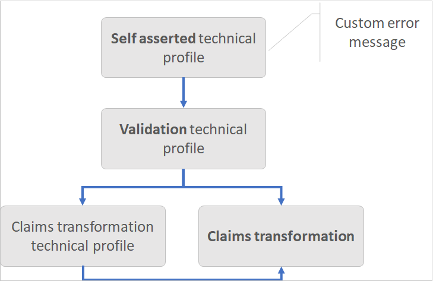

# Date claims transformations

[!INCLUDE [active-directory-b2c-advanced-audience-warning](../../includes/active-directory-b2c-advanced-audience-warning.md)]

This article provides examples for using the date claims transformations of the Identity Experience Framework  schema in Azure Active Directory (Azure AD) B2C. For more information, see [ClaimsTransformations](claimstransformations.md).

## AssertDateTimeIsGreaterThan 

Checks that one date and time claim (string data type) is greater than a second date and time claim (string data type), and throws an exception.

| Item | TransformationClaimType | Data Type | Notes |
| ---- | ----------------------- | --------- | ----- |
| inputClaim | leftOperand | string | First claim's type, which should be greater than the second claim. |
| inputClaim | rightOperand | string | Second claim's type, which should be less than the first claim. |
| InputParameter | AssertIfEqualTo | boolean | Specifies whether this assertion should pass if the left operand is equal to the right operand. |
| InputParameter | AssertIfRightOperandIsNotPresent | boolean | Specifies whether this assertion should pass if the right operand is missing. |
| InputParameter | TreatAsEqualIfWithinMillseconds | int | Specifies the number of milliseconds to allow between the two date times to consider the times equal (for example, to account for clock skew). |

The **AssertDateTimeIsGreaterThan** claims transformation is always executed from a [validation technical profile](validation-technical-profile.md) that is called by a [self-asserted technical profile](self-asserted-technical-profile.md). The **DateTimeGreaterThan** self-asserted technical profile metadata controls the error message that the technical profile presents to the user.



The following example compares the `currentDateTime` claim with the `approvedDateTime` claim. An error is thrown if `currentDateTime` is greater than  `approvedDateTime`. The transformation treats values as equal if they are within 5 minutes (30000 milliseconds) difference.

```XML
<ClaimsTransformation Id="AssertApprovedDateTimeLaterThanCurrentDateTime" TransformationMethod="AssertDateTimeIsGreaterThan">
  <InputClaims>
    <InputClaim ClaimTypeReferenceId="approvedDateTime" TransformationClaimType="leftOperand" />
    <InputClaim ClaimTypeReferenceId="currentDateTime" TransformationClaimType="rightOperand" />
  </InputClaims>
  <InputParameters>
    <InputParameter Id="AssertIfEqualTo" DataType="boolean" Value="false" />
    <InputParameter Id="AssertIfRightOperandIsNotPresent" DataType="boolean" Value="true" />
    <InputParameter Id="TreatAsEqualIfWithinMillseconds" DataType="int" Value="300000" />
  </InputParameters>
</ClaimsTransformation>
```

The `login-NonInteractive` validation technical profile calls the `AssertApprovedDateTimeLaterThanCurrentDateTime` claims transformation.
```XML
<TechnicalProfile Id="login-NonInteractive">
  ...
  <OutputClaimsTransformations>
    <OutputClaimsTransformation ReferenceId="AssertApprovedDateTimeLaterThanCurrentDateTime" />
  </OutputClaimsTransformations>
</TechnicalProfile>
```

The self-asserted technical profile calls the validation **login-NonInteractive** technical profile.

```XML
<TechnicalProfile Id="SelfAsserted-LocalAccountSignin-Email">
  <Metadata>
    <Item Key="DateTimeGreaterThan">Custom error message if the provided left operand is greater than the right operand.</Item>
  </Metadata>
  <ValidationTechnicalProfiles>
    <ValidationTechnicalProfile ReferenceId="login-NonInteractive" />
  </ValidationTechnicalProfiles>
</TechnicalProfile>
```

### Example

- Input claims:
    - **leftOperand**: 2018-10-01T15:00:00.0000000Z
    - **rightOperand**: 2018-10-01T14:00:00.0000000Z
- Result: Error thrown


## ConvertDateToDateTimeClaim

Converts a **Date** ClaimType to a **DateTime** ClaimType. The claims transformation converts the time format and adds 12:00:00 AM to the date.

| Item | TransformationClaimType | Data Type | Notes |
| ---- | ----------------------- | --------- | ----- |
| InputClaim | inputClaim | date | The ClaimType to be converted. |
| OutputClaim | outputClaim | dateTime | The ClaimType that is produced after this ClaimsTransformation has been invoked. |

The following example demonstrates the conversion of the claim `dateOfBirth` (date data type) to another claim `dateOfBirthWithTime` (dateTime data type).

```XML
<ClaimsTransformation Id="ConvertToDateTime" TransformationMethod="ConvertDateToDateTimeClaim">
    <InputClaims>
      <InputClaim ClaimTypeReferenceId="dateOfBirth" TransformationClaimType="inputClaim" />
    </InputClaims>
    <OutputClaims>
      <OutputClaim ClaimTypeReferenceId="dateOfBirthWithTime" TransformationClaimType="outputClaim" />
    </OutputClaims>
  </ClaimsTransformation>
```

### Example

- Input claims:
    - **inputClaim**: 2019-06-01
- Output claims:
    - **outputClaim**: 1559347200 (June 1, 2019 12:00:00 AM)

## GetCurrentDateTime

Get the current UTC date and time and add the value to a ClaimType.

| Item | TransformationClaimType | Data Type | Notes |
| ---- | ----------------------- | --------- | ----- |
| OutputClaim | currentDateTime | dateTime | The ClaimType that is produced after this ClaimsTransformation has been invoked. |

```XML
<ClaimsTransformation Id="GetSystemDateTime" TransformationMethod="GetCurrentDateTime">
  <OutputClaims>
    <OutputClaim ClaimTypeReferenceId="systemDateTime" TransformationClaimType="currentDateTime" />
  </OutputClaims>
</ClaimsTransformation>
```

### Example

* Output claims:
    * **currentDateTime**: 1534418820 (August 16, 2018 11:27:00 AM)

## DateTimeComparison

Determine whether one dateTime is greater, lesser, or equal to another. The result is a new boolean ClaimType boolean with a value of true or false.

| Item | TransformationClaimType | Data Type | Notes |
| ---- | ----------------------- | --------- | ----- |
| InputClaim | firstDateTime | dateTime | The first dateTime to compare. Null value throws an exception. |
| InputClaim | secondDateTime | dateTime | The second dateTime to complete. Null value treats as current datetTime. |
| InputParameter | operator | string | One of following values: same, later than, or earlier than. |
| InputParameter | timeSpanInSeconds | int | Add the timespan to the first datetime. |
| OutputClaim | result | boolean | The ClaimType that is produced after this ClaimsTransformation has been invoked. |

Use this claims transformation to determine if two ClaimTypes are  equal, greater, or lesser from each other. For example, you may store the last time a user accepted your terms of services (TOS). After 3 months, you can ask the user to access the TOS again.
To run the claim transformation, you first need to get the current dateTime and also the last time user accepts the TOS.

```XML
<ClaimsTransformation Id="CompareLastTOSAcceptedWithCurrentDateTime" TransformationMethod="DateTimeComparison">
  <InputClaims>
    <InputClaim ClaimTypeReferenceId="currentDateTime" TransformationClaimType="firstDateTime" />
    <InputClaim ClaimTypeReferenceId="extension_LastTOSAccepted" TransformationClaimType="secondDateTime" />
  </InputClaims>
  <InputParameters>
    <InputParameter Id="operator" DataType="string" Value="greater than" />
    <InputParameter Id="timeSpanInSeconds" DataType="int" Value="7776000" />
  </InputParameters>
  <OutputClaims>
    <OutputClaim ClaimTypeReferenceId="isLastTOSAcceptedGreaterThanNow" TransformationClaimType="result" />
  </OutputClaims>      
</ClaimsTransformation>
```

### Example

- Input claims:
    - **firstDateTime**: 2018-01-01T00:00:00.100000Z
    - **secondDateTime**: 2018-04-01T00:00:00.100000Z
- Input parameters:
    - **operator**: greater than
    - **timeSpanInSeconds**: 7776000 (90 days)
- Output claims: 
    - **result**: true

