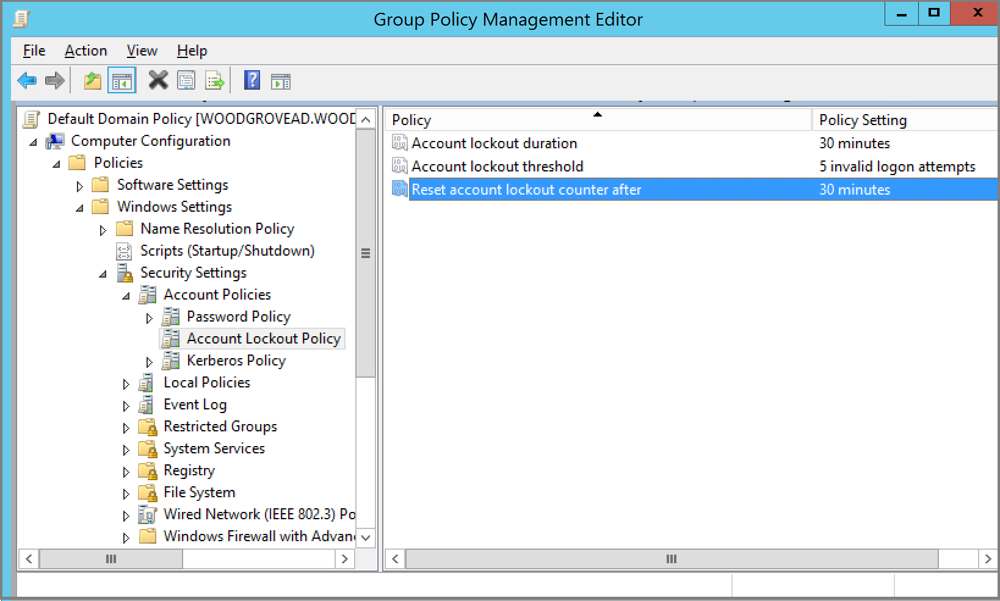
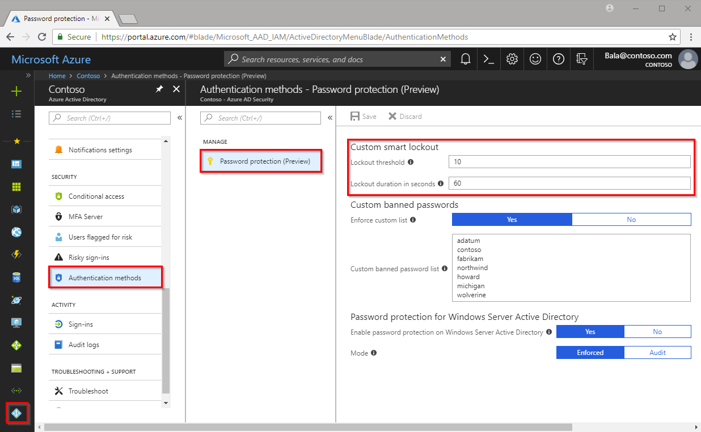

# Azure Active Directory smart lockout

Smart lockout uses cloud intelligence to lock out bad actors who are trying to guess your users’ passwords or use brute-force methods to get in. That intelligence can recognize sign-ins coming from valid users and treat them differently than ones of attackers and other unknown sources. Smart lockout locks out the attackers, while letting your users continue to access their accounts and be productive.

By default, smart lockout locks the account from sign-in attempts for one minute after ten failed attempts. The account locks again after each subsequent failed sign-in attempt, for one minute at first and longer in subsequent attempts.

Smart lockout is always on for all Azure AD customers with these default settings that offer the right mix of security and usability. Customization of the smart lockout settings, with values specific to your organization, requires Azure AD Basic or higher licenses for your users.

Smart lockout can be integrated with hybrid deployments, using password hash sync or pass-through authentication to protect on-premises Active Directory accounts from being locked out by attackers. By setting smart lockout policies in Azure AD appropriately, attacks can be filtered out before they reach on-premises Active Directory.

When using [pass-through authentication](../hybrid/how-to-connect-pta.md), you need to make sure that:

   * The Azure AD lockout threshold is **less** than the Active Directory account lockout threshold. Set the values so that the Active Directory account lockout threshold is at least two or three times longer than the Azure AD lockout threshold. 
   * The Azure AD lockout duration **in seconds** is **longer** than the Active Directory reset account lockout counter after duration **minutes**.

> [!IMPORTANT]
> Currently an administrator can't unlock the users' cloud accounts if they have been locked out by the Smart Lockout capability. The administrator must wait for the lockout duration to expire.

## Verify on-premises account lockout policy

Use the following instructions to verify your on-premises Active Directory account lockout policy:

1. Open the Group Policy Management tool.
2. Edit the group policy that includes your organization's account lockout policy, for example, the **Default Domain Policy**.
3. Browse to **Computer Configuration** > **Policies** > **Windows Settings** > **Security Settings** > **Account Policies** > **Account Lockout Policy**.
4. Verify your **Account lockout threshold** and **Reset account lockout counter after** values.

## Manage Azure AD smart lockout values

Based on your organizational requirements, smart lockout values may need to be customized. Customization of the smart lockout settings, with values specific to your organization, requires Azure AD Basic or higher licenses for your users.

To check or modify the smart lockout values for your organization, use the following steps:

1. Sign in to the [Azure portal](https://portal.azure.com), and click on **Azure Active Directory**, then  **Authentication Methods**.
1. Set the **Lockout threshold**, based on how many failed sign-ins are allowed on an account before its first lockout. The default is 10.
1. Set the **Lockout duration in seconds**, to the length in seconds of each lockout. The default is 60 seconds (one minute).

> [!NOTE]
> If the first sign-in after a lockout also fails, the account locks out again. If an account locks repeatedly, the lockout duration increases.

## Next steps

[Find out how to ban bad passwords in your organization using Azure AD.](howto-password-ban-bad.md)

[Configure self-service password reset to allow users to unlock their own accounts.](quickstart-sspr.md)