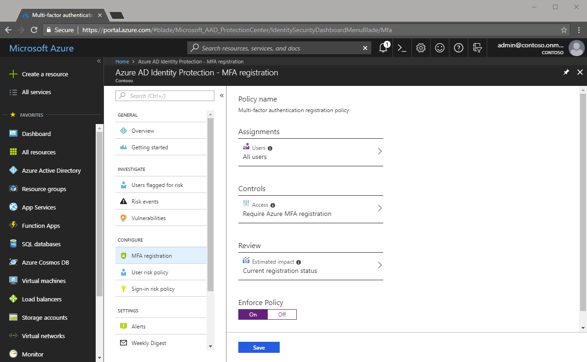

# Tutorial: Use risk events to trigger Multi-Factor Authentication and password changes

In this tutorial, you will enable features of Azure Active Directory (Azure AD) Identity Protection, an Azure AD Premium P2 feature that is more than just a monitoring and reporting tool. To protect your organization's identities, you can configure risk-based policies that automatically respond to risky behaviors. These policies, can either automatically block or initiate remediation, including requiring password changes and enforcing Multi-Factor Authentication.

Azure AD Identity Protection policies can be used in addition to existing conditional access policies as an extra layer of protection. Your users may never trigger a risky behavior requiring one of these policies, but as an administrator you know they are protected.

Some items that may trigger a risk event include:

* Users with leaked credentials
* Sign-ins from anonymous IP addresses
* Impossible travel to atypical locations
* Sign-ins from infected devices
* Sign-ins from IP addresses with suspicious activity
* Sign-ins from unfamiliar locations

More information about Azure AD Identity Protection can be found in the article [What is Azure AD Identity Protection](../active-directory-identityprotection.md)

> [!div class="checklist"]
> * Enable Azure MFA registration
> * Enable risk-based password changes
> * Enable risk-based Multi-Factor Authentication

## Prerequisites

* Access to a working Azure AD tenant with at least a trial Azure AD Premium P2 license assigned.
* An account with Global Administrator privileges in your Azure AD tenant.
* Have completed the previous self-service password reset (SSPR) and Multi-Factor Authentication (MFA) tutorials.

## Enable risk-based policies for SSPR and MFA

Enabling the risk-based policies is a straightforward process. The steps below will guide you through a sample configuration.

### Enable users to register for Multi-Factor Authentication

Azure AD Identity Protection includes a default policy that can hep you to get your users registered for Multi-Factor Authentication and easily identify the current registration status. Enabling this policy does not start requiring users to perform Multi-Factor Authentication, but will ask them to pre-register.

1. Sign in to the [Azure portal](https://portal.azure.com).
1. Click on **All services**, then browse to **Azure AD Identity Protection**.
1. Click on **MFA registration**.
1. Set Enforce Policy to **On**.
   1. Setting this policy will require all of your users to register methods to prepare to use by Multi-Factor Authentication.
1. Click **Save**.

   

### Enable risk-based password changes

Microsoft works with researchers, law enforcement, various security teams at Microsoft, and other trusted sources to find username and password pairs. When one of these pairs matches an account in your environment, a risk-based password change can be triggered using the following policy.

1. Click on User risk policy.
1. Under **Conditions**, select **User risk**, then choose **Medium and above**.
1. Click "Select" then "Done"
1. Under **Access**, choose **Allow access**, and then select **Require password change**.
1. Click "Select"
1. Set Enforce Policy to **On**.
1. Click **Save**

### Enable risk-based Multi-Factor Authentication

Most users have a normal behavior that can be tracked, when they fall outside of this norm it could be risky to allow them to just sign in. You may want to block that user or maybe just ask them to perform a Multi-Factor Authentication to prove that they are really who they say they are. To enable a policy requiring MFA when a risky sign-in is detected, enable the following policy.

1. Click on Sign-in risk policy
1. Under **Conditions**, select **User risk**, then choose **Medium and above**.
1. Click "Select" then "Done"
1. Under **Access**, choose **Allow access**, and then select **Require multi-factor authentication**.
1. Click "Select"
1. Set Enforce Policy to **On**.
1. Click **Save**

## Clean up resources

If you have completed testing and no longer want to have the risk-based policies enabled, return to each policy you want to disable, and set **Enforce Policy** to **Off**.