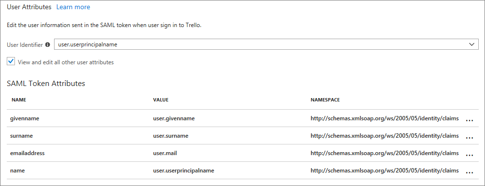

# B2B collaboration user claims mapping in Azure Active Directory

Azure Active Directory (Azure AD) supports customizing the claims that are issued in the SAML token for B2B collaboration users. When a user authenticates to the application, Azure AD issues a SAML token to the app that contains information (or claims) about the user that uniquely identifies them. By default, this includes the user's user name, email address, first name, and last name.

In the [Azure portal](https://portal.azure.com), you can view or edit the claims that are sent in the SAML token to the application. To access the settings, select **Azure Active Directory** > **Enterprise applications** > the application that's configured for single sign-on > **Single sign-on**. See the SAML token settings in the **User Attributes** section.

There are two possible reasons why you might need to edit the claims that are issued in the SAML token:

1. The application requires a different set of claim URIs or claim values.

2. The application requires the NameIdentifier claim to be something other than the user principal name (UPN) that's stored in Azure AD.

For information about how to add and edit claims, see [Customizing claims issued in the SAML token for enterprise applications in Azure Active Directory](../develop/active-directory-saml-claims-customization.md).

For B2B collaboration users, mapping NameID and UPN cross-tenant are prevented for security reasons.

## Next steps

- For information about B2B collaboration user properties, see [Properties of an Azure Active Directory B2B collaboration user](user-properties.md).
- For information about user tokens for B2B collaboration users, see [Understand user tokens in Azure AD B2B collaboration](user-token.md).

