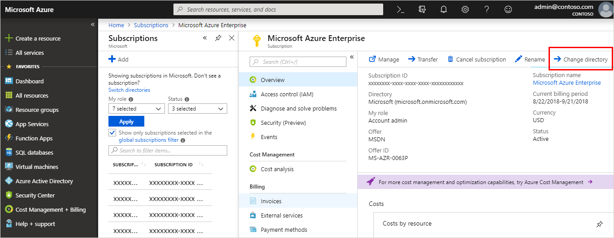
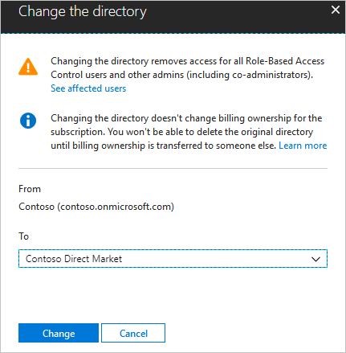
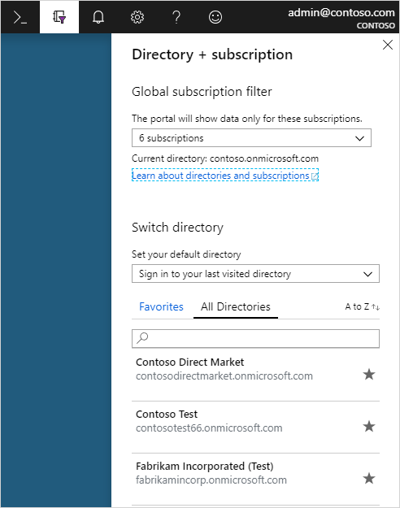

# How to: Associate or add an Azure subscription to Azure Active Directory
The Azure subscription has a trust relationship with Azure Active Directory (Azure AD), which means that the subscription trusts Azure AD to authenticate users, services, and devices. Multiple subscriptions can trust the same Azure AD directory, but each subscription can only trust a single directory.

If your subscription expires, you lose access to all the other resources associated with the subscription. However, the Azure AD directory remains in Azure, letting you associate and manage the directory using a different Azure subscription.

All of your users have a single "home" directory for authentication. However, your users can also be guests in other directories. You can see both the home and guest directories for each user in Azure AD.

>[!Important]
>All [Role-Based Access Control (RBAC)](../../role-based-access-control/role-assignments-portal.md) users with assigned access, along with all subscription admins will lose access after the subscription directory changes. Additionally, if you have any key vaults, they'll also be affected by the subscription move. To fix that, you must [change the key vault tenant ID](../../key-vault/key-vault-subscription-move-fix.md) before resuming operations.

## Before you begin
Before you can associate or add your subscription, you must perform the following tasks:

- Sign in using an account that:
    - Has **RBAC Owner** access to the subscription.

    - Exists in both the current directory that's associated with the subscription and in the new directory that's where you want to associate the subscription going forward. For more information about getting access to another directory, see [How do Azure Active Directory admins add B2B collaboration users?](../b2b/add-users-administrator.md).

- Make sure you're not using an Azure Cloud Service Providers (CSP) subscription (MS-AZR-0145P, MS-AZR-0146P, MS-AZR-159P), a Microsoft Internal subscription (MS-AZR-0015P), or a Microsoft Imagine subscription (MS-AZR-0144P).
    
## To associate an existing subscription to your Azure AD directory
1. Sign in and select the subscription you want to use from the [Subscriptions page in Azure portal](https://portal.azure.com/#blade/Microsoft_Azure_Billing/SubscriptionsBlade).

2. Select **Change directory**.

    

3. Review any warnings that appear, and then select **Change**.

    

    The directory is changed for the subscription and you get a success message.

        

4. Use the Directory switcher to go to your new directory. It might take up to 10 minutes for everything to show up properly.

    

Changing the subscription directory is a service-level operation, so it doesn't affect subscription billing ownership. The Account Admin can still change the Service Admin from the [Account Center](https://account.azure.com/subscriptions). To delete the original directory, you must transfer the subscription billing ownership to a new Account Admin. To learn more about transferring billing ownership, see [Transfer ownership of an Azure subscription to another account](../../billing/billing-subscription-transfer.md). 

## Next steps

- To create a new Azure AD tenant, see [Access Azure Active Directory to create a new tenant](active-directory-access-create-new-tenant.md)

- To learn more about how resource access is controlled in Microsoft Azure, see [Understanding resource access in Azure](../../role-based-access-control/rbac-and-directory-admin-roles.md)

- To learn more about how to assign roles in Azure AD, see [How to assign directory roles to users with Azure Active Directory](active-directory-users-assign-role-azure-portal.md)
