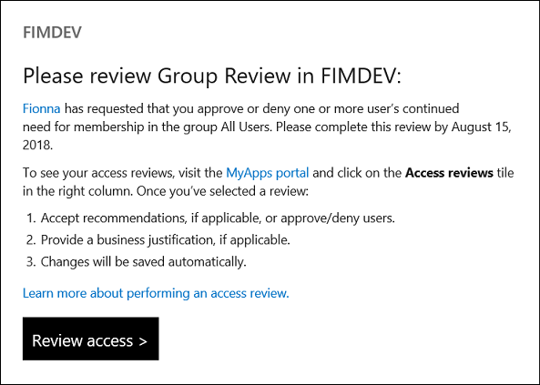

# Review access with Azure AD access reviews

Azure Active Directory (Azure AD) simplifies how enterprises manage access to applications and members of groups in Azure AD and other Microsoft Online Services with a feature called access reviews. Perhaps you  received an email from Microsoft that asks you to review access for members of a group or users with access to an application. 

## Open an access review

To see the pending access reviews, click the review access link in the email. Starting in August 2018, the email notifications for Azure AD roles have an updated design. The following shows an example email that is sent when a user is invited to be a reviewer. 

If you don't have the email, you can locate the access reviews by following these steps:

1. Sign in on the [Azure AD access panel](https://myapps.microsoft.com).

2. Select the user symbol in the upper-right corner of the page, which displays your name and default organization. If more than one organization is listed, select the organization that requested an access review.

3. If a tile labeled **Access reviews** is on the right side of the page, select it. If the tile isn't visible, there are no access reviews to perform for that organization and no action is needed at this time.

## Fill out an access review

When you select an access review from the list, you see the names of users who need to be reviewed. You might see only one name--your own--if the request was to review your own access.

For each row on the list, you can decide whether to approve or deny the user's access. Select the row, and choose whether to approve or deny. (If you don't know the user, you can indicate that too.)

The reviewer might require that you supply a justification for approving continued access or group membership.

## Next steps

A user's denied access isn't removed immediately. It can be removed when the review is finished or when an administrator stops the review. If you want to change your answer and approve a previously denied user or deny a previously approved user, select the row, reset the response, and select a new response. You can do this step until the access review is finished.

