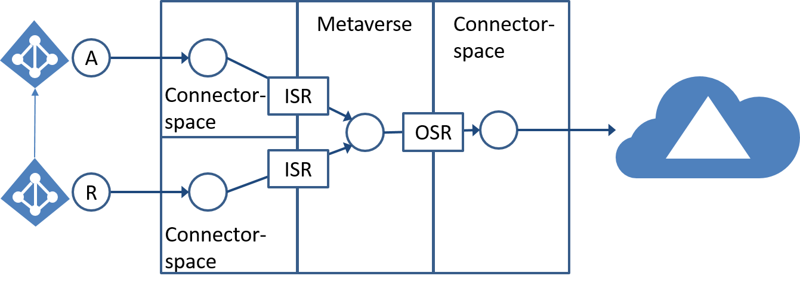

# Azure AD Connect sync: Technical Concepts
This article is a summary of the topic [Understanding architecture](how-to-connect-sync-technical-concepts.md).

Azure AD Connect sync builds upon a solid metadirectory synchronization platform.
The following sections introduce the concepts for metadirectory synchronization.
Building upon MIIS, ILM, and FIM, the Azure Active Directory Sync Services provides the next platform for connecting to data sources, synchronizing data between data sources, as well as the provisioning and deprovisioning of identities.

The following sections provide more details about the following aspects of the FIM Synchronization Service:

* Connector
* Attribute flow
* Connector space
* Metaverse
* Provisioning

## Connector
The code modules that are used to communicate with a connected directory are called connectors (formerly known as  management agents (MAs)).

These are installed on the computer running Azure AD Connect sync.
The connectors provide the agentless ability to converse by using remote system protocols instead of relying on the deployment of specialized agents. This means decreased risk and deployment times, especially when dealing with critical applications and systems.

In the picture above, the connector is synonymous with the connector space but encompasses all communication with the external system.

The connector is responsible for all import and export functionality to the system and frees developers from needing to understand how to connect to each system natively when using declarative provisioning to customize data transformations.

Imports and exports only occur when scheduled, allowing for further insulation from changes occurring within the system, since changes do not automatically propagate to the connected data source. In addition, developers may also create their own connectors for connecting to virtually any data source.

## Attribute flow
The metaverse is the consolidated view of all joined identities from neighboring connector spaces. In the figure above, attribute flow is depicted by lines with arrowheads for both inbound and outbound flow. Attribute flow is the process of copying or transforming data from one system to another and all attribute flows (inbound or outbound).

Attribute flow occurs between the connector space and the metaverse bi-directionally when synchronization (full or delta) operations are scheduled to run.

Attribute flow only occurs when these synchronizations are run. Attribute flows are defined in Synchronization Rules. These can be inbound (ISR in the picture above) or outbound (OSR in the picture above).

## Connected system
Connected system (aka connected directory) is referring to the remote system Azure AD Connect sync has connected to and reading and writing identity data to and from.

## Connector space
Each connected data source is represented as a filtered subset of the objects and attributes in the connector space.
This allows the sync service to operate locally without the need to contact the remote system when synchronizing the objects and restricts interaction to imports and exports only.

When the data source and the connector have the ability to provide a list of changes (a delta import), then the operational efficiency increases dramatically as only changes since the last polling cycle are exchanged. The connector space insulates the connected data source from changes propagating automatically by requiring that the connector schedule imports and exports. This added insurance grants you peace of mind while testing, previewing, or confirming the next update.

## Metaverse
The metaverse is the consolidated view of all joined identities from neighboring connector spaces.

As identities are linked together and authority is assigned for various attributes through import flow mappings, the central metaverse object begins to aggregate information from multiple systems. From this object attribute flow, mappings carry information to outbound systems.

Objects are created when an authoritative system projects them into the metaverse. As soon as all connections are removed, the metaverse object is deleted.

Objects in the metaverse cannot be edited directly. All data in the object must be contributed through attribute flow. The metaverse maintains persistent connectors with each connector space. These connectors do not require reevaluation for each synchronization run. This means that Azure AD Connect sync does not have to locate the matching remote object each time. This avoids the need for costly agents to prevent changes to attributes that would normally be responsible for correlating the objects.

When discovering new data sources that may have preexisting objects that need to be managed, Azure AD Connect sync uses a process called a join rule to evaluate potential candidates with which to establish a link.
Once the link is established, this evaluation does not reoccur and normal attribute flow can occur between the remote connected data source and the metaverse.

## Provisioning
When an authoritative source projects a new object into the metaverse a new connector space object can be created in another Connector representing a downstream connected data source.

This inherently establishes a link, and attribute flow can proceed bi-directionally.

Whenever a rule determines that a new connector space object needs to be created, it is called provisioning. However, because this operation only takes place within the connector space, it does not carry over into the connected data source until an export is performed.

## Additional Resources
* [Azure AD Connect Sync: Customizing Synchronization options](how-to-connect-sync-whatis.md)
* [Integrating your on-premises identities with Azure Active Directory](whatis-hybrid-identity.md)

<!--Image references-->
[1]: ./media/active-directory-aadsync-technical-concepts/ic750598.png
