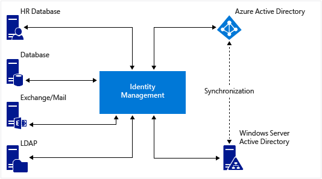

---
title: Hybrid identity design - management tasks Azure | Microsoft Docs
description: With Conditional access control, Azure Active Directory checks the specific conditions you pick when authenticating the user and before allowing access to the application. Once those conditions are met, the user is authenticated and allowed access to the application.
documentationcenter: ''
services: active-directory
author: billmath
manager: mtillman
editor: ''
ms.assetid: 65f80aea-0426-4072-83e1-faf5b76df034
ms.service: active-directory
ms.devlang: na
ms.topic: article
ms.tgt_pltfrm: na
ms.workload: identity
ms.date: 05/30/2018
ms.component: hybrid
ms.author: billmath
ms.custom: seohack1
---
# Plan for Hybrid Identity Lifecycle
Identity is one of the foundations of your enterprise mobility and application access strategy. Whether you are signing on to your mobile device or SaaS app, your identity is the key to gaining access to everything. At its highest level, an identity management solution encompasses unifying and syncing between your identity repositories, which includes automating and centralizing the process of provisioning resources. The identity solution should be a centralized identity across on-premises and cloud and also use some form of identity federation to maintain centralized authentication and securely share and collaborate with external users and businesses. Resources range from operating systems and applications to people in, or affiliated with, an organization. Organizational structure can be altered to accommodate the provisioning policies and procedures.

It is also important to have an identity solution geared to empower your users by providing them with self-service experiences to keep them productive. Your identity solution is more robust if it enables single sign-on for users across all the resources they need access. Administrators at all levels can use standardized procedures for managing user credentials. Some levels of administration can be reduced or eliminated, depending on the breadth of the provisioning management solution. Furthermore, you can securely distribute administration capabilities, manually or automatically, among various organizations. For example, a domain administrator can serve only the people and resources in that domain. This user can do administrative and provisioning tasks, but is not authorized to do configuration tasks, such as creating workflows.

## Determine Hybrid Identity Management Tasks
Distributing administrative tasks in your organization improves the accuracy and effectiveness of administration and improves the balance of the workload of an organization. Following are the pivots that define a robust identity management system.

 

To define hybrid identity management tasks, you must understand some essential characteristics of the organization that will be adopting hybrid identity. It is important to understand the current repositories being used for identity sources. By knowing those core elements, you will have the foundational requirements and based on that you will need to ask more granular questions that will lead you to a better design decision for your Identity solution.  

While defining those requirements, ensure that at least the following questions are answered

* Provisioning options: 
  
  * Does the hybrid identity solution support a robust account access management and provisioning system?
  * How are users, groups, and passwords going to be managed?
  * Is the identity lifecycle management responsive? 
    * How long does password updates account suspension take?
* License management: 
  
  * Does the hybrid identity solution handles license management?
    * If yes, what capabilities are available?
* Does the solution handle group-based license management? 
  
      - If yes, is it possible to assign a security group to it? 
       - If yes, will the cloud directory automatically assign licenses to all the members of the group? 
        - What happens if a user is subsequently added to, or removed from the group, will a license be automatically assigned or removed as appropriate? 
* Integration with other third-party identity providers:
* Can this hybrid solution be integrated with third-party identity providers to implement single sign-on?
* Is it possible to unify all the different identity providers into a cohesive identity system?
* If yes, how and which are they and what capabilities are available?

## Synchronization Management
One of the goals of an identity manager, to be able to bring all the identity providers and keep them synchronized. You keep the data synchronized based on an authoritative master identity provider. In a hybrid identity scenario, with a synchronized management model, you manage all user and device identities in an on-premises server and synchronize the accounts and, optionally, passwords to the cloud. The user enters the same password on-premises as they do in the cloud, and at sign-in, the password is verified by the identity solution. This model uses a directory synchronization tool.

To proper design the synchronization of your hybrid identity solution ensure that the following questions are answered:
•    What are the sync solutions available for the hybrid identity solution?
•    What are the single sign on capabilities available?
•    What are the options for identity federation between B2B and B2C?

## Next steps
[Determine hybrid identity management adoption strategy](plan-hybrid-identity-design-considerations-lifecycle-adoption-strategy.md)

## See Also
[Design considerations overview](plan-hybrid-identity-design-considerations-overview.md)

