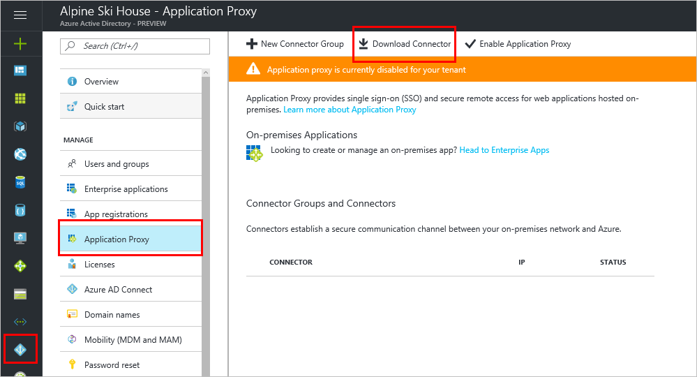
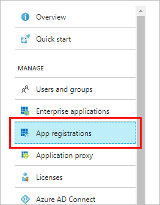
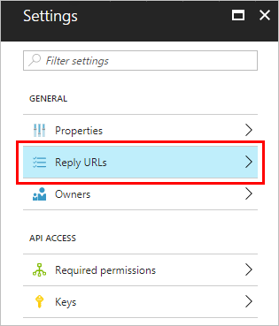
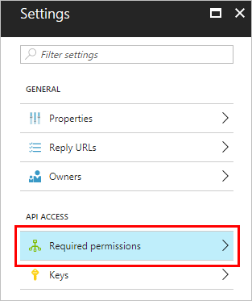
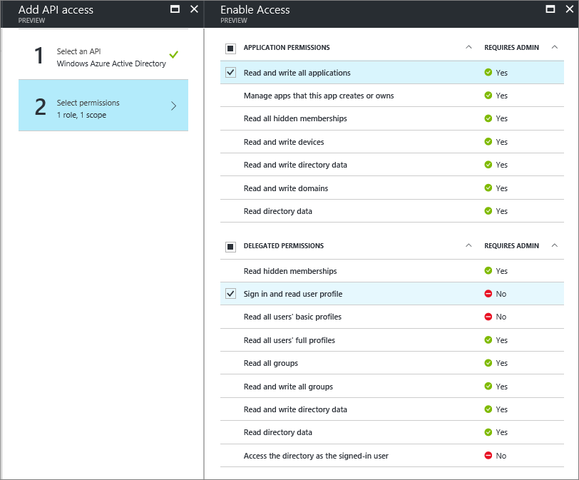
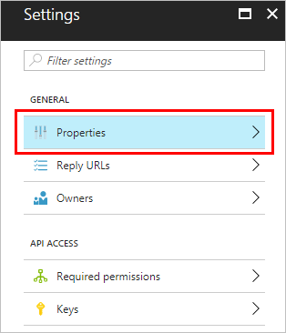

# Header-based authentication for single sign-on with Application Proxy and PingAccess

Azure Active Directory Application Proxy and PingAccess have partnered together to provide Azure Active Directory customers with access to even more applications. PingAccess expands the [existing Application Proxy offerings](application-proxy.md) to include single sign-on access to applications that use headers for authentication.

## What is PingAccess for Azure AD?

PingAccess for Azure Active Directory is an offering of PingAccess that enables you to give users access and single sign-on to applications that use headers for authentication. Application Proxy treats these apps like any other, using Azure AD to authenticate access and then passing traffic through the connector service. PingAccess sits in front of the apps and translates the access token from Azure AD into a header so that the application receives the authentication in the format it can read.

Your users won’t notice anything different when they sign in to use your corporate apps. They can still work from anywhere on any device. 

Since the Application Proxy connectors direct remote traffic to all apps regardless of their authentication type, they’ll continue to load balance automatically, as well.

## How do I get access?

Since this scenario is offered through a partnership between Azure Active Directory and PingAccess, you need licenses for both services. However, Azure Active Directory Premium subscriptions include a basic PingAccess license that covers up to 20 applications. If you need to publish more than 20 header-based applications, you can purchase an additional license from PingAccess. 

For more information, see [Azure Active Directory editions](../fundamentals/active-directory-whatis.md).

## Publish your application in Azure

This article is intended for people who are publishing an app with this scenario for the first time. It walks through how to get started with both Application and PingAccess, in addition to the publishing steps. If you’ve already configured both services but want a refresher on the publishing steps, you can skip the connector installation and move on to [Add your app to Azure AD with Application Proxy](#add-your-app-to-Azure-AD-with-Application-Proxy).

>[!NOTE]
>Since this scenario is a partnership between Azure AD and PingAccess, some of the instructions exist on the Ping Identity site.

### Install an Application Proxy connector

If you already have Application Proxy enabled, and have a connector installed, you can skip this section and move on to [Add your app to Azure AD with Application Proxy](#add-your-app-to-azure-ad-with-application-proxy).

The Application Proxy connector is a Windows Server service that directs the traffic from your remote employees to your published apps. For more detailed installation instructions, see [Enable Application Proxy in the Azure portal](application-proxy-enable.md).

1. Sign in to the [Azure portal](https://portal.azure.com) as a global administrator.
2. Select **Azure Active Directory** > **Application proxy**.
3. Select **Download Connector** to start the Application Proxy connector download. Follow the installation instructions.

   

4. Downloading the connector should automatically enable Application Proxy for your directory, but if not you can select **Enable Application Proxy**.


### Add your app to Azure AD with Application Proxy

There are two actions you need to take in the Azure portal. First, you need to publish your application with Application Proxy. Then, you need to collect some information about the app that you can use during the PingAccess steps.

Follow these steps to publish your app. For a more detailed walkthrough of steps 1-8, see [Publish applications using Azure AD Application Proxy](application-proxy-publish-azure-portal.md).

1. If you didn't in the last section, sign in to the [Azure portal](https://portal.azure.com) as a global administrator.
2. Select **Azure Active Directory** > **Enterprise applications**.
3. Select **Add** at the top of the blade.
4. Select **On-premises application**.
5. Fill out the required fields with information about your new app. Use the following guidance for the settings:
   - **Internal URL**: Normally you provide the URL that takes you to the app’s sign in page when you’re on the corporate network. For this scenario the connector needs to treat the PingAccess proxy as the front page of the app. Use this format: `https://<host name of your PA server>:<port>`. The port is 3000 by default, but you can configure it in PingAccess.

    > [!WARNING]
    > For this type of SSO, the internal URL must use https and cannot use http.

   - **Pre-authentication method**: Azure Active Directory
   - **Translate URL in Headers**: No

   >[!NOTE]
   >If this is your first application, use port 3000 to start and come back to update this setting if you change your PingAccess configuration. If this is your second or later app, this will need to match the Listener you’ve configured in PingAccess. Learn more about [listeners in PingAccess](https://documentation.pingidentity.com/pingaccess/pa31/index.shtml#Listeners.html).

6. Select **Add** at the bottom of the blade. Your application is added, and the quick start menu opens.
7. In the quick start menu,
select **Assign a user for testing**, and add at least one user to the application. Make sure this test account has access to the on-premises application.
8. Select **Assign** to save the test user assignment.
9. On the app management blade, select **Single sign-on**.
10. Choose **Header-based sign-on** from the drop-down menu. Select **Save**.

   >[!TIP]
   >If this is your first time using header-based single sign-on, you need to install PingAccess. To make sure your Azure subscription is automatically associated with your PingAccess installation, use the link on this single sign-on page to download PingAccess. You can open the download site now, or come back to this page later. 

   

11. Close the Enterprise applications blade or scroll all the way to the left to return to the Azure Active Directory menu.
12. Select **App registrations**.

   

13. Select the app you just added, then **Reply URLs**.

   

14. Check to see if the external URL that you assigned to your app in step 5 is in the Reply URLs list. If it’s not, add it now.
15. On the app settings blade, select **Required permissions**.

  

16. Select **Add**. For the API, choose **Windows Azure Active Directory**, then **Select**. For the permissions, choose **Read and write all applications** and **Sign in and read user profile**, then **Select** and **Done**.  

  

17. Grant permissions before you close the permissions screen. 


### Collect information for the PingAccess steps

1. On your app settings blade, select **Properties**. 

  

2. Save the **Application Id** value. This is used for the client ID when you configure PingAccess.
3. On the app settings blade, select **Keys**.

  

4. Create a key by entering a key description and choosing an expiration date from the drop-down menu.
5. Select **Save**. A GUID appears in the **Value** field.

  Save this value now, as you won’t be able to see it again after you close this window.

  

6. Close the App registrations blade or scroll all the way to the left to return to the Azure Active Directory menu.
7. Select **Properties**.
8. Save the **Directory ID** GUID.

### Optional - Update GraphAPI to send custom fields

For a list of security tokens that Azure AD sends for authentication, see [Azure AD token reference](../develop/v1-id-and-access-tokens.md). If you need a custom claim that sends other tokens, use Graph Explorer or the manifest for the application in the Azure Portal to set the app field *acceptMappedClaims* to **True**.    

This example uses Graph Explorer:

```
PATCH https://graph.windows.net/myorganization/applications/<object_id_GUID_of_your_application> 

{
  "acceptMappedClaims":true
}
```
This example uses the [Azure portal](https://portal.azure.com) to udpate the *acceptedMappedClaims* field:
1. Sign in to the [Azure portal](https://portal.azure.com) as a global administrator.
2. Select **Azure Active Directory** > **App registrations**.
3. Select your application > **Manifest**.
4. Select **Edit**, search for the *acceptedMappedClaims* field and change the value to **true**.

1. Select **Save**.

>[!NOTE]
>To use a custom claim, you must also have a custom policy defined and assigned to the application.  This policy should include all required custom attributes.
>
>Policy definition and assignment can be done through PowerShell, Azure AD Graph Explorer, or MS Graph.  If you are doing this in PowerShell, you may need to first use `New-AzureADPolicy `and then assign it to the application with `Set-AzureADServicePrincipalPolicy`.  For more information see the [Azure AD Policy documentation](../active-directory-claims-mapping.md#claims-mapping-policy-assignment).

### Optional - Use a custom claim
To make your application use a custom claim and include additional fields, be sure that you have also [created a custom claims mapping policy and assigned it to the application](../active-directory-claims-mapping.md#claims-mapping-policy-assignment).

## Download PingAccess and configure your app

Now that you've completed all the Azure Active Directory setup steps, you can move on to configuring PingAccess. 

The detailed steps for the PingAccess part of this scenario continue in the Ping Identity documentation, [Configure PingAccess for Azure AD](https://docs.pingidentity.com/bundle/paaad_m_ConfigurePAforMSAzureADSolution_paaad43/page/pa_c_PAAzureSolutionOverview.html).

Those steps walk you through the process of getting a PingAccess account if you don't already have one, installing the PingAccess Server, and creating an Azure AD OIDC Provider connection with the Directory ID that you copied from the Azure portal. Then, you use the Application ID and Key values to create a Web Session on PingAccess. After that, you can set up identity mapping and create a virtual host, site, and application.

### Test your app

When you've completed all these steps, your app should be up and running. To test it, open a browser and navigate to the external URL that you created when you published the app in Azure. Sign in with the test account that you assigned to the app.

## Next steps

- [Configure PingAccess for Azure AD](https://docs.pingidentity.com/bundle/paaad_m_ConfigurePAforMSAzureADSolution_paaad43/page/pa_c_PAAzureSolutionOverview.html)
- [How does Azure AD Application Proxy provide single sign-on?](application-proxy-single-sign-on.md)
- [Troubleshoot Application Proxy](application-proxy-troubleshoot.md)
