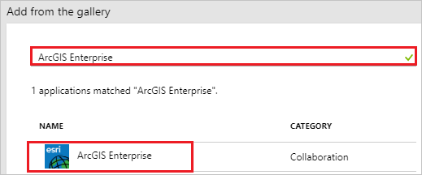
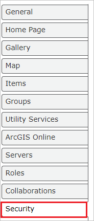
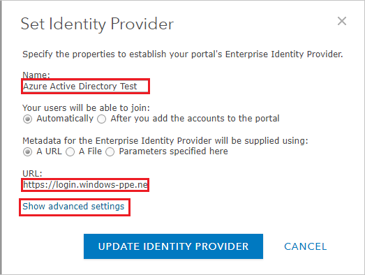

# Tutorial: Azure Active Directory integration with ArcGIS Enterprise

In this tutorial, you learn how to integrate ArcGIS Enterprise with Azure Active Directory (Azure AD).

Integrating ArcGIS Enterprise with Azure AD provides you with the following benefits:

- You can control in Azure AD who has access to ArcGIS Enterprise.
- You can enable your users to automatically get signed-on to ArcGIS Enterprise (Single Sign-On) with their Azure AD accounts.
- You can manage your accounts in one central location - the Azure portal.

If you want to know more details about SaaS app integration with Azure AD, see [what is application access and single sign-on with Azure Active Directory](../manage-apps/what-is-single-sign-on.md)

## Prerequisites

To configure Azure AD integration with ArcGIS Enterprise, you need the following items:

- An Azure AD subscription
- An ArcGIS Enterprise single sign-on enabled subscription

> [!NOTE]
> To test the steps in this tutorial, we do not recommend using a production environment.

To test the steps in this tutorial, you should follow these recommendations:

- Do not use your production environment, unless it is necessary.
- If you don't have an Azure AD trial environment, you can [get a one-month trial](https://azure.microsoft.com/pricing/free-trial/).

## Scenario description

In this tutorial, you test Azure AD single sign-on in a test environment. 
The scenario outlined in this tutorial consists of two main building blocks:

1. Adding ArcGIS Enterprise from the gallery
2. Configuring and testing Azure AD single sign-on

## Adding ArcGIS Enterprise from the gallery

To configure the integration of ArcGIS Enterprise into Azure AD, you need to add ArcGIS Enterprise from the gallery to your list of managed SaaS apps.

**To add ArcGIS Enterprise from the gallery, perform the following steps:**

1. In the **[Azure portal](https://portal.azure.com)**, on the left navigation panel, click **Azure Active Directory** icon. 

	![The Azure Active Directory button][1]

2. Navigate to **Enterprise applications**. Then go to **All applications**.

	![The Enterprise applications blade][2]

3. To add new application, click **New application** button on the top of dialog.

	![The New application button][3]

4. In the search box, type **ArcGIS Enterprise**, select **ArcGIS Enterprise** from result panel then click **Add** button to add the application.

	

## Configure and test Azure AD single sign-on

In this section, you configure and test Azure AD single sign-on with ArcGIS Enterprise based on a test user called "Britta Simon".

For single sign-on to work, Azure AD needs to know what the counterpart user in ArcGIS Enterprise is to a user in Azure AD. In other words, a link relationship between an Azure AD user and the related user in ArcGIS Enterprise needs to be established.

To configure and test Azure AD single sign-on with ArcGIS Enterprise, you need to complete the following building blocks:

1. **[Configure Azure AD Single Sign-On](#configure-azure-ad-single-sign-on)** - to enable your users to use this feature.
2. **[Create an Azure AD test user](#create-an-azure-ad-test-user)** - to test Azure AD single sign-on with Britta Simon.
3. **[Create an ArcGIS Enterprise test user](#create-an-arcgis-enterprise-test-user)** - to have a counterpart of Britta Simon in ArcGIS Enterprise that is linked to the Azure AD representation of user.
4. **[Assign the Azure AD test user](#assign-the-azure-ad-test-user)** - to enable Britta Simon to use Azure AD single sign-on.
5. **[Test single sign-on](#test-single-sign-on)** - to verify whether the configuration works.

### Configure Azure AD single sign-on

In this section, you enable Azure AD single sign-on in the Azure portal and configure single sign-on in your ArcGIS Enterprise application.

**To configure Azure AD single sign-on with ArcGIS Enterprise, perform the following steps:**

1. In the Azure portal, on the **ArcGIS Enterprise** application integration page, click **Single sign-on**.

	![Configure single sign-on link][4]

2. On the **Single sign-on** dialog, select **Mode** as	**SAML-based Sign-on** to enable single sign-on.

	

3. On the **ArcGIS Enterprise Domain and URLs** section, perform the following steps if you wish to configure the application in **IDP** initiated mode:

	

    a. In the **Identifier** textbox, type a URL using the following pattern: `<EXTERNAL_DNS_NAME>.portal`

	b. In the **Reply URL** textbox, type a URL using the following pattern: `https://<EXTERNAL_DNS_NAME>/portal/sharing/rest/oauth2/saml/signin2`

4. Check **Show advanced URL settings** and perform the following step if you wish to configure the application in **SP** initiated mode:

	

    In the **Sign-on URL** textbox, type a URL using the following pattern: `https://<EXTERNAL_DNS_NAME>/portal/sharing/rest/oauth2/saml/signin`

	> [!NOTE]
	> These values are not real. Update these values with the actual Identifier, Reply URL, and Sign-On URL. Contact [ArcGIS Enterprise Client support team](mailto:support@esri.com) to get these values. You will get the Identifier value from **Set Identity Provider** section, which is explained later in this tutorial.

5. On the **SAML Signing Certificate** section, click the copy button to copy **App Federation Metadata Url** and paste it into notepad.

	

6. Click **Save** button.

	

7. In a different web browser window, log in to your ArcGIS Enterprise company site as an administrator.

8. Select **Organization >EDIT SETTINGS**.

	

9. Select **Security** tab.

	

10. Scroll down to the **Enterprise Logins via SAML** section and select **SET ENTERPRISE LOGIN**.

	

11. On the **Set Identity Provider** section, perform the following steps:

	

	a. Please provide a name like **Azure Active Directory Test** in the **Name** textbox.

	b. In the **URL** textbox, paste the **App Federation Metadata Url** value which you have copied from the Azure portal.

	c. Click **Show advanced settings** and copy the **Entity ID** value and paste it into the **Identifier** textbox in the **ArcGIS Enterprise Domain and URLs** section in Azure portal.
	
	

	d. Click **UPDATE IDENTITY PROVIDER**.

### Create an Azure AD test user

The objective of this section is to create a test user in the Azure portal called Britta Simon.

   ![Create an Azure AD test user][100]

**To create a test user in Azure AD, perform the following steps:**

1. In the Azure portal, in the left pane, click the **Azure Active Directory** button.

    

2. To display the list of users, go to **Users and groups**, and then click **All users**.

    

3. To open the **User** dialog box, click **Add** at the top of the **All Users** dialog box.

    

4. In the **User** dialog box, perform the following steps:

    

    a. In the **Name** box, type **BrittaSimon**.

    b. In the **User name** box, type the email address of user Britta Simon.

    c. Select the **Show Password** check box, and then write down the value that's displayed in the **Password** box.

    d. Click **Create**.

### Create an ArcGIS Enterprise test user

The objective of this section is to create a user called Britta Simon in ArcGIS Enterprise. ArcGIS Enterprise supports just-in-time provisioning, which is by default enabled. There is no action item for you in this section. A new user is created during an attempt to access ArcGIS Enterprise if it doesn't exist yet.

> [!Note]
> If you need to create a user manually, contact [ArcGIS Enterprise support team](mailto:support@esri.com).

### Assign the Azure AD test user

In this section, you enable Britta Simon to use Azure single sign-on by granting access to ArcGIS Enterprise.

![Assign the user role][200]

**To assign Britta Simon to ArcGIS Enterprise, perform the following steps:**

1. In the Azure portal, open the applications view, and then navigate to the directory view and go to **Enterprise applications** then click **All applications**.

	![Assign User][201]

2. In the applications list, select **ArcGIS Enterprise**.

	  

3. In the menu on the left, click **Users and groups**.

	![The "Users and groups" link][202]

4. Click **Add** button. Then select **Users and groups** on **Add Assignment** dialog.

	![The Add Assignment pane][203]

5. On **Users and groups** dialog, select **Britta Simon** in the Users list.

6. Click **Select** button on **Users and groups** dialog.

7. Click **Assign** button on **Add Assignment** dialog.

### Test single sign-on

In this section, you test your Azure AD single sign-on configuration using the Access Panel.

When you click the ArcGIS Enterprise tile in the Access Panel, you should get automatically signed-on to your ArcGIS Enterprise application.
For more information about the Access Panel, see [Introduction to the Access Panel](../user-help/active-directory-saas-access-panel-introduction.md). 

## Additional resources

* [List of Tutorials on How to Integrate SaaS Apps with Azure Active Directory](tutorial-list.md)
* [What is application access and single sign-on with Azure Active Directory?](../manage-apps/what-is-single-sign-on.md)

<!--Image references-->

[1]: ./media/arcgisenterprise-tutorial/tutorial_general_01.png
[2]: ./media/arcgisenterprise-tutorial/tutorial_general_02.png
[3]: ./media/arcgisenterprise-tutorial/tutorial_general_03.png
[4]: ./media/arcgisenterprise-tutorial/tutorial_general_04.png

[100]: ./media/arcgisenterprise-tutorial/tutorial_general_100.png

[200]: ./media/arcgisenterprise-tutorial/tutorial_general_200.png
[201]: ./media/arcgisenterprise-tutorial/tutorial_general_201.png
[202]: ./media/arcgisenterprise-tutorial/tutorial_general_202.png
[203]: ./media/arcgisenterprise-tutorial/tutorial_general_203.png