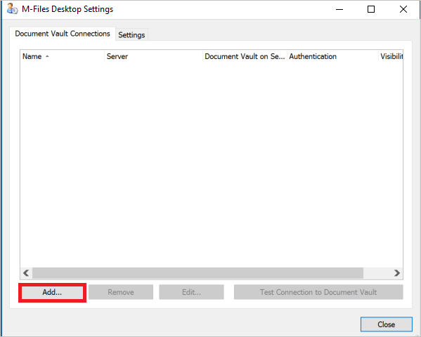
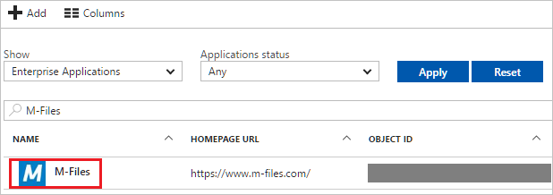

# Tutorial: Azure Active Directory integration with M-Files

In this tutorial, you learn how to integrate M-Files with Azure Active Directory (Azure AD).

Integrating M-Files with Azure AD provides you with the following benefits:

- You can control in Azure AD who has access to M-Files
- You can enable your users to automatically get signed-on to M-Files (Single Sign-On) with their Azure AD accounts
- You can manage your accounts in one central location - the Azure portal

If you want to know more details about SaaS app integration with Azure AD, see [what is application access and single sign-on with Azure Active Directory](../manage-apps/what-is-single-sign-on.md).

## Prerequisites

To configure Azure AD integration with M-Files, you need the following items:

- An Azure AD subscription
- A M-Files single sign-on enabled subscription

> [!NOTE]
> To test the steps in this tutorial, we do not recommend using a production environment.

To test the steps in this tutorial, you should follow these recommendations:

- Do not use your production environment, unless it is necessary.
- If you don't have an Azure AD trial environment, you can get a one-month trial [here](https://azure.microsoft.com/pricing/free-trial/).

## Scenario description
In this tutorial, you test Azure AD single sign-on in a test environment. 
The scenario outlined in this tutorial consists of two main building blocks:

1. Adding M-Files from the gallery
1. Configuring and testing Azure AD single sign-on

## Adding M-Files from the gallery
To configure the integration of M-Files into Azure AD, you need to add M-Files from the gallery to your list of managed SaaS apps.

**To add M-Files from the gallery, perform the following steps:**

1. In the **[Azure portal](https://portal.azure.com)**, on the left navigation panel, click **Azure Active Directory** icon. 

	![Active Directory][1]

1. Navigate to **Enterprise applications**. Then go to **All applications**.

	![Applications][2]
	
1. To add new application, click **New application** button on the top of dialog.

	![Applications][3]

1. In the search box, type **M-Files**.

	

1. In the results panel, select **M-Files**, and then click **Add** button to add the application.

	

##  Configuring and testing Azure AD single sign-on
In this section, you configure and test Azure AD single sign-on with M-Files based on a test user called "Britta Simon".

For single sign-on to work, Azure AD needs to know what the counterpart user in M-Files is to a user in Azure AD. In other words, a link relationship between an Azure AD user and the related user in M-Files needs to be established.

In M-Files, assign the value of the **user name** in Azure AD as the value of the **Username** to establish the link relationship.

To configure and test Azure AD single sign-on with M-Files, you need to complete the following building blocks:

1. **[Configuring Azure AD Single Sign-On](#configuring-azure-ad-single-sign-on)** - to enable your users to use this feature.
1. **[Creating an Azure AD test user](#creating-an-azure-ad-test-user)** - to test Azure AD single sign-on with Britta Simon.
1. **[Creating a M-Files test user](#creating-a-m-files-test-user)** - to have a counterpart of Britta Simon in M-Files that is linked to the Azure AD representation of user.
1. **[Assigning the Azure AD test user](#assigning-the-azure-ad-test-user)** - to enable Britta Simon to use Azure AD single sign-on.
1. **[Testing Single Sign-On](#testing-single-sign-on)** - to verify whether the configuration works.

### Configuring Azure AD single sign-on

In this section, you enable Azure AD single sign-on in the Azure portal and configure single sign-on in your M-Files application.

**To configure Azure AD single sign-on with M-Files, perform the following steps:**

1. In the Azure portal, on the **M-Files** application integration page, click **Single sign-on**.

	![Configure Single Sign-On][4]

1. On the **Single sign-on** dialog, select **Mode** as	**SAML-based Sign-on** to enable single sign-on.
 
	

1. On the **M-Files Domain and URLs** section, perform the following steps:

	

    a. In the **Sign-on URL** textbox, type a URL using the following pattern: `https://<tenantname>.cloudvault.m-files.com/authentication/MFiles.AuthenticationProviders.Core/sso`

	b. In the **Identifier** textbox, type a URL using the following pattern: `https://<tenantname>.cloudvault.m-files.com`

	> [!NOTE] 
	> These values are not real. Update these values with the actual Sign-On URL and Identifier. Contact [M-Files Client support team](mailto:support@m-files.com) to get these values. 
 
1. On the **SAML Signing Certificate** section, click **Metadata XML** and then save the metadata file on your computer.

	 

1. Click **Save** button.

	

1. To get SSO configured for your application, contact [M-Files support team](mailto:support@m-files.com) and provide them the downloaded Metadata.
   
    >[!NOTE]
    >Follow the next steps if you want to configure SSO for you M-File desktop application. No extra steps are required if you only want to configure SSO for M-Files web version.  

1. Follow the next steps to configure the M-File desktop application to enable SSO with Azure AD. To download M-Files, go to [M-Files download](https://www.m-files.com/en/download-latest-version) page.

1. Open the **M-Files Desktop Settings** window. Then, click **Add**.
   
    

1. On the **Document Vault Connection Properties** window, perform the following steps:
   
      

    Under the Server section type, the values as follows:  

    a. For **Name**, type `<tenant-name>.cloudvault.m-files.com`. 
 
    b. For **Port Number**, type **4466**. 

    c. For **Protocol**, select **HTTPS**. 

    d. In the **Authentication** field, select **Specific Windows user**. Then, you are prompted with a signing page. Insert your Azure AD credentials. 

    e. For the **Vault on Server**,  select the corresponding vault on server.
 
    f. Click **OK**.

> [!TIP]
> You can now read a concise version of these instructions inside the [Azure portal](https://portal.azure.com), while you are setting up the app!  After adding this app from the **Active Directory > Enterprise Applications** section, simply click the **Single Sign-On** tab and access the embedded documentation through the **Configuration** section at the bottom. You can read more about the embedded documentation feature here: [Azure AD embedded documentation]( https://go.microsoft.com/fwlink/?linkid=845985)
> 

### Creating an Azure AD test user
The objective of this section is to create a test user in the Azure portal called Britta Simon.

![Create Azure AD User][100]

**To create a test user in Azure AD, perform the following steps:**

1. In the **Azure portal**, on the left navigation pane, click **Azure Active Directory** icon.

	 

1. To display the list of users, go to **Users and groups** and click **All users**.
	
	 

1. To open the **User** dialog, click **Add** on the top of the dialog.
 
	 

1. On the **User** dialog page, perform the following steps:
 
	 

    a. In the **Name** textbox, type **BrittaSimon**.

    b. In the **User name** textbox, type the **email address** of BrittaSimon.

	c. Select **Show Password** and write down the value of the **Password**.

    d. Click **Create**.
 
### Creating a M-Files test user

The objective of this section is to create a user called Britta Simon in M-Files. Work with  [M-Files support team](mailto:support@m-files.com) to add the users in the M-Files.

### Assigning the Azure AD test user

In this section, you enable Britta Simon to use Azure single sign-on by granting access to M-Files.

![Assign User][200] 

**To assign Britta Simon to M-Files, perform the following steps:**

1. In the Azure portal, open the applications view, and then navigate to the directory view and go to **Enterprise applications** then click **All applications**.

	![Assign User][201] 

1. In the applications list, select **M-Files**.

	 

1. In the menu on the left, click **Users and groups**.

	![Assign User][202] 

1. Click **Add** button. Then select **Users and groups** on **Add Assignment** dialog.

	![Assign User][203]

1. On **Users and groups** dialog, select **Britta Simon** in the Users list.

1. Click **Select** button on **Users and groups** dialog.

1. Click **Assign** button on **Add Assignment** dialog.
	
### Testing single sign-on

The objective of this section is to test your Azure AD SSO configuration using the Access Panel.

When you click the M-Files tile in the Access Panel, you should get automatically signed-on to your M-Files application.

## Additional resources

* [List of Tutorials on How to Integrate SaaS Apps with Azure Active Directory](tutorial-list.md)
* [What is application access and single sign-on with Azure Active Directory?](../manage-apps/what-is-single-sign-on.md)

<!--Image references-->

[1]: ./media/m-files-tutorial/tutorial_general_01.png
[2]: ./media/m-files-tutorial/tutorial_general_02.png
[3]: ./media/m-files-tutorial/tutorial_general_03.png
[4]: ./media/m-files-tutorial/tutorial_general_04.png

[100]: ./media/m-files-tutorial/tutorial_general_100.png

[200]: ./media/m-files-tutorial/tutorial_general_200.png
[201]: ./media/m-files-tutorial/tutorial_general_201.png
[202]: ./media/m-files-tutorial/tutorial_general_202.png
[203]: ./media/m-files-tutorial/tutorial_general_203.png

