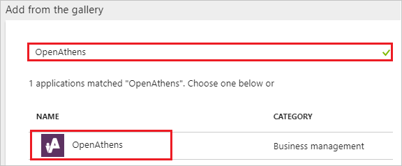
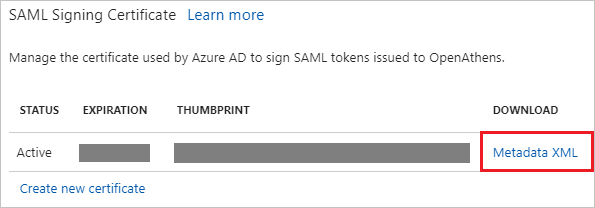
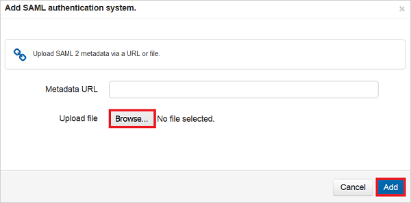
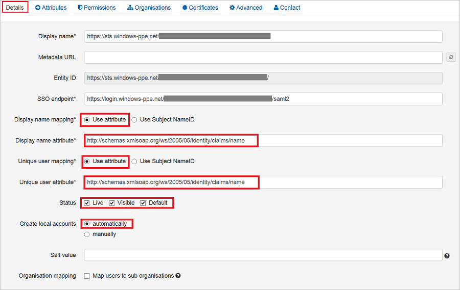
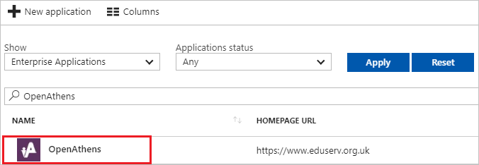

---
title: 'Tutorial: Azure Active Directory integration with OpenAthens | Microsoft Docs'
description: Learn how to configure single sign-on between Azure Active Directory and OpenAthens.
services: active-directory
documentationCenter: na
author: jeevansd
manager: mtillman
ms.reviewer: joflore

ms.assetid: dd4adfc7-e238-41d5-8b25-1811f08078b6
ms.service: active-directory
ms.component: saas-app-tutorial
ms.workload: identity
ms.tgt_pltfrm: na
ms.devlang: na
ms.topic: article
ms.date: 09/05/2017
ms.author: jeedes

---
# Tutorial: Azure Active Directory integration with OpenAthens

In this tutorial, you learn how to integrate OpenAthens with Azure Active Directory (Azure AD).

Integrating OpenAthens with Azure AD provides you with the following benefits:

- You can control in Azure AD who has access to OpenAthens.
- You can enable your users to automatically sign on to OpenAthens (single sign-on) with their Azure AD accounts.
- You can manage your accounts in one central location--the Azure portal.

For more information about SaaS app integration with Azure AD, see [What is application access and single sign-on with Azure Active Directory?](../manage-apps/what-is-single-sign-on.md).

## Prerequisites

To configure Azure AD integration with OpenAthens, you need the following items:

- An Azure AD subscription
- An OpenAthens single sign-on enabled subscription

To test the steps in this tutorial, you should follow these recommendations:

- Do not use your production environment, unless it is necessary.
- If you don't have an Azure AD trial environment, you can [get a one-month free trial](https://azure.microsoft.com/pricing/free-trial/).

## Scenario description
In this tutorial, you test Azure AD single sign-on in a test environment. 
The scenario outlined in this tutorial consists of two main building blocks:

1. Adding OpenAthens from the gallery
1. Configuring and testing Azure AD single sign-on

## Adding OpenAthens from the gallery
To configure the integration of OpenAthens into Azure AD, you need to add OpenAthens from the gallery to your list of managed SaaS apps.

**To add OpenAthens from the gallery**

1. In the [Azure portal](https://portal.azure.com), in the left pane, select the **Azure Active Directory** icon. 

	![The Azure Active Directory button][1]

1. Browse to **Enterprise applications**, and then go to **All applications**.

	![The Enterprise applications pane][2]
	
1. To add new application, select the **New application** button on the top of the dialog box.

	![The New application button][3]

1. In the search box, type **OpenAthens**, select **OpenAthens** from the results panel, and then select the **Add** button.

	

## Configure and test Azure AD single sign-on

In this section, you configure and test Azure AD single sign-on with OpenAthens based on a test user named "Britta Simon."

For single sign-on to work, Azure AD needs to know what the counterpart user in OpenAthens is to the user in Azure AD. In other words, you need to establish a link relationship between an Azure AD user and the related user in OpenAthens.

In OpenAthens, assign the value of the **user name** in Azure AD as the value of the **Username** to establish the link relationship.

To configure and test Azure AD single sign-on with OpenAthens, you need to complete the following building blocks:

1. [Configure Azure AD single sign-On](#configure-azure-ad-single-sign-on), to enable your users to use this feature.
1. [Create an Azure AD test user](#create-an-azure-ad-test-user), to test Azure AD single sign-on with Britta Simon.
1. [Create an OpenAthens test user](#create-a-openathens-test-user), to have a counterpart of Britta Simon in OpenAthens that is linked to the Azure AD representation of the user.
1. [Assign the Azure AD test user](#assign-the-azure-ad-test-user), to enable Britta Simon to use Azure AD single sign-on.
1. [Test single sign-on](#test-single-sign-on), to verify whether the configuration works.

### Configure Azure AD single sign-on

In this section, you enable Azure AD single sign-on in the Azure portal and configure single sign-on in your OpenAthens application.

**To configure Azure AD single sign-on with OpenAthens**

1. In the Azure portal, on the **OpenAthens** application integration page, select **Single sign-on**.

	![Configure the single sign-on link][4]

1. To enable single sign-on, in the **Single sign-on** dialog box, select **SAML-based Sign-on** as the **Mode**.
 
	

1. In the **OpenAthens Domain and URLs** section, enter the value `https://login.openathens.net/saml/2/metadata-sp` in the **Identifier** text box.

	

1. In the **SAML Signing Certificate** section, select **Metadata XML**, and then save the metadata file on your computer.

	 

1. Select the **Save** button.

	

1. In a different web browser window, log in to your OpenAthens company site as an administrator.

1. Select **Connections** from the list under the **Management** tab. 

	

1. Select **SAML 1.1/2.0**, and then select the **Configure** button.

	
	
1. To add the configuration, select the **Browse** button to upload the metadata .xml file that you downloaded from the Azure portal, and then select **Add**.

	

1. Perform the following steps under the **Details** tab.

	

	a. In **Display name mapping**, select **Use attribute**.

	b. In the **Display name attribute** text box, enter the value `http://schemas.xmlsoap.org/ws/2005/05/identity/claims/name`.
	
	c. In **Unique user mapping**, select **Use attribute**.

	d. In the **Unique user attribute** text box, enter the value `http://schemas.xmlsoap.org/ws/2005/05/identity/claims/name`.

	e. In **Status**, select all the three check boxes.

	f. In **Create local accounts**, select **automatically**.

	g. Select **Save changes**.

> [!TIP]
> You can now read a concise version of these instructions inside the [Azure portal](https://portal.azure.com), while you are setting up the app. After you add this app from the **Active Directory** > **Enterprise Applications** section, select the **Single Sign-On** tab and access the embedded documentation through the **Configuration** section at the bottom. For more about the embedded documentation feature, see the [Azure AD embedded documentation](https://go.microsoft.com/fwlink/?linkid=845985).

### Create an Azure AD test user

The objective of this section is to create a test user in the Azure portal called "Britta Simon."

   ![Create an Azure AD test user][100]

**To create a test user in Azure AD**

1. In the Azure portal, in the left pane, select **Azure Active Directory**.

    

1. To display the list of users, go to **Users and groups**, and then select **All users**.

    

1. To open the **User** dialog box, select **Add** at the top of the **All Users** dialog box.

    

1. In the **User** dialog box, perform the following steps:

    

    a. In the **Name** text box, type **BrittaSimon**.

    b. In the **User name** text box, type the email address for Britta Simon.

    c. Select the **Show Password** check box, and then write down the value that's displayed in the **Password** text box.

    d. Select **Create**.
  
### Create an OpenAthens test user

OpenAthens supports just-in-time provisioning, and users are created automatically after successful authentication. You don't need to perform any action in this section.

### Assign the Azure AD test user

In this section, you enable Britta Simon to use Azure single sign-on by granting her access to OpenAthens.

![Assign the user role][200] 

**To assign Britta Simon to OpenAthens**

1. In the Azure portal, open the applications view, browse to the directory view and go to **Enterprise applications**, and then select **All applications**.

	![Assign User][201] 

1. In the **Applications** list, select **OpenAthens**.

	  

1. In the menu on the left, select **Users and groups**.

	![The "Users and groups" link][202]

1. Select the **Add** button. Then select **Users and groups** in the **Add Assignment** pane.

	![The Add Assignment pane][203]

1. In the **Users and groups** list, select **Britta Simon**.

1. Select the **Select** button in the **Users and groups** list.

1. Select the **Assign** button in the **Add Assignment** pane.
	
### Test single sign-on

In this section, you test your Azure AD single sign-on configuration by using the Access Panel.

When you select the **OpenAthens** tile in the Access Panel, you should be automatically signed on to your OpenAthens application.
For more information about the Access Panel, see [Introduction to the Access Panel](../user-help/active-directory-saas-access-panel-introduction.md). 

## Additional resources

* For a list of tutorials on how to integrate SaaS apps with Azure Active Directory, see [SaaS app integration tutorials for use with Azure AD](tutorial-list.md).
* For more information about application access and single sign-on with Azure Active Directory, see [What is application access and single sign-on with Azure Active Directory?](../manage-apps/what-is-single-sign-on.md).

<!--Image references-->

[1]: ./media/openathens-tutorial/tutorial_general_01.png
[2]: ./media/openathens-tutorial/tutorial_general_02.png
[3]: ./media/openathens-tutorial/tutorial_general_03.png
[4]: ./media/openathens-tutorial/tutorial_general_04.png

[100]: ./media/openathens-tutorial/tutorial_general_100.png

[200]: ./media/openathens-tutorial/tutorial_general_200.png
[201]: ./media/openathens-tutorial/tutorial_general_201.png
[202]: ./media/openathens-tutorial/tutorial_general_202.png
[203]: ./media/openathens-tutorial/tutorial_general_203.png

