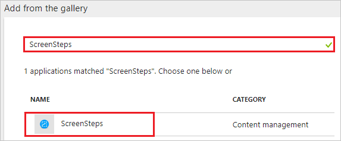
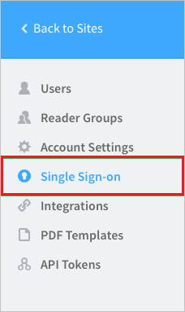
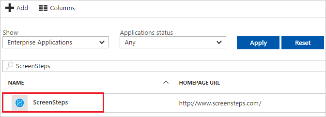

---
title: 'Tutorial: Azure Active Directory integration with ScreenSteps | Microsoft Docs'
description: Learn how to configure single sign-on between Azure Active Directory and ScreenSteps.
services: active-directory
documentationCenter: na
author: jeevansd
manager: mtillman
ms.reviewer: joflore

ms.assetid: 4563fe94-a88f-4895-a07f-79df44889cf9
ms.service: active-directory
ms.component: saas-app-tutorial
ms.workload: identity
ms.tgt_pltfrm: na
ms.devlang: na
ms.topic: article
ms.date: 08/14/2017
ms.author: jeedes

---
# Tutorial: Azure Active Directory integration with ScreenSteps

In this tutorial, you learn how to integrate ScreenSteps with Azure Active Directory (Azure AD).

Integrating ScreenSteps with Azure AD provides you with the following benefits:

- You can control in Azure AD who has access to ScreenSteps.
- You can enable your users to automatically get signed-on to ScreenSteps (Single Sign-On) with their Azure AD accounts.
- You can manage your accounts in one central location - the Azure portal.

If you want to know more details about SaaS app integration with Azure AD, see [what is application access and single sign-on with Azure Active Directory](../manage-apps/what-is-single-sign-on.md).

## Prerequisites

To configure Azure AD integration with ScreenSteps, you need the following items:

- An Azure AD subscription
- A ScreenSteps single sign-on enabled subscription

> [!NOTE]
> To test the steps in this tutorial, we do not recommend using a production environment.

To test the steps in this tutorial, you should follow these recommendations:

- Do not use your production environment, unless it is necessary.
- If you don't have an Azure AD trial environment, you can [get a one-month trial](https://azure.microsoft.com/pricing/free-trial/).

## Scenario description
In this tutorial, you test Azure AD single sign-on in a test environment. 
The scenario outlined in this tutorial consists of two main building blocks:

1. Adding ScreenSteps from the gallery
1. Configuring and testing Azure AD single sign-on

## Adding ScreenSteps from the gallery
To configure the integration of ScreenSteps into Azure AD, you need to add ScreenSteps from the gallery to your list of managed SaaS apps.

**To add ScreenSteps from the gallery, perform the following steps:**

1. In the **[Azure portal](https://portal.azure.com)**, on the left navigation panel, click **Azure Active Directory** icon. 

	![The Azure Active Directory button][1]

1. Navigate to **Enterprise applications**. Then go to **All applications**.

	![The Enterprise applications blade][2]
	
1. To add new application, click **New application** button on the top of dialog.

	![The New application button][3]

1. In the search box, type **ScreenSteps**, select **ScreenSteps** from result panel then click **Add** button to add the application.

	

## Configure and test Azure AD single sign-on

In this section, you configure and test Azure AD single sign-on with ScreenSteps based on a test user called "Britta Simon".

For single sign-on to work, Azure AD needs to know what the counterpart user in ScreenSteps is to a user in Azure AD. In other words, a link relationship between an Azure AD user and the related user in ScreenSteps needs to be established.

In ScreenSteps, assign the value of the **user name** in Azure AD as the value of the **Username** to establish the link relationship.

To configure and test Azure AD single sign-on with ScreenSteps, you need to complete the following building blocks:

1. **[Configure Azure AD Single Sign-On](#configure-azure-ad-single-sign-on)** - to enable your users to use this feature.
1. **[Create an Azure AD test user](#create-an-azure-ad-test-user)** - to test Azure AD single sign-on with Britta Simon.
1. **[Create a ScreenSteps test user](#create-a-screensteps-test-user)** - to have a counterpart of Britta Simon in ScreenSteps that is linked to the Azure AD representation of user.
1. **[Assign the Azure AD test user](#assign-the-azure-ad-test-user)** - to enable Britta Simon to use Azure AD single sign-on.
1. **[Test single sign-on](#test-single-sign-on)** - to verify whether the configuration works.

### Configure Azure AD single sign-on

In this section, you enable Azure AD single sign-on in the Azure portal and configure single sign-on in your ScreenSteps application.

**To configure Azure AD single sign-on with ScreenSteps, perform the following steps:**

1. In the Azure portal, on the **ScreenSteps** application integration page, click **Single sign-on**.

	![Configure single sign-on link][4]

1. On the **Single sign-on** dialog, select **Mode** as	**SAML-based Sign-on** to enable single sign-on.
 
	

1. On the **ScreenSteps Domain and URLs** section, perform the following steps:

	

    In the **Sign-on URL** textbox, type a URL using the following pattern: `https://<tenantname>.ScreenSteps.com`

	> [!NOTE] 
	> This value is not real. Update this value with the actual Sign-On URL, which is explained later in this tutorial. 

1. On the **SAML Signing Certificate** section, click **Certificate(Base64)** and then save the certificate file on your computer.

	 

1. Click **Save** button.

	

1. On the **ScreenSteps Configuration** section, click **Configure ScreenSteps** to open **Configure sign-on** window. Copy the **Sign-Out URL and SAML Single Sign-On Service URL** from the **Quick Reference section.**

	 

1. In a different web browser window, log into your ScreenSteps company site as an administrator.

1. Click **Account Settings**.

    

1. Click **Single Sign-on**.

    

1. Click **Create Single Sign-on Endpoint**.

    

1. In the **Create Single Sign-on Endpoint** section, perform the following steps:

    
	
	a. In the **Title** textbox, type a title.
    
	b. From the **Mode** list, select **SAML**.
    
	c. Click **Create**.

1. **Edit** the new endpoint.

    

1. In the **Edit Single Sign-on Endpoint** section, perform the following steps:

    

    a. Click **Upload new SAML Certificate file**, and then upload the certificate, which you have downloaded from Azure portal.
    
	b. Paste **SAML Single Sign-On Service URL** value, which you have copied from the Azure portal into the **Remote Login URL** textbox.
    
	c. Paste **Sign-Out URL** value, which you have copied from the Azure portal into the **Log out URL** textbox.
    
	d. Select a **Group** to assign users to when they are provisioned.
    
	e. Click **Update**.

	f. Copy the **SAML Consumer URL** to the clipboard and paste in to the **Sign-on URL** textbox in **ScreenSteps Domain and URLs** section.
    
	g. Return to the **Edit Single Sign-on Endpoint**.
    
	h. Click the **Make default for account** button to use this endpoint for all users who log into ScreenSteps. Alternatively you can click the **Add to Site** button to use this endpoint for specific sites in **ScreenSteps**.

> [!TIP]
> You can now read a concise version of these instructions inside the [Azure portal](https://portal.azure.com), while you are setting up the app!  After adding this app from the **Active Directory > Enterprise Applications** section, simply click the **Single Sign-On** tab and access the embedded documentation through the **Configuration** section at the bottom. You can read more about the embedded documentation feature here: [Azure AD embedded documentation]( https://go.microsoft.com/fwlink/?linkid=845985)
> 

### Create an Azure AD test user

The objective of this section is to create a test user in the Azure portal called Britta Simon.

   ![Create an Azure AD test user][100]

**To create a test user in Azure AD, perform the following steps:**

1. In the Azure portal, in the left pane, click the **Azure Active Directory** button.

    

1. To display the list of users, go to **Users and groups**, and then click **All users**.

    

1. To open the **User** dialog box, click **Add** at the top of the **All Users** dialog box.

    

1. In the **User** dialog box, perform the following steps:

    

    a. In the **Name** box, type **BrittaSimon**.

    b. In the **User name** box, type the email address of user Britta Simon.

    c. Select the **Show Password** check box, and then write down the value that's displayed in the **Password** box.

    d. Click **Create**.
 
### Create a ScreenSteps test user

In this section, you create a user called Britta Simon in ScreenSteps. Work with [ScreenSteps Client support team](https://www.screensteps.com/contact) to add the users in the ScreenSteps platform. Users must be created and activated before you use single sign-on. 

### Assign the Azure AD test user

In this section, you enable Britta Simon to use Azure single sign-on by granting access to ScreenSteps.

![Assign the user role][200] 

**To assign Britta Simon to ScreenSteps, perform the following steps:**

1. In the Azure portal, open the applications view, and then navigate to the directory view and go to **Enterprise applications** then click **All applications**.

	![Assign User][201] 

1. In the applications list, select **ScreenSteps**.

	  

1. In the menu on the left, click **Users and groups**.

	![The "Users and groups" link][202]

1. Click **Add** button. Then select **Users and groups** on **Add Assignment** dialog.

	![The Add Assignment pane][203]

1. On **Users and groups** dialog, select **Britta Simon** in the Users list.

1. Click **Select** button on **Users and groups** dialog.

1. Click **Assign** button on **Add Assignment** dialog.
	
### Test single sign-on

In this section, you test your Azure AD single sign-on configuration using the Access Panel.

When you click the ScreenSteps tile in the Access Panel, you should get automatically signed-on to your ScreenSteps application.
For more information about the Access Panel, see [Introduction to the Access Panel](../user-help/active-directory-saas-access-panel-introduction.md). 

## Additional resources

* [List of Tutorials on How to Integrate SaaS Apps with Azure Active Directory](tutorial-list.md)
* [What is application access and single sign-on with Azure Active Directory?](../manage-apps/what-is-single-sign-on.md)

<!--Image references-->

[1]: ./media/screensteps-tutorial/tutorial_general_01.png
[2]: ./media/screensteps-tutorial/tutorial_general_02.png
[3]: ./media/screensteps-tutorial/tutorial_general_03.png
[4]: ./media/screensteps-tutorial/tutorial_general_04.png

[100]: ./media/screensteps-tutorial/tutorial_general_100.png

[200]: ./media/screensteps-tutorial/tutorial_general_200.png
[201]: ./media/screensteps-tutorial/tutorial_general_201.png
[202]: ./media/screensteps-tutorial/tutorial_general_202.png
[203]: ./media/screensteps-tutorial/tutorial_general_203.png

