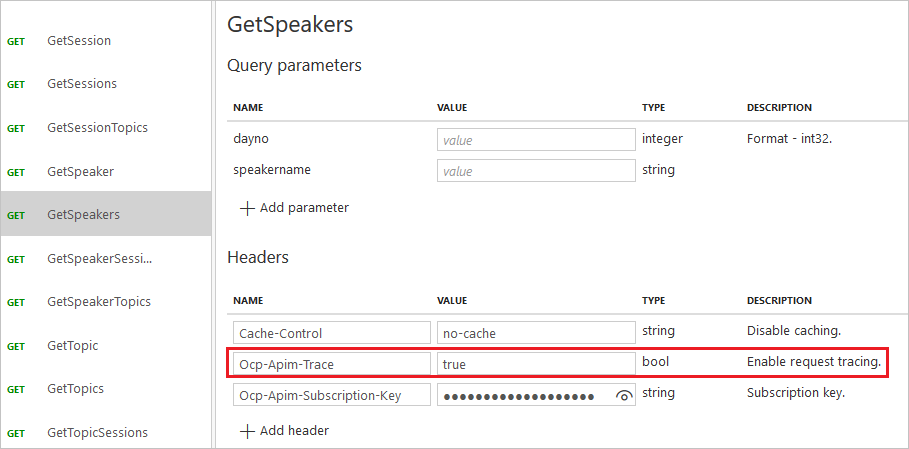

# Debug your APIs using request tracing

This tutorial describes how to inspect request processing to help you with debugging and troubleshooting your API. 

In this tutorial, you learn how to:

> [!div class="checklist"]
> * Trace a call

## Prerequisites

+ Complete the following quickstart: [Create an Azure API Management instance](get-started-create-service-instance.md).
+ Also, complete the following tutorial: [Import and publish your first API](import-and-publish.md).

## Trace a call

1. Select **APIs**.
2. Click **Demo Conference API** from your API list.
3. Select **GetSpeakers** operation.
4. Switch to the **Test** tab.
5. Make sure to include an HTTP header named **Ocp-Apim-Trace** with the value set to **true**.

    

    > [!NOTE]
    > If Ocp-Apim-Subscription-Key is not automatically populated, you can retrieve it by going to the Developer Portal and exposing the keys on the profile page.

6. Click **"Send"** to make an API call. 
7. Wait for the call to complete. 
8. Go to the **Trace** tab in the **API console**. You can click any of the following links to jump to detailed trace info: **inbound**, **backend**, **outbound**.

    In the **inbound** section, you see the original request API Management received from the caller and all the policies applied to the request including the rate-limit and set-header policies we added in step 2.

    In the **backend** section, you see the requests API Management sent to the API backend and the response it received.
    
    In the **outbound** section, you see all the policies applied to the response before sending back to the caller.
 
    > [!TIP]
    > Each step also shows the elapsed time since the request is received by API Management.

## Next steps

In this tutorial, you learned how to:

> [!div class="checklist"]
> * Trace a call

Advance to the next tutorial:

> [!div class="nextstepaction"]
> [Use revisions](api-management-get-started-revise-api.md)
