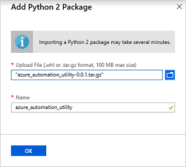

# Manage Python 2 packages in Azure Automation

Azure Automation allows you to run Python 2 runbooks on Azure and on Linux Hybrid Runbook Workers. To help in simplification of runbooks, you can use Python packages to import the modules that you need. This article describes how you manage and use Python packages in Azure Automation.

## Import packages

In your Automation Account, select **Python 2 packages** under **Shared Resources**. Click **+ Add a Python 2 package**.


On the **Add Python 2 Package** page, select a local package to upload. The package can be a `.whl` file or `.tar.gz` file. When selected, click **OK** to upload the package.



Once a package has been imported, it is listed on the **Python 2 packages** page in your Automation Account. If you need to remove a package, select the package and choose **Delete**  on the package page.


## Use a package in a runbook

Once you have imported a package, you can now use it in a runbook. The following example uses the [
Azure Automation utility package](https://github.com/azureautomation/azure_automation_utility). This package makes it easier to use Python with Azure Automation. To use the package, follow the instructions in the GitHub repository and add it to the runbook by using `from azure_automation_utility import get_automation_runas_credential` for example to import the function for retrieving the RunAs Account.

```python
import azure.mgmt.resource
import automationassets
from azure_automation_utility import get_automation_runas_credential

# Authenticate to Azure using the Azure Automation RunAs service principal
runas_connection = automationassets.get_automation_connection("AzureRunAsConnection")
azure_credential = get_automation_runas_credential()

# Intialize the resource management client with the RunAs credential and subscription
resource_client = azure.mgmt.resource.ResourceManagementClient(
    azure_credential,
    str(runas_connection["SubscriptionId"]))

# Get list of resource groups and print them out
groups = resource_client.resource_groups.list()
for group in groups:
    print group.name
```

## Develop and test runbooks offline

To develop and test your Python 2 runbooks offline, you can use the [Azure Automation python emulated assets](https://github.com/azureautomation/python_emulated_assets) module on GitHub. This module allows you to reference your shared resources such as credentials, variables, connections, and certificates.

## Next steps

To get started with Python 2 runbooks, see [My first Python 2 runbook](automation-first-runbook-textual-python2.md)