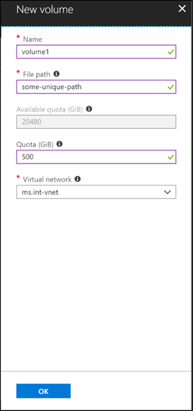

# Create a volume for Azure NetApp Files

A volume's capacity consumption counts against its pool's provisioned capacity.  You can create multiple volumes in a capacity pool, but the volumes' total capacity consumption must not exceed the pool size. 

## Before you begin 
You must have already set up a capacity pool.  

[Set up a capacity pool](azure-netapp-files-set-up-capacity-pool.md)

## Steps 
1.	Click the **Volumes** blade from the Manage Capacity Pools blade. 
2.	Click **+ Add volume** to create a volume.  
    The New Volume window appears.

3.	In the New Volume window, click **Create** and provide information for the following fields:   
    * **Name**      
        Specify the name for the volume that you are creating.   
        The name must be unique within a resource group. It must be at least 3 characters long.  It can use any alphanumeric characters.

    * **File path**  
        Specify the file path that will be used to create the export path for the new volume. The export path is used to mount and access the volume.   
        A mount target is the endpoint of the NFS service IP address. It is automatically generated.    
        The file path name can contain letters, numbers, and hyphens ("-") only. It must be between 16 and 40 characters in length.  

    * **Quota**  
        Specify the amount of logical storage that is allocated to the volume.  
        The **Available quota** field shows the amount of unused space in the chosen capacity pool that you can use towards creating a new volume. The size of the new volume must not exceed the available quota.  

    * **Virtual network**  
        Specify the Azure virtual network (Vnet) from which you want to access the volume. The Vnet you specify must have Azure NetApp Files configured. The Azure NetApp Files service can be accessed only from a Vnet that is in the same location as the volume.   

    

4.	Click **OK**. 
 
A volume inherits subscription, resource group, location attributes from its capacity pool. To monitor the volume deployment status, you can use the Notifications tab.

## Next steps  
[Configure export policy for a volume (optional)](azure-netapp-files-configure-export-policy.md)

