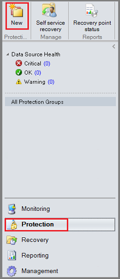
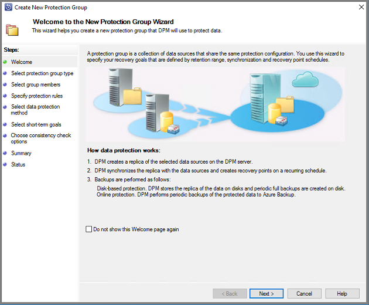
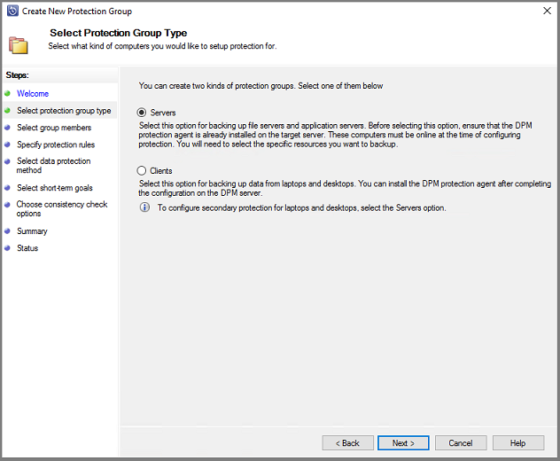
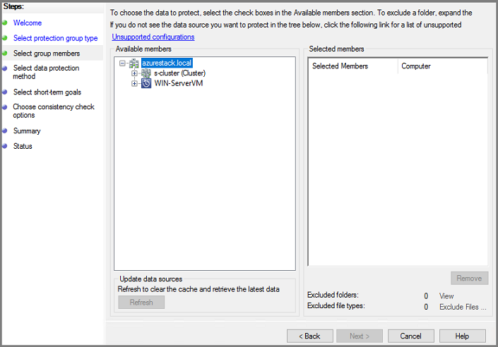
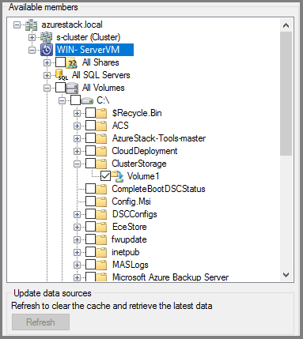
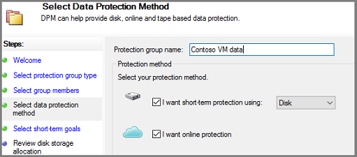
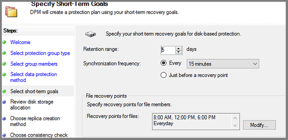

# Back up files on Azure Stack
You can use Azure Backup to protect (or back up) files and applications on Azure Stack. To back up files and applications, install Microsoft Azure Backup Server as a virtual machine running on Azure Stack. You can protect the files on any Azure Stack server in the same virtual network. Once you have installed Azure Backup Server, add Azure disks to increase the local storage available for short-term backup data. Azure Backup Server uses Azure storage for long-term retention.

> [!NOTE]
> Though Azure Backup Server and System Center Data Protection Manager (DPM) are similar, DPM is not supported for use with Azure Stack.
>

This article does not cover installing Azure Backup Server in the Azure Stack environment. To install Azure Backup Server on Azure Stack, see the article, [Installing Azure Backup Server](backup-mabs-install-azure-stack.md).

## Back up Files and Folders in Azure Stack VMs to Azure

To configure Azure Backup Server to protect Files in Azure Stack virtual machines, open the Azure Backup Server console. You'll use the console to configure protection groups and to protect the data on your virtual machines.

1. In the Azure Backup Server console, click **Protection** and in the toolbar, click **New** to open the **Create New Protection Group** wizard.

   

    It may take a few seconds for the wizard to open. Once the wizard opens, click **Next** to advance to the **Select Protection Group Type** screen.

   

2. On the **Select Protection Group Type** screen, choose **Servers** and click **Next**.

    

    The **Select Group Members** screen opens. 

    

3. In the **Select Group Members** screen, click **+** to expand the list of subitems. For all items that you want to protect, select the check box. Once all items have been selected, click **Next**.

    

    Microsoft recommends putting all data that will share a protection policy, into one protection group. For complete information about planning and deploying protection groups, see the System Center DPM article, [Deploy Protection Groups](https://docs.microsoft.com/system-center/dpm/create-dpm-protection-groups?view=sc-dpm-1801).

4. In the **Select Data Protection Method** screen, type a name for the protection group. Select the checkbox for **I want short-term protection using:** and **I want online protection**. Click **Next**.

    

    To select **I want online protection**, you must first select **I want short-term protection using:** Disk. Azure Backup Server does not protect to tape, so disk is the only choice for short-term protection.

5. In the **Specify Short-Term Goals** screen, choose how long to retain the recovery points saved to disk, and when to save incremental backups. Click **Next**.

    > [!IMPORTANT]
    > You should **not** retain operational recovery (backup) data on Azure Backup Server-attached disks for more than five days.
    >

     

    Instead of selecting an interval for incremental backups, to run an express full backup just before each scheduled recovery point, click **Just before a recovery point**. If you're protecting application workloads, Azure Backup Server creates recovery points per the Synchronization frequency schedule (provided the application supports incremental backups). If the application doesn't support incremental backups, Azure Backup Server runs an express full backup.

    For **File recovery points**, specify when to create recovery points. Click **Modify** to set the times and days of the week when recovery points are created.

6. In the **Review disk allocation** screen, review the storage pool disk space allocated for the protection group.

    **Total Data size** is the size of the data you want to back up and **Disk space to be provisioned** on Azure Backup Server is the recommended space for the protection group. Azure Backup Server chooses the ideal backup volume, based on the settings. However, you can edit the backup volume choices in the Disk allocation details. For the workloads, select the preferred storage in the dropdown menu. Your edits change the values for Total Storage and Free Storage in the Available Disk Storage pane. Underprovisioned space is the amount of storage Azure Backup Server suggests you add to the volume, to continue with backups smoothly in the future.

7. In **Choose replica creation method**, select how you want to handle the initial full data replication. If you decide to replicate over the network, Azure recommends you choose an off-peak time. For large amounts of data or less than optimal network conditions, consider replicating the data 
using removable media.

8. In **Choose consistency check options**, select how you want to automate consistency checks. Enable consistency checks to run only when data replication becomes inconsistent, or according to a schedule. If you don't want to configure automatic consistency checking, run a manual check at any time by:
    * In the **Protection** area of the Azure Backup Server console, right-click the protection group and select **Perform Consistency Check**.

9. If you choose to back up to Azure, on the **Specify online protection data** page make sure the workloads you want to back up to Azure are selected.

10. In **Specify online backup schedule**, specify when incremental backups to Azure should occur. 

    You can schedule backups to run every day/week/month/year and the time/date at which they should run. Backups can occur up to twice a day. Each time a backup job runs, a data recovery point is created in Azure from the copy of the backed-up data stored on the Azure Backup Server disk.

11. In **Specify online retention policy**, specify how the recovery points created from the daily/weekly/monthly/yearly backups are retained in Azure.

12. In **Choose online replication**, specify how the initial full replication of data occurs. 

13. On **Summary**, review your settings. When you click **Create Group**, the initial data replication occurs. When the data replication finishes, on the **Status** page, the protection group status shows as **OK**. The initial backup job takes place in line with the protection group settings.

## Recover file data

Use Azure Backup Server console to recover data to your virtual machine.

1. In the Azure Backup Server console, on the navigation bar, click **Recovery** and browse for the data you want to recover. In the results pane, select the data.

2. On the calendar in the recovery points section, dates in bold indicate recovery points are available. Select the date to recover.

3. In the **Recoverable item** pane, select the item you want to recover.

4. In the **Actions** pane, click **Recover** to open the Recovery Wizard.

5. You can recover data as follows:

    * **Recover to the original location** - If the client computer is connected over VPN, this option doesn't work. Instead use an alternate location, and then copy data from that location.
    * **Recover to an alternate location**

6. Specify the recovery options:

    * For **Existing version recovery behavior**, select **Create copy**, **Skip**, or **Overwrite**. Overwrite is available only when recovering to the original location.
    * For **Restore security**, choose **Apply settings of the destination computer** or **Apply the security settings of the recovery point version**.
    * For **Network bandwidth usage throttling**, click **Modify** to enable network bandwidth usage throttling.
    * **Notification** Click **Send an e-mail when the recovery completes**, and specify the recipients who will receive the notification. Separate the e-mail addresses with commas.
    * After making the selections, click **Next**

7. Review your recovery settings, and click **Recover**. 

    > [!Note] 
    > While the recovery job is in progress, all synchronization jobs for the selected recovery items are canceled.
    >

If you're using Modern Backup Storage (MBS), File Server end-user recovery (EUR) isn't supported. File Server EUR has a dependency on Volume Shadow Copy Service (VSS), which Modern Backup Storage doesn't use. If EUR is enabled, use the following steps to recover data:

1. Navigate to the protected files, and right-click the file name and select **Properties**.

2. On the **Properties** menu, click **Previous Versions** and choose the version you want to recover.

## View Azure Backup Server with a vault
To view Azure Backup Server entities in Azure Portal, you can follow the following steps:
1. Open Recovery Services vault.
2. Click Backup Infrastructure.
3. View Backup Management Servers.

## See also
For information on using Azure Backup Server to protect other workloads, see one of the following articles:
- [Back up SharePoint farm](https://docs.microsoft.com/azure/backup/backup-mabs-sharepoint-azure-stack)
- [Back up SQL server](https://docs.microsoft.com/azure/backup/backup-mabs-sql-azure-stack)
