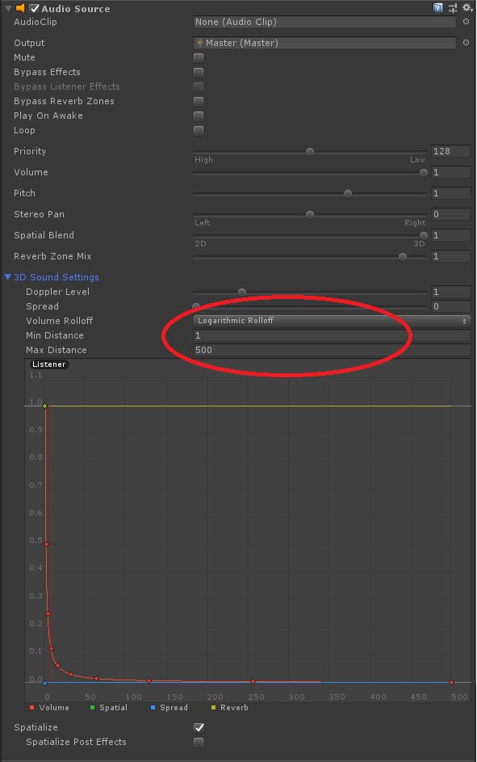

# Design process overview
You can express your design intent in all three phases of the Project Acoustics workflow: pre-bake design, sound source placement, and post-bake design. The process requires less markup associated with placing reverb volumes while retaining designer control over how a scene sounds.

## Pre-bake design
The pre-bake design process produces the scene and metadata that are used for the sound wave simulation, which includes selecting which scene elements will participate in the simulation to provide occlusions, reflections, and reverberation. The metadata for the scene is the selection of acoustic materials for each scene element. The acoustic materials control the amount of sound energy reflected back from each surface.

The default absorption coefficient for all surfaces is 0.04, which is highly reflective. You can achieve aesthetic and gameplay effects by tuning the absorption coefficients of different materials throughout the scene, which are especially prominent to listeners when they hear the transitions from one area of the scene to another. For example, transitioning from a dark reverberant room to a bright, non-reverberant outdoor scene enhances the impact of the transition. To achieve this effect, tune the absorption coefficients on the outdoor scene materials higher.

The reverberation time of a given material in a room is inversely related to its absorption coefficient, with most materials having absorption values in the 0.01 to 0.20 range. Materials with absorption coefficients outside this range are very absorbent.

The [bake UI walk through](bake-ui-walkthrough.md) describes the pre-bake controls in detail.

## Sound source placement
Viewing voxels and probe points at runtime can help debug issues with sound sources being stuck inside the voxelized geometry. To toggle the voxel grid and probe points display, click the corresponding checkbox in the Gizmos menu, in the upper right of the scene view. If the sound source is inside a wall voxel, move it into an air voxel.

  

The voxel display can help determine if visual components in the game have a transform applied to them. If so, apply the same transform to the GameObject hosting the **Acoustics Manager**.

## Post-bake design
Bake results are stored in the ACE file as occlusion and reverberation parameters for all source-listener location pairs throughout the scene. This physically accurate result can be used for your project as-is, and is a great starting point for design. The post-bake design process specifies rules for transforming the bake result parameters at runtime.

### Distance-based attenuation
The audio DSP provided by the **Microsoft Acoustics** Unity spatializer plugin respects the per-source distance-based attenuation built into the Unity Editor. Controls for distance-based attenuation are in the **Audio Source** component found in the **Inspector** panel of sound sources, under **3D Sound Settings**:

### Tuning scene parameters
To adjust parameters for all sources, click on the channel strip in Unity's **Audio Mixer**, and adjust the parameters on the **Acoustics Mixer** effect.

### Tuning source parameters
Attaching the **AcousticsSourceCustomization** script to a source enables tuning parameters for that source. To attach the script, click **Add Component** on the bottom of the **Inspector** panel and navigate to **Scripts > Acoustics Source Customization**. The script has three parameters:

* **Reverb Power Adjust** - Adjusts the reverb power, in dB. Positive values make a sound more reverberant, while negative values make a sound more dry.
* **Decay Time Scale** - Adjusts a multiplier for the decay time. For example, if the bake result specifies a decay time of 750 milliseconds, but this value is set to 1.5, the decay time applied to the source is 1,125 milliseconds.
* **Enable Acoustics** - Controls whether acoustics is applied to this source. When unchecked, the source will be spatialized with HRTFs, but without acoustics, meaning without obstruction, occlusion, and dynamic reverberation parameters such as level and decay time. Reverberation is still applied with a fixed level and decay time.

Different sources may require different settings to achieve certain aesthetic or gameplay effects. Dialog is one possible example. The human ear is more attuned to reverberation in speech, while dialog often needs to be intelligible for gameplay. You can account for this without making the dialog non-diegetic by adjusting the reverb power downwards.
