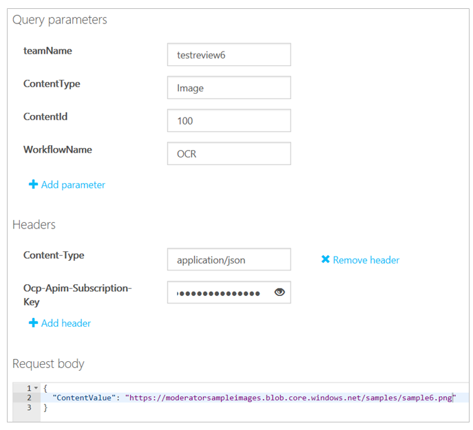

# Start a moderation job from the API console

Use the Review API's [job operations](https://westus.dev.cognitive.microsoft.com/docs/services/580519463f9b070e5c591178/operations/580519483f9b0709fc47f9c5) to initiate end-to-end content moderation jobs for image or text content in Azure Content Moderator. 

The moderation job scans your content by using the Content Moderator Image Moderation API or Text Moderation API. Then, the moderation job uses workflows (defined in the review tool) to generate reviews in the Review tool. 

After a human moderator reviews the auto-assigned tags and prediction data and submits a final moderation decision, the Review API submits all information to your API endpoint.

## Prerequisites

Navigate to the [review tool](https://contentmoderator.cognitive.microsoft.com/). Sign up if you have not done so yet. Within the review tool, [define a custom workflow](Review-Tool-User-Guide/Workflows.md) to use in this `Job` operation.

## Use the API console
To test-drive the API by using the online console, you need a few values to enter into the console:
	
- `teamName`: Use the `Id` field from your review tool's credentials screen. 
- `ContentId`: This string is passed to the API and returned through the callback. **ContentId** is useful for associating internal identifiers or metadata with the results of a moderation job.- `Workflowname`: The name of the [workflow that you created](Review-Tool-User-Guide/Workflows.md) in the previous section.
- `Ocp-Apim-Subscription-Key`: Located on the **Settings** tab. For more information, see [Overview](overview.md).

Access the API console is from the **Credentials** window.

### Navigate to the API Reference
In the **Credentials** window, select [API reference](https://westus.dev.cognitive.microsoft.com/docs/services/580519463f9b070e5c591178/operations/580519483f9b0709fc47f9c5).

  The `Job.Create` page opens.

### Select your region
For **Open API testing console**, select the region that most closely describes your location.
  

  The `Job.Create` API console opens. 

### Enter parameters

Enter values for the required query parameters, and your subscription key. In the **Request body** box, specify the location of the information that you want to scan. For this example, let's use this [sample image](https://moderatorsampleimages.blob.core.windows.net/samples/sample6.png).

  

### Submit your request
Select **Send**. A job ID is created. Copy this to use in the next steps.

  `"JobId": "2018014caceddebfe9446fab29056fd8d31ffe"`

### Open the Get Job details page
Select **Get**, and then open the API by selecting the button that matches your region.

  

### Review the response

Enter values for **teamName** and **JobID**. Enter your subscription key, and then select **Send**. The following response shows sample Job status and details.

```
	{
		"Id": "2018014caceddebfe9446fab29056fd8d31ffe",
		"TeamName": "some team name",
		"Status": "InProgress",
		"WorkflowId": "OCR",
		"Type": "Image",
		"CallBackEndpoint": "",
		"ReviewId": "",
		"ResultMetaData": [],
		"JobExecutionReport": 
		[
    		{
			"Ts": "2018-01-07T00:38:26.7714671",
      			"Msg": "Successfully got hasText response from Moderator"
    		},
    		{
      			"Ts": "2018-01-07T00:38:26.4181346",
      			"Msg": "Getting hasText from Moderator"
    		},
    		{
      			"Ts": "2018-01-07T00:38:25.5122828",
      			"Msg": "Starting Execution - Try 1"
    		}
		]
	}
```

## Navigate to the review tool
On the Content Moderator Dashboard, select **Review** > **Image**. The image that you scanned appears, ready for human review.

  

## Next steps

Use the REST API in your code or start with the [Jobs .NET quickstart](moderation-jobs-quickstart-dotnet.md) to integrate with your application.
