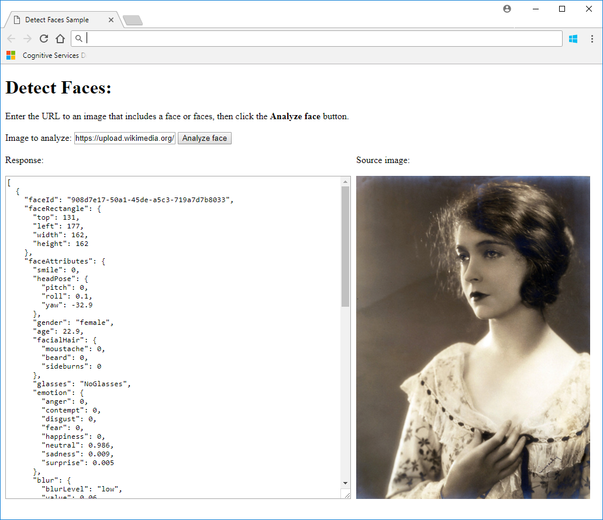

# Quickstart: Detect faces in an image using JavaScript

In this quickstart, you detect faces in an image using the Face API.

## Prerequisites

You need a subscription key to run the sample. You can get free trial subscription keys from [Try Cognitive Services](https://azure.microsoft.com/try/cognitive-services/?api=face-api).

## Detect faces in an image

Use the [Face - Detect](https://westcentralus.dev.cognitive.microsoft.com/docs/services/563879b61984550e40cbbe8d/operations/563879b61984550f30395236)
method to detect faces in an image and return face attributes including:

* Face ID: Unique ID used in several Face API scenarios.
* Face Rectangle: The left, top, width, and height indicating the location of the face in the image.
* Landmarks: An array of 27-point face landmarks pointing to the important positions of face components.
* Facial attributes including age, gender, smile intensity, head pose, and facial hair.

To run the sample, do the following steps:

1. Copy the following and save it to a file such as `detectFaces.html`.
2. Replace `<Subscription Key>` with your valid subscription key.
3. Change the `uriBase` value to use the location where you obtained your subscription keys, if necessary.
4. Drag-and-drop the file into your browser.
5. Click the `Analyze faces` button.

### Face - Detect request

```html
<!DOCTYPE html>
<html>
<head>
    <title>Detect Faces Sample</title>
    <script src="http://ajax.googleapis.com/ajax/libs/jquery/1.9.0/jquery.min.js"></script>
</head>
<body>

<script type="text/javascript">
    function processImage() {
        // Replace <Subscription Key> with your valid subscription key.
        var subscriptionKey = "<Subscription Key>";

        // NOTE: You must use the same region in your REST call as you used to
        // obtain your subscription keys. For example, if you obtained your
        // subscription keys from westus, replace "westcentralus" in the URL
        // below with "westus".
        //
        // Free trial subscription keys are generated in the westcentralus region.
        // If you use a free trial subscription key, you shouldn't need to change 
        // this region.
        var uriBase =
            "https://westcentralus.api.cognitive.microsoft.com/face/v1.0/detect";

        // Request parameters.
        var params = {
            "returnFaceId": "true",
            "returnFaceLandmarks": "false",
            "returnFaceAttributes":
                "age,gender,headPose,smile,facialHair,glasses,emotion," +
                "hair,makeup,occlusion,accessories,blur,exposure,noise"
        };

        // Display the image.
        var sourceImageUrl = document.getElementById("inputImage").value;
        document.querySelector("#sourceImage").src = sourceImageUrl;

        // Perform the REST API call.
        $.ajax({
            url: uriBase + "?" + $.param(params),

            // Request headers.
            beforeSend: function(xhrObj){
                xhrObj.setRequestHeader("Content-Type","application/json");
                xhrObj.setRequestHeader("Ocp-Apim-Subscription-Key", subscriptionKey);
            },

            type: "POST",

            // Request body.
            data: '{"url": ' + '"' + sourceImageUrl + '"}',
        })

        .done(function(data) {
            // Show formatted JSON on webpage.
            $("#responseTextArea").val(JSON.stringify(data, null, 2));
        })

        .fail(function(jqXHR, textStatus, errorThrown) {
            // Display error message.
            var errorString = (errorThrown === "") ?
                "Error. " : errorThrown + " (" + jqXHR.status + "): ";
            errorString += (jqXHR.responseText === "") ?
                "" : (jQuery.parseJSON(jqXHR.responseText).message) ?
                    jQuery.parseJSON(jqXHR.responseText).message :
                        jQuery.parseJSON(jqXHR.responseText).error.message;
            alert(errorString);
        });
    };
</script>

<h1>Detect Faces:</h1>
Enter the URL to an image that includes a face or faces, then click
the <strong>Analyze face</strong> button.<br><br>

Image to analyze: <input type="text" name="inputImage" id="inputImage"
value="https://upload.wikimedia.org/wikipedia/commons/c/c3/RH_Louise_Lillian_Gish.jpg" />

<button onclick="processImage()">Analyze face</button><br><br>

<div id="wrapper" style="width:1020px; display:table;">
    <div id="jsonOutput" style="width:600px; display:table-cell;">
        Response:<br><br>

        <textarea id="responseTextArea" class="UIInput"
                  style="width:580px; height:400px;"></textarea>
    </div>
    <div id="imageDiv" style="width:420px; display:table-cell;">
        Source image:<br><br>

        
    </div>
</div>
</body>
</html>
```

### Face - Detect response

A successful response is returned in JSON.



Following is an example of a successful response:

```json
[
  {
    "faceId": "49d55c17-e018-4a42-ba7b-8cbbdfae7c6f",
    "faceRectangle": {
      "top": 131,
      "left": 177,
      "width": 162,
      "height": 162
    },
    "faceAttributes": {
      "smile": 0,
      "headPose": {
        "pitch": 0,
        "roll": 0.1,
        "yaw": -32.9
      },
      "gender": "female",
      "age": 22.9,
      "facialHair": {
        "moustache": 0,
        "beard": 0,
        "sideburns": 0
      },
      "glasses": "NoGlasses",
      "emotion": {
        "anger": 0,
        "contempt": 0,
        "disgust": 0,
        "fear": 0,
        "happiness": 0,
        "neutral": 0.986,
        "sadness": 0.009,
        "surprise": 0.005
      },
      "blur": {
        "blurLevel": "low",
        "value": 0.06
      },
      "exposure": {
        "exposureLevel": "goodExposure",
        "value": 0.67
      },
      "noise": {
        "noiseLevel": "low",
        "value": 0
      },
      "makeup": {
        "eyeMakeup": true,
        "lipMakeup": true
      },
      "accessories": [],
      "occlusion": {
        "foreheadOccluded": false,
        "eyeOccluded": false,
        "mouthOccluded": false
      },
      "hair": {
        "bald": 0,
        "invisible": false,
        "hairColor": [
          {
            "color": "brown",
            "confidence": 1
          },
          {
            "color": "black",
            "confidence": 0.87
          },
          {
            "color": "other",
            "confidence": 0.51
          },
          {
            "color": "blond",
            "confidence": 0.08
          },
          {
            "color": "red",
            "confidence": 0.08
          },
          {
            "color": "gray",
            "confidence": 0.02
          }
        ]
      }
    }
  }
]
```

## Next steps

Explore the Face APIs used to detect human faces in an image, demarcate the faces with rectangles, and return attributes such as age and gender.

> [!div class="nextstepaction"]
> [Face APIs](https://westus.dev.cognitive.microsoft.com/docs/services/563879b61984550e40cbbe8d/operations/563879b61984550f30395236)
