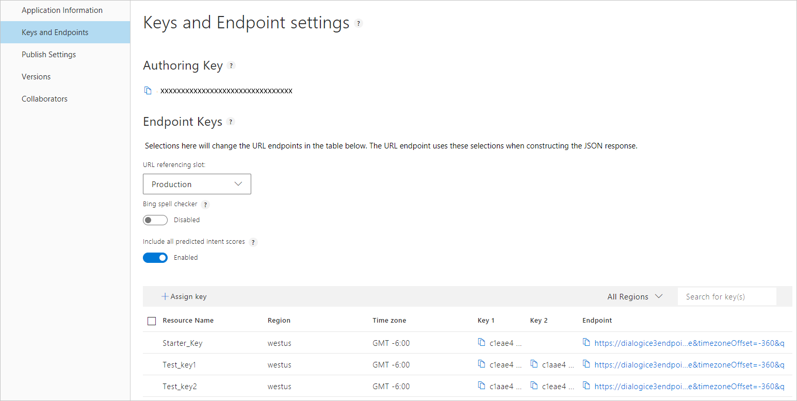
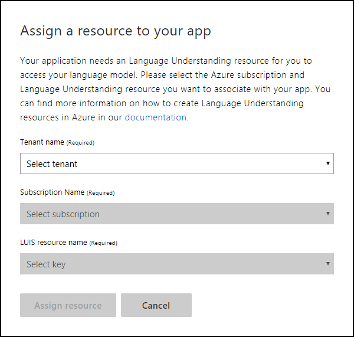

# Add an Azure LUIS resource to app

After you create a LUIS resource in the Azure portal, assign the resource to the LUIS app and get the correct endpoint URL. Use this endpoint URL to get LUIS predictions.

<a name="programmatic-key" ></a>
<a name="authoring-key" ></a>
<a name="endpoint-key" ></a>
<a name="use-endpoint-key-in-query" ></a>
<a name="api-usage-of-ocp-apim-subscription-key" ></a>
<a name="key-limits" ></a>
<a name="key-limit-errors" ></a>
<a name="key-concepts"></a>
<a name="authoring-key"></a>
<a name="create-and-use-an-endpoint-key"></a>
<a name="assign-endpoint-key"></a>

## Assign resource

1. Create a LUIS key on the [Azure portal](https://portal.azure.com). For further instructions, see [Creating an endpoint key using Azure](luis-how-to-azure-subscription.md).
 
2. Select **Manage** in the top right menu, then select **Keys and endpoints**.

    [  ](./media/luis-manage-keys/keys-and-endpoints.png#lightbox)

3. In order to add the LUIS, select **Assign Resource +**.

    

4. Select a Tenant in the dialog associated with the email address you login with to the LUIS website.  

5. Choose the **Subscription Name** associated with the Azure resource you want to add.

6. Select the **LUIS resource name**. 

7. Select **Assign resource**. 

8. Find the new row in the table and copy the endpoint URL. It is correctly constructed to make an HTTP GET request to the LUIS endpoint for a prediction. 

<!-- content moved to luis-reference-regions.md, need replacement links-->
<a name="regions-and-keys"></a>
<a name="publishing-to-europe"></a>
<a name="publishing-to-australia"></a>

## Unassign resource
When you unassign the endpoint key, it is not deleted from Azure. It is only unlinked from LUIS. 

When an endpoint key is unassigned, or not assigned to the app, any request to the endpoint URL returns an error: `401 This application cannot be accessed with the current subscription`. 

## Include all predicted intent scores
The **Include all predicted intent scores** checkbox allows the endpoint query response to include the prediction score for each intent. 

This setting allows your chatbot or LUIS-calling application to make a programmatic decision based on the scores of the returned intents. Generally the top two intents are the most interesting. If the top score is the None intent, your chatbot can choose to ask a follow-up question that makes a definitive choice between the None intent and the other high-scoring intent. 

The intents and their scores are also included the endpoint logs. You can [export](luis-how-to-start-new-app.md#export-app) those logs and analyze the scores. 

```JSON
{
  "query": "book a flight to Cairo",
  "topScoringIntent": {
    "intent": "None",
    "score": 0.5223427
  },
  "intents": [
    {
      "intent": "None",
      "score": 0.5223427
    },
    {
      "intent": "BookFlight",
      "score": 0.372391433
    }
  ],
  "entities": []
}
```

## Enable Bing spell checker 
In the **Endpoint url settings**, the **Bing spell checker** toggle allows LUIS to correct misspelled words before prediction. Create a **[Bing Spell Check key](https://azure.microsoft.com/try/cognitive-services/?api=spellcheck-api)**. 

Add the **spellCheck=true** querystring parameter and the **bing-spell-check-subscription-key={YOUR_BING_KEY_HERE}** . Replace the `{YOUR_BING_KEY_HERE}` with your Bing spell checker key.

```JSON
{
  "query": "Book a flite to London?",
  "alteredQuery": "Book a flight to London?",
  "topScoringIntent": {
    "intent": "BookFlight",
    "score": 0.780123
  },
  "entities": []
}
```


## Publishing regions

Learn more about publishing [regions](luis-reference-regions.md) including publishing in [Europe](luis-reference-regions.md#publishing-to-europe), and [Australia](luis-reference-regions.md#publishing-to-australia). Publishing regions are different from authoring regions. Create an app in the authoring region corresponding to the publishing region you want for the query endpoint.

## Next steps

Use your key to publish your app in the **Publish app** page. For instructions on publishing, see [Publish app](luis-how-to-publish-app.md).

See [Keys in LUIS](luis-concept-keys.md) to understand LUIS authoring and endpoint key concepts.