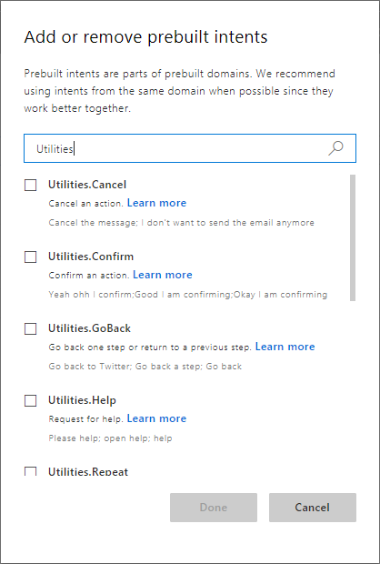
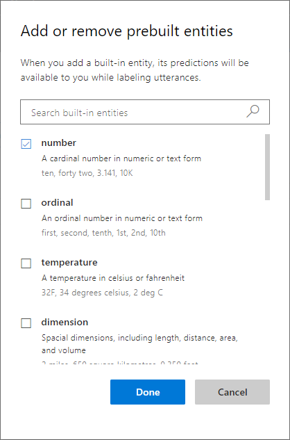

---
title: "Tutorial 2: Prebuilt intents and entities - use prebuilt common utterances - extract common data in LUIS"
titleSuffix: Azure Cognitive Services
description: Add prebuilt intents and entities to the Human Resources tutorial app to quickly gain intent prediction and data extraction. You do not need to label any utterances with prebuilt entities. The entity is detected automatically. 
services: cognitive-services
author: diberry
manager: cgronlun

ms.service: cognitive-services
ms.component: language-understanding
ms.topic: tutorial
ms.date: 09/09/2018
ms.author: diberry
--- 

# Tutorial 2: Identify common intents and entities
In this tutorial,  modify the Human Resources app. Add prebuilt intents and entities to the Human Resources tutorial app to quickly gain intent prediction and data extraction. You do not need to label any utterances with prebuilt entities because the entity is detected automatically.

Prebuilt models of common subject domains and data types help you build your model quickly as well as provide an example of what a model looks like. 

**In this tutorial, you learn how to:**

> [!div class="checklist"]
> * Use existing tutorial app
> * Add prebuilt intents 
> * Add prebuilt entities 
> * Train 
> * Publish 
> * Get intents and entities from endpoint

[!INCLUDE [LUIS Free account](../../../includes/cognitive-services-luis-free-key-short.md)]

## Use existing app
Continue with the app created in the last tutorial, named **HumanResources**. 

If you do not have the HumanResources app from the previous tutorial, use the following steps:

1.  Download and save [app JSON file](https://github.com/Microsoft/LUIS-Samples/blob/master/documentation-samples/tutorials/custom-domain-intent-only-HumanResources.json).

2. Import the JSON into a new app.

3. From the **Manage** section, on the **Versions** tab, clone the version, and name it `prebuilts`. Cloning is a great way to play with various LUIS features without affecting the original version. Because the version name is used as part of the URL route, the name can't contain any characters that are not valid in a URL. 

## Add prebuilt intents
LUIS provides several prebuilt intents to help with common user intentions.  

1. [!include[Start in Build section](../../../includes/cognitive-services-luis-tutorial-build-section.md)]

2. Select **Add prebuilt intent**. 

3. Search for `Utilities`. 

    [ ](./media/luis-tutorial-prebuilt-intents-and-entities/prebuilt-intent-utilities.png#lightbox)

4. Select the following intents and select **Done**: 

    * Utilities.Cancel
    * Utilities.Confirm
    * Utilities.Help
    * Utilities.StartOver
    * Utilities.Stop


## Add prebuilt entities
LUIS provides several prebuilt entities for common data extraction. 

1. Select **Entities** from the left navigation menu.

2. Select **Manage prebuilt entity** button.

3. Select **number** and **datetimeV2** from the list of prebuilt entities then select **Done**.

    

## Train

[!INCLUDE [LUIS How to Train steps](../../../includes/cognitive-services-luis-tutorial-how-to-train.md)]

## Publish

[!INCLUDE [LUIS How to Publish steps](../../../includes/cognitive-services-luis-tutorial-how-to-publish.md)]

## Get intent and entities from endpoint

1. [!INCLUDE [LUIS How to get endpoint first step](../../../includes/cognitive-services-luis-tutorial-how-to-get-endpoint.md)]

2. Go to the end of the URL in the browser address bar and enter `I want to cancel on March 3`. The last query string parameter is `q`, the utterance **query**. 

    ```JSON
    {
      "query": "I want to cancel on March 3",
      "topScoringIntent": {
        "intent": "Utilities.Cancel",
        "score": 0.7818295
      },
      "intents": [
        {
          "intent": "Utilities.Cancel",
          "score": 0.7818295
        },
        {
          "intent": "ApplyForJob",
          "score": 0.0237864349
        },
        {
          "intent": "GetJobInformation",
          "score": 0.017576348
        },
        {
          "intent": "Utilities.StartOver",
          "score": 0.0130122062
        },
        {
          "intent": "Utilities.Help",
          "score": 0.006731322
        },
        {
          "intent": "None",
          "score": 0.00524190161
        },
        {
          "intent": "Utilities.Stop",
          "score": 0.004912514
        },
        {
          "intent": "Utilities.Confirm",
          "score": 0.00092950504
        }
      ],
      "entities": [
        {
          "entity": "march 3",
          "type": "builtin.datetimeV2.date",
          "startIndex": 20,
          "endIndex": 26,
          "resolution": {
            "values": [
              {
                "timex": "XXXX-03-03",
                "type": "date",
                "value": "2018-03-03"
              },
              {
                "timex": "XXXX-03-03",
                "type": "date",
                "value": "2019-03-03"
              }
            ]
          }
        },
        {
          "entity": "3",
          "type": "builtin.number",
          "startIndex": 26,
          "endIndex": 26,
          "resolution": {
            "value": "3"
          }
        }
      ]
    }
    ```

    The result predicted the Utilities.Cancel intent and extracted the date of March 3 and the number 3. 

    There are two values for March 3 because the utterance didn't state if March 3 is in the past or in the future. It is up to the client application to make an assumption or ask for clarification, if that is needed. 

## Clean up resources

[!INCLUDE [LUIS How to clean up resources](../../../includes/cognitive-services-luis-tutorial-how-to-clean-up-resources.md)]

## Next steps

By adding prebuilt intents and entities, the client application can determine common user intentions and extract common datatypes. 

> [!div class="nextstepaction"]
> [Add a regular expression entity to the app](luis-quickstart-intents-regex-entity.md)

