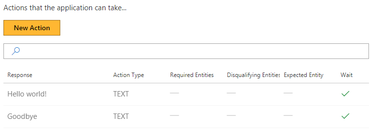
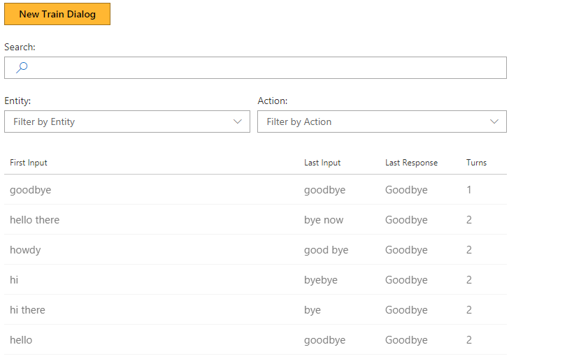

# How to create a "Hello World" model with Conversation Learner

This tutorial shows how to get started with Conversation Learner, including creating actions, teaching interactively, and making corrections of logged dialogs from end users.

## Video

## Requirements
If you haven't already, first ensure all setup steps have been completed, including creating a `.env` file with your LUIS authoring key.  See [Quickstart](https://github.com/Microsoft/ConversationLearner-Samples) for details.

This tutorial requires that the general tutorial bot is running

	npm run tutorial-general

## Steps

Start on the home page in the Web UI.

### Create the model
1. Click New Model
2. In the Name field, enter Hello World
3. Click Create

### Create an Action

1. Click on the Hello World model to start it
2. Click Actions, then New Action
	- An Action can be a text message that Conversation Learner returns to the user, an API call, or a card.
3. In Response, type 'Hello World!'
	- This is the response that the bot will return
4. Click Create

You have created the first thing that the bot can do i.e. return a text response.

### Train the bot

#### Create the first dialog

1. Click Train Dialogs, then New Train Dialog
2. Enter an example of what the user will say in the begging of the conversation, for example, 'hello'.
3. Click Score Actions
4. Select 'Hello World!'
	- This creates a one-turn example dialog. 
2. Enter 'goodbye'
3. Click Score Actions
4. click Add Action, then enter 'Goodbye!' in Response, then click 'Create'
5. Click Done Teaching. This will end this training dialog.

Now you have one teaching dialog in the system.

#### Continue teaching the bot
Let's do one more training, and see how the bot responds.

1. Click New Train Dialog
2. Enter 'hi there'
	- This is similar to the first dialog, and we expect to get a good score from the bot.
2. Click Score Action
	- The position and score may not still be accurate enough and require additional teaching.
3. Click Select next to 'Hello World!'
4. Then enter 'bye'
5. Click Score Actions
6. Select 'Goodbye!'
7. Click Done Teaching

We will do another teaching session to see how the bot is working.

Repeat the above steps using 'hi', and 'byebye', and note the changes in position and score of the bots response when you click Score Action.

You can now repeat the steps using 'howdy' and 'good bye', and note that the scoring shows improvements in scores indicating the bot has learned this interaction.

### Test the bot as an end user

1. Click Log Dialogs, then New Log Dialog
2. Type 'hello there'
3. Then 'bye'

You can also try starting a conversation with 'bye', and note the bot's response.

### View conversations in the Log Dialogs

In Log Dialogs, you can view the list of conversations, update, and save the interactions as training dialogs. To do that:

1. Click on the log of a conversation
2. If the conversation looks good, click on the last action e.g. 'Goodbye'.
3. Click to select the suggested response. 
	- You can also select or add another action.
4. Then click Done to save this as a training dialog.

## Next steps

> [!div class="nextstepaction"]
> [Wait and non-wait actions](./2-wait-vs-nonwait-actions.md)