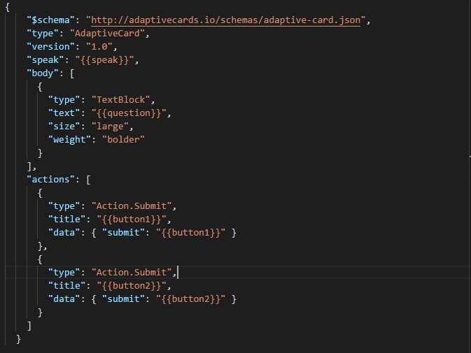
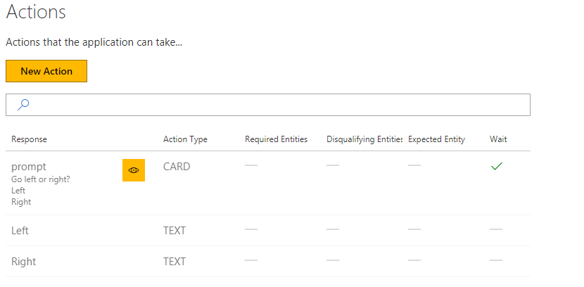
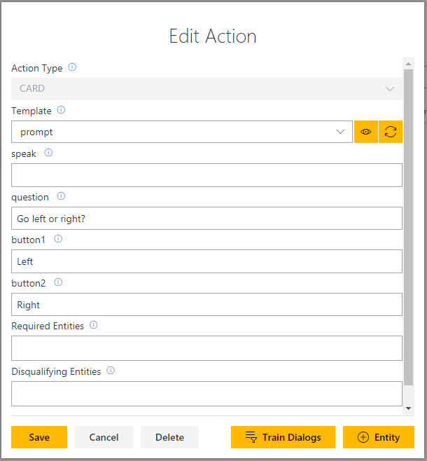

# How to use cards (part 1 of 2)

This tutorial shows how to add and use a simple card in your bot.

> [!NOTE]
> Currently Conversation Learner expects your card definition files to be located in a directory called "cards" which is present in the directory where the bot is started. We will make this configurable in the future.

## Video

## Requirements
This tutorial requires that the general tutorial bot is running

	npm run tutorial-general

## Details

Cards are UI elements that allow the user to select an option in the conversation. 

### Open the demo

In the Model list of the web UI, click on Tutorial-13-Cards-1. 

### The Card

The card definition is at the following location: C:\<installedpath\>\src\cards\prompt.json.

The system expects to find your card definitions in this cards directory.

> [!NOTE]
> Notice the body type `TextBlock` and the `{{question}}` placeholder in the text field.
> There are two submit buttons and the text that gets submitted for each.

### Actions

We have created three actions. As you see below, the first action is a card.

Let's see how the card action type was created:

> [!NOTE]
> The question input, and buttons 1 and 2. Those are template references in the card where you enter the question and the respective answers. You can also reference and use entities or a mixture of text and entities.

The eye icon shows you what the card looks like.

### Train Dialog

Let's walk through a teaching dialog.

1. Click Train Dialogs, then New Train Dialog.
1. Enter 'hi'.
2. Click Score Action.
3. Click to Select 'Prompt go left or right'.
	- Clicking 'left' or 'right' is equivalent to user typing in 'left' or 'right' respectively. 
4. Click Score Actions.
4. Click to Select 'left'. This is a non-wait action.
6. Click to Select 'Prompt go left or right'.
4. Click 'right'.
5. Click Score Actions.
3. Click to Select 'Right'
6. Click to Select 'Prompt go left or right'.
4. Click Done Testing.

You have now seen how cards work. They are defined in the cards directory as json templates. The templates will surface in the UI which you can populate using a string or an entity or a mix of both.

## Next steps

> [!div class="nextstepaction"]
> [Cards part 2](./14-cards-2.md)
