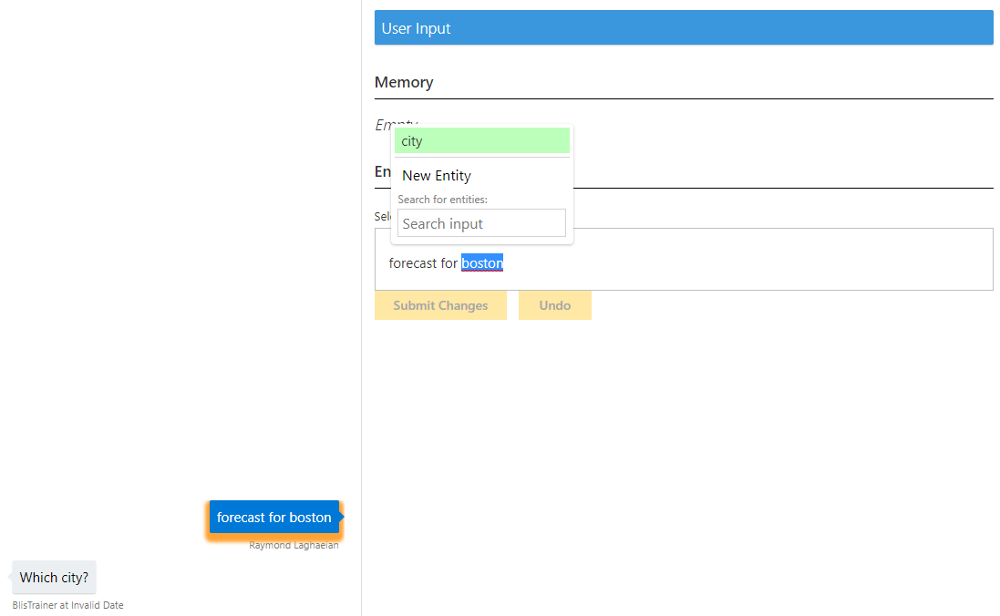
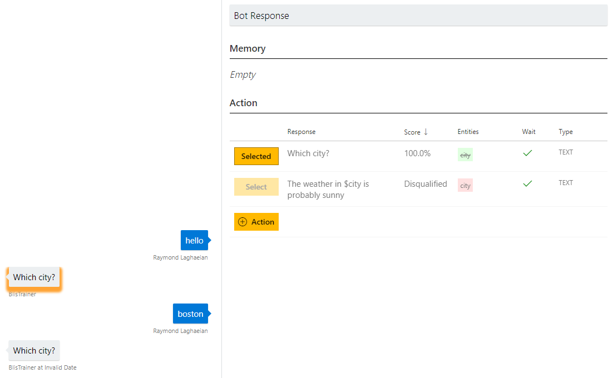

# How to log dialogs in a Conversation Learner model

This tutorial shows how to do end-user testing within the Conversation Learner interface; how dialogs are logged; and how to make corrections to logged dialogs in order to improve your model.

## Video

## Requirements
This tutorial requires that the general tutorial bot is running

	npm run tutorial-general

## Details
You can use the log dialogs to review and make corrections to dialogs conducted with end users.  Specifically, you can fix entity labels and action selections to improve the performance of the trained model and overall system. 

## Steps

### Create the model

1. In the Web UI, click New Model
2. In Name, enter LogDialogs. Then click Create.

### Create an entity

1. Click Entities, then New Entity.
2. In Entity Name, enter city.
3. Click Create.

### Create two actions

1. Click Actions, then New Action
2. In Response, type 'Which city?'.
3. In Disqualifying Entities, enter $city.
3. Click Create

Then create the second action:

1. Click Actions, then New Action.
3. In Response, type 'The weather in $city is probably sunny'.
4. Required Entities, enter $city.
4. Click Create.

You now have two actions.

### Train the bot

1. Click Train Dialogs, then New Train Dialog.
2. Type 'what's the weather'.
3. Click Score Actions, and Select 'Which city?'
2. Enter 'Seattle'.
3. Double-click on 'Seattle', and select city.
	- This marks it as a city entity.
5. Click Score Actions
6. Select 'The weather in $city is probably sunny'.
7. Click Done Teaching.

Add another example dialog:

1. Click New Action, then New Train Dialog.
2. Type 'what's the weather in Seattle?'. Notice Seattle is tagged as an entity.
5. Click Score Actions 
6. Select 'The weather in $city is probably sunny'.
7. Click Done Teaching.

### Try the bot as the user
Let's imagine that we have deployed this bot to users.

1. Click on Log Dialogs.
2. Click New Chat Session.
	- This presents the bot as the user would experience it in the web chat control on the left of the UI. You can ignore the white-space area on the right.
3. Type 'hello'.
4. Bot response: 'which city?'
4. Type 'Boston'.
5. Bot response: 'which city?'
	- This doesn't seem right. So let's save this dialog.
2. Click Done Testing.

Let's start a new session:

2. Click New Chat Session.
3. Type 'forecast for Boston'.
4. Bot response: 'which city?'
2. Click Done Teaching.

Now let's make corrections to the second dialog:

1. Click on 'forecast for Boston' under Log Dialogs.
	- This opens the conversation.
	- If you click on the user side of the conversation (here on 'forecast for Boston'), you can change entity labels.
	- If you click on the system side (here on 'which city'), you can change which action is selected.
5. Click on 'forecast for Boston'. 
	- The root cause here is that Boston was not tagged as an entity. We need to change that.
	- Double-click on 'Boston', then select city.
	- Click Submit Changes, and click Save. This will create a training dialog based on the changes you made, and drop you into training dialogs at the point of the change you made.
6. Select 'The weather in $city is probably sunny.'
7. Click Done Teaching. If you go to Train Dialogs now, you will see the new action is added.

Now let's make corrections to the other dialog:

1. Click on 'hello' under Log Dialogs.
	- This opens the conversation.
3. The response to 'hello' is 'which city'. But we want to change that to something that makes more sense. A better answer would be something like 'hello, I'm the weather bot'. But there is no action that does that so we have to create one.
4. Click on Action.
	- In the Response, type 'I'm the weather bot. I can help with forecasts.'
6. Un-check the Wait for Response check-box to make it a non-wait action.
7. Click Create.
8. Then click to Select this new action. Then click Save.
	- This brings you back to that point in the training session.
6. Click to Select 'which city?'
7. Type in 'Boston'. Double-click to tag Boston as an entity if not already.
8. Click Score Actions.
9. Click to Select 'The weather in $city is probably sunny.'
10. Click Done Teaching.

## Next steps

> [!div class="nextstepaction"]
> [Entity detection callback](./10-entity-detection-callback.md)
