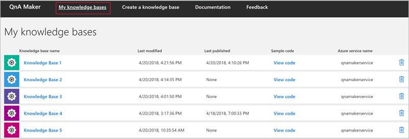
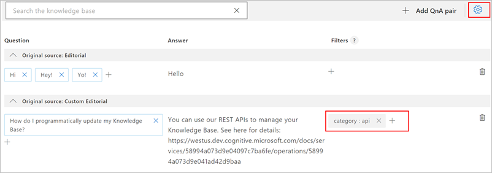

# Edit a knowledge base

QnA Maker allows you to manage the content of your knowledge base by providing an easy-to-use editing experience.

## Edit your knowledge base content

1.  Select **My knowledge bases** in the top navigation bar. 

    You can see all the services you created or shared with you sorted in the descending order of the **last modified** date.

    

2. Select a particular knowledge base to make edits to it.

3. Once you are done making changes to the Knowledge base, click on **Save and train** in the top right corner of the page in order to persist the changes.    

    

    >[!NOTE]
	Leaving the page before clicking on Save and train will not persist the changes.

## Add a QnA pair

Select **Add QnA pair** to add a new row to the knowledge base table.

## Delete a QnA pair

To delete a QnA, click the **delete** icon on the far right of the QnA row.

## Add alternate questions

Add alternate questions to an existing QnA pair to improve the likelihood of a match to a user query.

## Add metadata

Add metadata pairs by selecting the filter icon

> [!TIP]
> Make sure to periodically Save and train the knowledge base after making edits to avoid losing changes.

## Manage large knowledge bases

1. The QnAs are **grouped** by the data source from which they were extracted. You can expand or collapse the data source.
2. You can **search** the knowledge base by typing in the text box at the top of the Knowledge Base table. Click enter to search on the question, answer or metadata content. Click on the X icon to remove the search filter.
3. **Pagination** allows you to manage large knowledge bases

    

## Next steps

> [!div class="nextstepaction"]
> [Collaborate on a knowledge base](./collaborate-knowledge-base.md)
