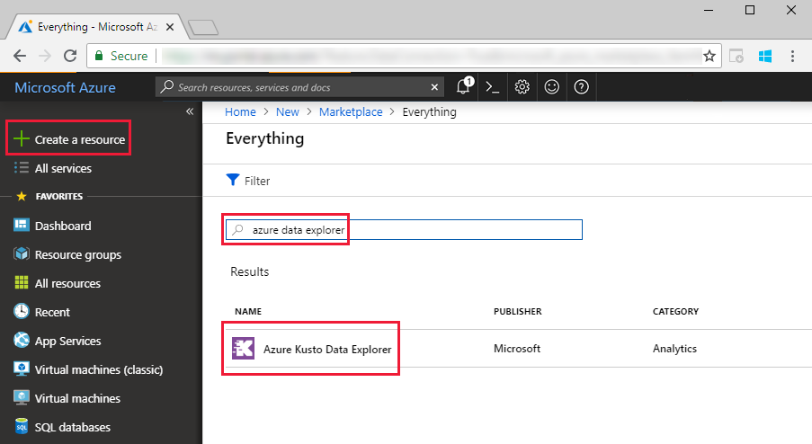
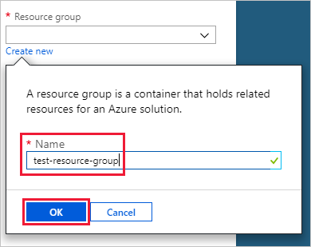
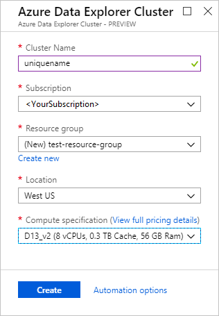
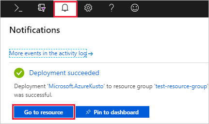
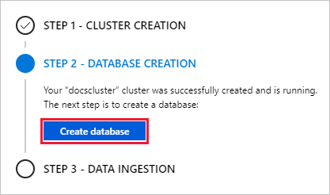
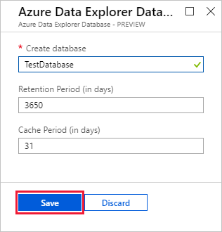
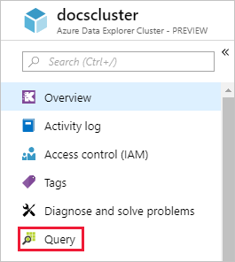
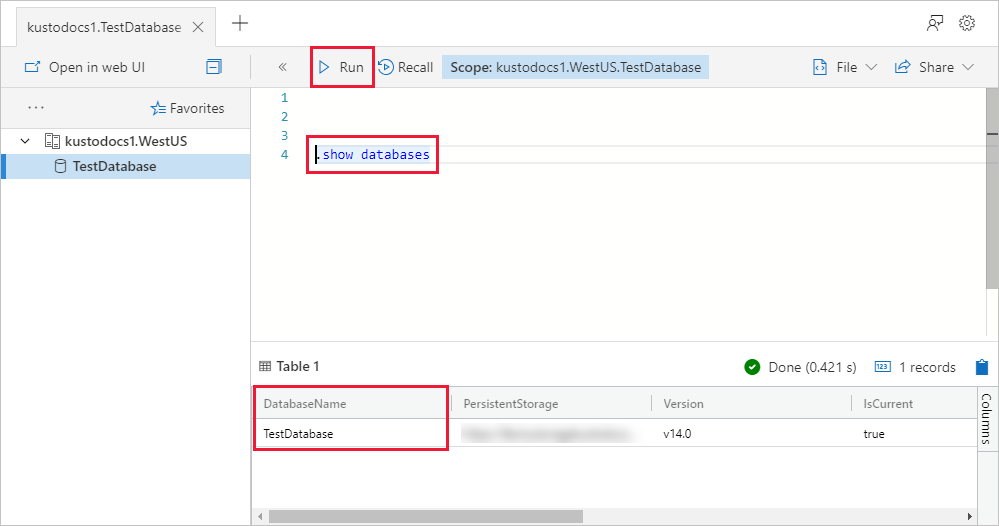
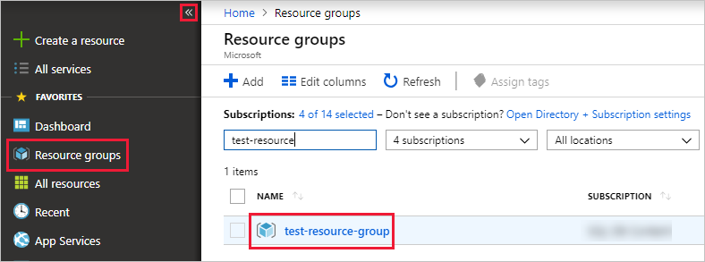

# Quickstart: Create an Azure Data Explorer cluster and database

Azure Data Explorer is a fast and highly scalable data exploration service for log and telemetry data. To use Azure Data Explorer, you first create a *cluster*, and create one or more *databases* in that cluster. Then you *ingest* (load) data into a database so that you can run queries against it. In this quickstart, you create a cluster and a database. In subsequent articles, we show you how to ingest data.

If you don't have an Azure subscription, create a [free Azure account](https://azure.microsoft.com/free/) before you begin.

## Sign in to the Azure portal

Sign in to the [Azure portal](https://portal.azure.com/).

## Create a cluster

You create an Azure Data Explorer cluster in an Azure resource group, with a defined set of compute and storage resources.

1. Select the **Create a resource** button (+) in the upper-left corner of the  portal.

1. Search for *Azure Data Explorer*, then select **Azure Data Explorer**.

   

1. In the lower-right corner, select **Create**.

1. Enter a unique name for your cluster, select your subscription, and create a resource group named *test-resource-group*.

    

1. Fill out the form with the following information.

   

    **Setting** | **Suggested value** | **Field description**
    |---|---|---|
    | Cluster name | A unique cluster name | Choose a unique name that identifies your cluster. For example, *mytestcluster*. The domain name *[region].kusto.windows.net* is appended to the cluster name you provide. The name can contain only lowercase letters and numbers. It must contain from 3 to 22 characters.
    | Subscription | Your subscription | Select the Azure subscription that you want to use for your cluster.|
    | Resource group | *test-resource-group* | Create a new resource group. |
    | Location | *West US* | Select *West US* for this quickstart. For a production system, select the region that best meets your needs.
    | Compute specification | *D13_v2* | Select the lowest price specification for this quickstart. For a production system, select the specification that best meets your needs.
    | | |

1. Select **Create** to provision the cluster. Provisioning typically takes about ten minutes. Select **Notifications** on the toolbar (the bell icon) to monitor the provisioning process.

1. When the process is complete, select **Notifications**, then **Go to resource**.

    

## Create a database

You're now ready for the second step in the process: database creation.

1. On the **Overview** tab, select **Create database**.

    

1. Fill out the form with the following information.

    

    **Setting** | **Suggested value** | **Field description**
    |---|---|---|
    | Database name | *TestDatabase* | The database name must be unique within the cluster.
    | Retention period | *3650* | The time span for which it's guaranteed that the data is kept available to query. The time span is measured from the time that data is ingested.
    | Cache period | *31* | The time span for which to keep frequently-queried data available in SSD storage or RAM, rather than in longer-term storage.
    | | | |

1. Select **Save** to create the database. Creation typically takes less than a minute. When the process is complete, you're back on the cluster **Overview** tab.

## Run basic commands in the database

Now that you have a cluster and database, you can run queries and commands. You don't have any data in the database yet, but you can still see how the tools work.

1. Under your cluster, select **Query**.

    

1. Paste the following command into the query window: `.show databases`, then select **Run**.

    

    The result set shows **TestDatabase**, the only database in the cluster.

1. Paste the following command into the query window: `.show tables`, then select that command in the window. Select **Run**.

    This command returns an empty result set because you don't have any tables yet. You add a table in the next article in this series.

## Stop and restart the cluster

You can stop and restart a cluster depending on business needs.

1. To stop the cluster, at the top of the **Overview** tab, select **Stop**.

    When the cluster is stopped, data is not available for queries, and you can't ingest new data.

1. To restart the cluster, at the top of the **Overview** tab, select **Start**.

    When the cluster is restarted, it takes about ten minutes for it to become available (like when it was originally provisioned). It takes additional time for data to load into the hot cache.  

## Clean up resources

If you plan to follow our other quickstarts and tutorials, keep the resources you created. If not, clean up **test-resource-group**, to avoid incurring costs.

1. In the Azure portal, select **Resource groups** on the far left, and then select the resource group you created.  

    If the left menu is collapsed, select  to expand it.

   

1. Under **test-resource-group**, select **Delete resource group**.

1. In the new window, type the name of the resource group to delete (*test-resource-group*), and then select **Delete**.

## Next steps

> [!div class="nextstepaction"]
> [Quickstart: Ingest data from Event Hub into Azure Data Explorer](ingest-data-event-hub.md)

