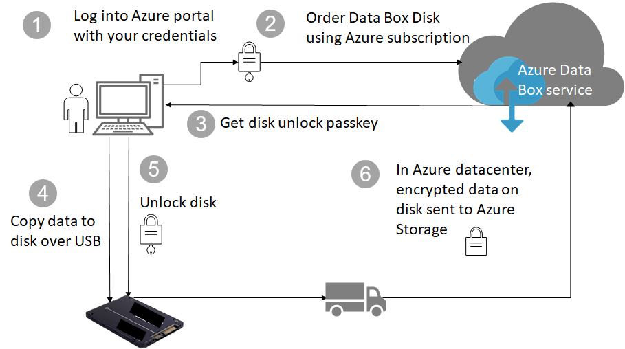

# Azure Data Box Disk security and data protection (Preview)

This article describes the Azure Data Box Disk security features that help protect each of the Data Box solution components and the data stored on them. 

> [!IMPORTANT]
> Data Box Disk is in preview. Review the [Azure terms of service for preview](https://azure.microsoft.com/support/legal/preview-supplemental-terms/) before you deploy this solution.

## Data flow through components

The Microsoft Azure Data Box solution consists of four main components that interact with each other:

- **Azure Data Box service hosted in Azure** – The management service that you use to create the disk order, configure the disks, and then track the order to completion.
- **Data Box Disks** – The physical disks that are shipped to you to import your on-premises data into Azure. 
- **Clients/hosts connected to the disks** – The clients in your infrastructure that connect to the Data Box disk over USB and contain data that needs to be protected.
- **Cloud storage** – The location in the Azure cloud where data is stored. This is typically the storage account linked to the Azure Data Box resource that you created.

The following diagram indicates the flow of data through the Azure Data Box Disk solution from on-premises to Azure.

## Security features

Data Box Disk provides a secure solution for data protection by ensuring that only authorized entities can view, modify, or delete your data. The security features for this solution are for the disk and for the associated service ensuring the security of the data stored on them. 

### Data Box Disk protection

The Data Box Disk is protected by the following features:

- BitLocker AES-128 bit encryption for the disk at all times.
- Secure update capability for the disks.
- Disks are shipped in a locked state and can only be unlocked via a Data Box Disk unlock tool. The unlock tool is available in the Data Box Disk service portal.

### Data Box Disk data protection

The data that flows in and out of Data Box Disk is protected by the following features:

- BitLocker encryption of data at all times. 
- Secure erasure of data from disk once data upload to Azure is complete. Data erasure is in accordance with NIST 800-88r1 standards.

### Data Box service protection

The Data Box service is protected by the following features.

- Access to the Data Box Disk service requires that your organization has an Azure subscription that includes Data Box Disk. Your subscription governs the features that you can access in the Azure portal.
- Because the Data Box service is hosted in Azure, it is protected by the Azure security features. For more information about the security features provided by Microsoft Azure, go to the [Microsoft Azure Trust Center](https://www.microsoft.com/TrustCenter/Security/default.aspx). 
- The Data Box Disk stores disk passkey that is used to unlock the disk in the service. 
- The Data box Disk service stores order details and status in the service. This information is deleted when the order is deleted. 

## Managing personal data

[!INCLUDE [GDPR-related guidance](../../includes/gdpr-intro-sentence.md)]

Azure Data Box Disk collects and displays personal information in the following key instances in the service:

- **Notification settings** - When you create an order, you configure the email address of users under notification settings. This information can be viewed by the administrator. This information is deleted by the service when the job reaches the terminal state or when you delete the order.

- **Order details** – Once the order is created, the shipping address, email, contact information of users is stored in the Azure portal. The information saved includes:

    - Contact name
    - Phone number
    - Email
    - Street address
    - City
    - Zip/postal code
    - State
    - Country/Province/Region
    - Drive ID
    - Carrier account number
    - Shipping tracking number

    The order details are deleted by the Data Box service when the job completes or when you delete the order.

- **Shipping address** – After the order is placed, Data Box service provides the shipping address to third party carriers such as UPS or DHL. 

For more information, review the Microsoft Privacy policy at [Trust Center](https://www.microsoft.com/trustcenter).

## Next steps

- Review the [Data Box Disk requirements](data-box-disk-system-requirements.md).
- Understand the [Data Box Disk limits](data-box-disk-limits.md).
- Quickly deploy [Azure Data Box Disk](data-box-disk-quickstart-portal.md) in Azure portal.
