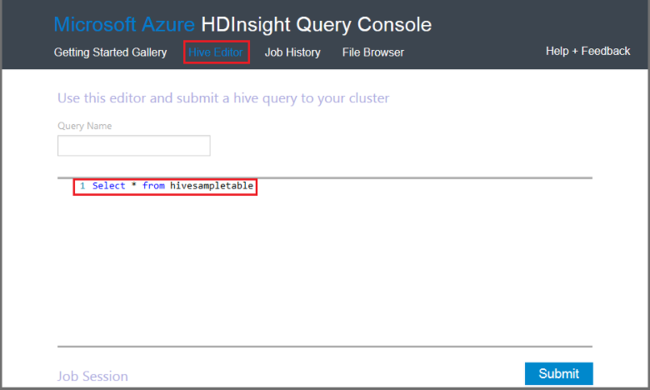

# Run Hive queries using the Query Console
[!INCLUDE [hive-selector](../../../includes/hdinsight-selector-use-hive.md)]

In this article, you will learn how to use the HDInsight Query Console to run Hive queries on an HDInsight Hadoop cluster from your browser.

> [!IMPORTANT]
> The HDInsight Query Console is only available on Windows-based HDInsight clusters. Linux is the only operating system used on HDInsight version 3.4 or greater. For more information, see [HDInsight retirement on Windows](../hdinsight-component-versioning.md#hdinsight-windows-retirement).
>
> For HDInsight 3.4 or greater, see [Run Hive queries in Ambari Hive View](apache-hadoop-use-hive-ambari-view.md) for information on running Hive queries from a web browser.

## Prerequisites
To complete the steps in this article, you will need the following.

* A Windows-based HDInsight Hadoop cluster
* A modern web browser

##  Run Hive queries using the Query Console
1. Open a web browser and navigate to **https://CLUSTERNAME.azurehdinsight.net**, where **CLUSTERNAME** is the name of your HDInsight cluster. If prompted, enter the user name and password that you used when you created the cluster.
2. From the links at the top of the page, select **Hive Editor**. This displays a form that can be used to enter the HiveQL statements that you want to run in the HDInsight cluster.

    

    Replace the text `Select * from hivesampletable` with the following HiveQL statements:

        set hive.execution.engine=tez;
        DROP TABLE log4jLogs;
        CREATE EXTERNAL TABLE log4jLogs (t1 string, t2 string, t3 string, t4 string, t5 string, t6 string, t7 string)
        ROW FORMAT DELIMITED FIELDS TERMINATED BY ' '
        STORED AS TEXTFILE LOCATION 'wasb:///example/data/';
        SELECT t4 AS sev, COUNT(*) AS count FROM log4jLogs WHERE t4 = '[ERROR]' AND INPUT__FILE__NAME LIKE '%.log' GROUP BY t4;

    These statements perform the following actions:

   * **DROP TABLE**: Deletes the table and the data file if the table already exists.
   * **CREATE EXTERNAL TABLE**: Creates a new 'external' table in Hive. External tables store only the table definition in Hive; the data is left in the original location.

     > [!NOTE]
     > External tables should be used when you expect the underlying data to be updated by an external source (such as an automated data upload process) or by another MapReduce operation, but you always want Hive queries to use the latest data.
     >
     > Dropping an external table does **not** delete the data, only the table definition.
     >
     >
   * **ROW FORMAT**: Tells Hive how the data is formatted. In this case, the fields in each log are separated by a space.
   * **STORED AS TEXTFILE LOCATION**: Tells Hive where the data is stored (the example/data directory) and that it is stored as text
   * **SELECT**: Select a count of all rows where column **t4** contain the value **[ERROR]**. This should return a value of **3** because there are three rows that contain this value.
   * **INPUT__FILE__NAME LIKE '%.log'** - Tells Hive that we should only return data from files ending in .log. This restricts the search to the sample.log file that contains the data, and keeps it from returning data from other example data files that do not match the schema we defined.
3. Click **Submit**. The **Job Session** at the bottom of the page should display details for the job.
4. When the **Status** field changes to **Completed**, select **View Details** for the job. On the details page, the **Job Output** contains `[ERROR]    3`. You can use the **Download** button under this field to download a file that contains the output of the job.

## Summary
As you can see, the Query Console provides an easy way to run Hive queries in an HDInsight cluster, monitor the job status, and retrieve the output.

To learn more about using Hive Query Console to run Hive jobs, select **Getting Started** at the top of the Query Console, then use the samples that are provided. Each sample walks through the process of using Hive to analyze data, including explanations about the HiveQL statements used in the sample.

## Next steps
For general information about Hive in HDInsight:

* [Use Hive with Hadoop on HDInsight](hdinsight-use-hive.md)

For information about other ways you can work with Hadoop on HDInsight:

* [Use Pig with Hadoop on HDInsight](hdinsight-use-pig.md)
* [Use MapReduce with Hadoop on HDInsight](hdinsight-use-mapreduce.md)

If you are using Tez with Hive, see the following documents for debugging information:

* [Use the Tez UI on Windows-based HDInsight](../hdinsight-debug-tez-ui.md)
* [Use the Ambari Tez view on Linux-based HDInsight](../hdinsight-debug-ambari-tez-view.md)

[1]:apache-hadoop-visual-studio-tools-get-started.md

[hdinsight-sdk-documentation]: http://msdnstage.redmond.corp.microsoft.com/library/dn479185.aspx

[azure-purchase-options]: http://azure.microsoft.com/pricing/purchase-options/
[azure-member-offers]: http://azure.microsoft.com/pricing/member-offers/
[azure-free-trial]: http://azure.microsoft.com/pricing/free-trial/

[apache-tez]: http://tez.apache.org
[apache-hive]: http://hive.apache.org/
[apache-log4j]: http://en.wikipedia.org/wiki/Log4j
[hive-on-tez-wiki]: https://cwiki.apache.org/confluence/display/Hive/Hive+on+Tez
[import-to-excel]: http://azure.microsoft.com/documentation/articles/hdinsight-connect-excel-power-query/

[hdinsight-use-oozie]: hdinsight-use-oozie.md
[hdinsight-analyze-flight-data]: hdinsight-analyze-flight-delay-data.md

[hdinsight-storage]: hdinsight-hadoop-use-blob-storage.md

[hdinsight-provision]: hdinsight-hadoop-provision-linux-clusters.md
[hdinsight-submit-jobs]:submit-apache-hadoop-jobs-programmatically.md
[hdinsight-upload-data]: hdinsight-upload-data.md
[hdinsight-get-started]:apache-hadoop-linux-tutorial-get-started.md

[Powershell-install-configure]: /powershell/azureps-cmdlets-docs
[powershell-here-strings]: http://technet.microsoft.com/library/ee692792.aspx

[img-hdi-hive-powershell-output]: ./media/hdinsight-use-hive/HDI.Hive.PowerShell.Output.png
