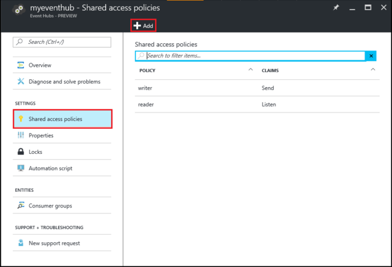
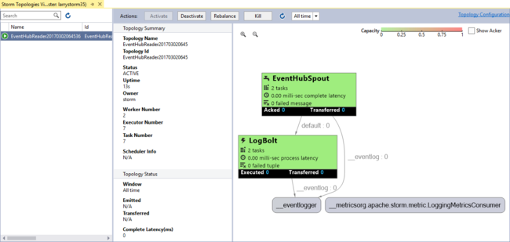
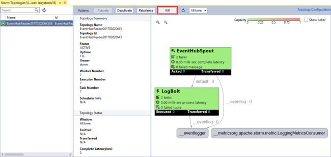

# Process events from Azure Event Hubs with Storm on HDInsight (C#)

Learn how to work with Azure Event Hubs from Apache Storm on HDInsight. This document uses a C# Storm topology to read and write data from Event Hubs

> [!NOTE]
> For a Java version of this project, see [Process events from Azure Event Hubs with Storm on HDInsight (Java)](https://azure.microsoft.com/resources/samples/hdinsight-java-storm-eventhub/).

## SCP.NET

The steps in this document use SCP.NET, a NuGet package that makes it easy to create C# topologies and components for use with Storm on HDInsight.

> [!IMPORTANT]
> While the steps in this document rely on a Windows development environment with Visual Studio, the compiled project can be submitted to a Storm on HDInsight cluster that uses Linux. Only Linux-based clusters created after October 28, 2016, support SCP.NET topologies.

HDInsight 3.4 and greater use Mono to run C# topologies. The example used in this document works with HDInsight 3.6. If you plan on creating your own .NET solutions for HDInsight, check the [Mono compatibility](http://www.mono-project.com/docs/about-mono/compatibility/) document for potential incompatibilities.

### Cluster versioning

The Microsoft.SCP.Net.SDK NuGet package you use for your project must match the major version of Storm installed on HDInsight. HDInsight versions 3.5 and 3.6 use Storm 1.x, so you must use SCP.NET version 1.0.x.x with these clusters.

> [!IMPORTANT]
> The example in this document expects an HDInsight 3.5 or 3.6 cluster.
>
> Linux is the only operating system used on HDInsight version 3.4 or greater. For more information, see [HDInsight retirement on Windows](../hdinsight-component-versioning.md#hdinsight-windows-retirement).

C# topologies must also target .NET 4.5.

## How to work with Event Hubs

Microsoft provides a set of Java components that can be used to communicate with Event Hubs from a Storm topology. You can find the Java archive (JAR) file that contains an HDInsight 3.6 compatible version of these components at [https://github.com/hdinsight/mvn-repo/raw/master/org/apache/storm/storm-eventhubs/1.1.0.1/storm-eventhubs-1.1.0.1.jar](https://github.com/hdinsight/mvn-repo/raw/master/org/apache/storm/storm-eventhubs/1.1.0.1/storm-eventhubs-1.1.0.1.jar).

> [!IMPORTANT]
> While the components are written in Java, you can easily use them from a C# topology.

The following components are used in this example:

* __EventHubSpout__: Reads data from Event Hubs.
* __EventHubBolt__: Writes data to Event Hubs.
* __EventHubSpoutConfig__: Used to configure EventHubSpout.
* __EventHubBoltConfig__: Used to configure EventHubBolt.

### Example spout usage

SCP.NET provides methods for adding an EventHubSpout to your topology. These methods make it easier to add a spout than using the generic methods for adding a Java component. The following example demonstrates how to create a spout by using the __SetEventHubSpout__ and **EventHubSpoutConfig** methods provided by SCP.NET:

```csharp
 topologyBuilder.SetEventHubSpout(
    "EventHubSpout",
    new EventHubSpoutConfig(
        ConfigurationManager.AppSettings["EventHubSharedAccessKeyName"],
        ConfigurationManager.AppSettings["EventHubSharedAccessKey"],
        ConfigurationManager.AppSettings["EventHubNamespace"],
        ConfigurationManager.AppSettings["EventHubEntityPath"],
        eventHubPartitions),
    eventHubPartitions);
```

The previous example creates a new spout component named __EventHubSpout__, and configures it to communicate with an event hub. The parallelism hint for the component is set to the number of partitions in the event hub. This setting allows Storm to create an instance of the component for each partition.

### Example bolt usage

Use the **JavaComponmentConstructor** method to create an instance of the bolt. The following example demonstrates how to create and configure a new instance of the **EventHubBolt**:

```csharp
// Java construcvtor for the Event Hub Bolt
JavaComponentConstructor constructor = JavaComponentConstructor.CreateFromClojureExpr(
    String.Format(@"(org.apache.storm.eventhubs.bolt.EventHubBolt. (org.apache.storm.eventhubs.bolt.EventHubBoltConfig. " +
        @"""{0}"" ""{1}"" ""{2}"" ""{3}"" ""{4}"" {5}))",
        ConfigurationManager.AppSettings["EventHubPolicyName"],
        ConfigurationManager.AppSettings["EventHubPolicyKey"],
        ConfigurationManager.AppSettings["EventHubNamespace"],
        "servicebus.windows.net",
        ConfigurationManager.AppSettings["EventHubName"],
        "true"));

// Set the bolt to subscribe to data from the spout
topologyBuilder.SetJavaBolt(
    "eventhubbolt",
    constructor,
    partitionCount)
        .shuffleGrouping("Spout");
```

> [!NOTE]
> This example uses a Clojure expression passed as a string, instead of using **JavaComponentConstructor** to create an **EventHubBoltConfig**, as the spout example did. Either method works. Use the method that feels best to you.

## Download the completed project

You can download a complete version of the project created in this tutorial from [GitHub](https://github.com/Azure-Samples/hdinsight-dotnet-java-storm-eventhub). However, you still need to provide configuration settings by following the steps in this tutorial.

### Prerequisites

* An [Apache Storm on HDInsight cluster version 3.5 or 3.6](apache-storm-tutorial-get-started-linux.md).

    > [!WARNING]
    > The example used in this document requires Storm on HDInsight version 3.5 or 3.6. This does not work with older versions of HDInsight, due to breaking class name changes. For a version of this example that works with older clusters, see [GitHub](https://github.com/Azure-Samples/hdinsight-dotnet-java-storm-eventhub/releases).

* An [Azure event hub](../../event-hubs/event-hubs-create.md).

* The [Azure .NET SDK](http://azure.microsoft.com/downloads/).

* The [HDInsight tools for Visual Studio](../hadoop/apache-hadoop-visual-studio-tools-get-started.md).

* Java JDK 1.8 or later on your development environment. JDK downloads are available from [Oracle](http://www.oracle.com/technetwork/java/javase/downloads/index.html).

  * The **JAVA_HOME** environment variable must point to the directory that contains Java.
  * The **%JAVA_HOME%/bin** directory must be in the path.

## Download the Event Hubs components

Download the Event Hubs spout and bolt component from [https://github.com/hdinsight/mvn-repo/raw/master/org/apache/storm/storm-eventhubs/1.1.0.1/storm-eventhubs-1.1.0.1.jar](https://github.com/hdinsight/mvn-repo/raw/master/org/apache/storm/storm-eventhubs/1.1.0.1/storm-eventhubs-1.1.0.1.jar).

Create a directory named `eventhubspout`, and save the file into the directory.

## Configure Event Hubs

Event Hubs is the data source for this example. Use the information in the "Create an event hub" section of [Get started with Event Hubs](../../event-hubs/event-hubs-create.md).

1. After the event hub has been created, view the **EventHub** settings in the Azure portal, and select **Shared access policies**. Select **+ Add** to add the following policies:

   | Name | Permissions |
   | --- | --- |
   | writer |Send |
   | reader |Listen |

    

2. Select the **reader** and **writer** policies. Copy and save the primary key value for both policies, as these values are used later.

## Configure the EventHubWriter

1. If you have not already installed the latest version of the HDInsight tools for Visual Studio, see [Get started using HDInsight tools for Visual Studio](../hadoop/apache-hadoop-visual-studio-tools-get-started.md).

2. Download the solution from [eventhub-storm-hybrid](https://github.com/Azure-Samples/hdinsight-dotnet-java-storm-eventhub).

3. In the **EventHubWriter** project, open the **App.config** file. Use the information from the event hub that you configured earlier to fill in the value for the following keys:

   | Key | Value |
   | --- | --- |
   | EventHubPolicyName |writer (If you used a different name for the policy with *Send* permission, use it instead.) |
   | EventHubPolicyKey |The key for the writer policy. |
   | EventHubNamespace |The namespace that contains your event hub. |
   | EventHubName |Your event hub name. |
   | EventHubPartitionCount |The number of partitions in your event hub. |

4. Save and close the **App.config** file.

## Configure the EventHubReader

1. Open the **EventHubReader** project.

2. Open the **App.config** file for the **EventHubReader**. Use the information from the event hub that you configured earlier to fill in the value for the following keys:

   | Key | Value |
   | --- | --- |
   | EventHubPolicyName |reader (If you used a different name for the policy with *listen* permission, use it instead.) |
   | EventHubPolicyKey |The key for the reader policy. |
   | EventHubNamespace |The namespace that contains your event hub. |
   | EventHubName |Your event hub name. |
   | EventHubPartitionCount |The number of partitions in your event hub. |

3. Save and close the **App.config** file.

## Deploy the topologies

1. From **Solution Explorer**, right-click the **EventHubReader** project, and select **Submit to Storm on HDInsight**.

    

2. On the **Submit Topology** dialog box, select your **Storm Cluster**. Expand **Additional Configurations**, select **Java File Paths**, select **...**, and select the directory that contains the JAR file that you downloaded earlier. Finally, click **Submit**.

    

3. When the topology has been submitted, the **Storm Topologies Viewer** appears. To view information about the topology, select the **EventHubReader** topology in the left pane.

    

4. From **Solution Explorer**, right-click the **EventHubWriter** project, and select **Submit to Storm on HDInsight**.

5. On the **Submit Topology** dialog box, select your **Storm Cluster**. Expand **Additional Configurations**, select **Java File Paths**, select **...**, and select the directory that contains the JAR file you downloaded earlier. Finally, click **Submit**.

6. When the topology has been submitted, refresh the topology list in the **Storm Topologies Viewer** to verify that both topologies are running on the cluster.

7. In **Storm Topologies Viewer**, select the **EventHubReader** topology.

8. To open the component summary for the bolt, double-click the **LogBolt** component in the diagram.

9. In the **Executors** section, select one of the links in the **Port** column. This displays information logged by the component. The logged information is similar to the following text:

        2017-03-02 14:51:29.255 m.s.p.TaskHost [INFO] Received C# STDOUT: 2017-03-02 14:51:29,255 [1] INFO  EventHubReader_LogBolt [(null)] - Received data: {"deviceValue":1830978598,"deviceId":"8566ccbc-034d-45db-883d-d8a31f34068e"}
        2017-03-02 14:51:29.283 m.s.p.TaskHost [INFO] Received C# STDOUT: 2017-03-02 14:51:29,283 [1] INFO  EventHubReader_LogBolt [(null)] - Received data: {"deviceValue":1756413275,"deviceId":"647a5eff-823d-482f-a8b4-b95b35ae570b"}
        2017-03-02 14:51:29.313 m.s.p.TaskHost [INFO] Received C# STDOUT: 2017-03-02 14:51:29,312 [1] INFO  EventHubReader_LogBolt [(null)] - Received data: {"deviceValue":1108478910,"deviceId":"206a68fa-8264-4d61-9100-bfdb68ee8f0a"}

## Stop the topologies

To stop the topologies, select each topology in the **Storm Topology Viewer**, then click **Kill**.



## Delete your cluster

[!INCLUDE [delete-cluster-warning](../../../includes/hdinsight-delete-cluster-warning.md)]

## Next steps

In this document, you have learned how to use the Java Event Hubs spout and bolt from a C# topology to work with data in Azure Event Hubs. To learn more about creating C# topologies, see the following:

* [Develop C# topologies for Apache Storm on HDInsight using Visual Studio](apache-storm-develop-csharp-visual-studio-topology.md)
* [SCP programming guide](apache-storm-scp-programming-guide.md)
* [Example topologies for Storm on HDInsight](apache-storm-example-topology.md)
