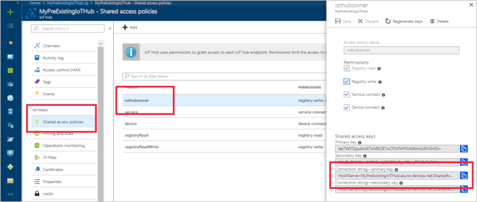
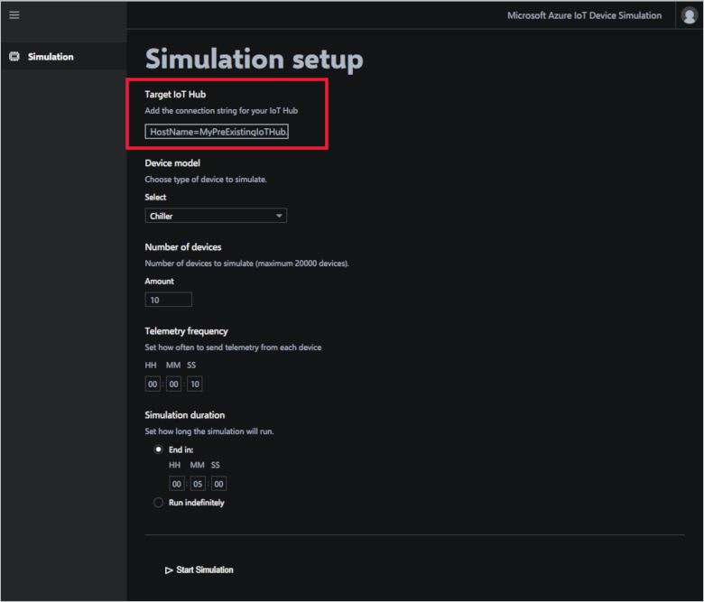

# Use an existing IoT hub with the Device Simulation solution accelerator

When you provision the Device Simulation solution accelerator, you can choose to deploy an IoT hub in the solution accelerator's resource group to use in your simulation.

If you don't choose to deploy the optional IoT Hub, you must use your own hub for any simulations you run. If you do choose to deploy the optional IoT Hub, you can choose to use this optional hub or your own hub.

If you don't have an IoT hub, you can always create a new one from the [Azure portal](https://portal.azure.com).

To use a pre-existing IoT hub, you need a connection string for the **iothubowner** shared access policy. You can get this connection string from the [Azure portal](https://portal.azure.com):

1. On the hub's configuration page in the portal, click **Shared access policies**.
1. Click **iothubowner**.
1. Copy either the primary or secondary connection string.

USe the connection string you copied when you configure the simulation:

## Next steps

In this how-to guide, you've learned how to use an existing IoT hub in a simulation. Next, you may want to learn how to [Configure a custom device model](iot-accelerators-device-simulation-custom-model.md) for a simulation.
