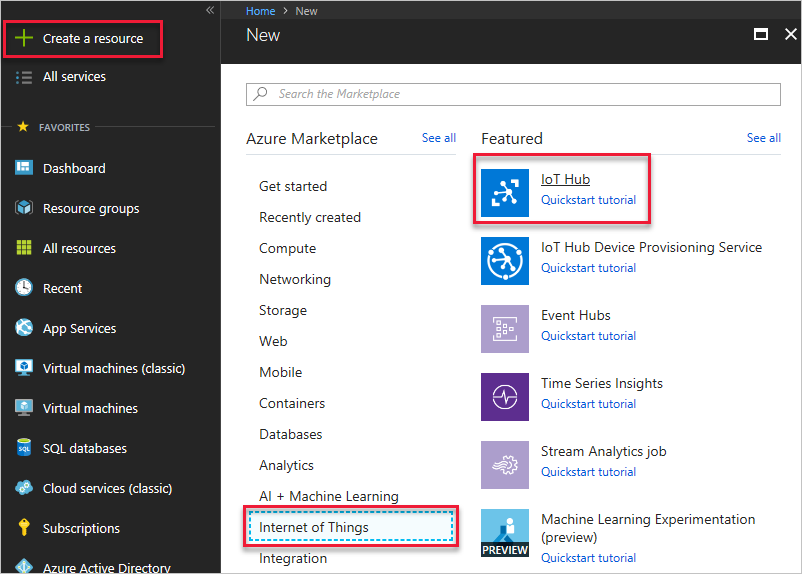
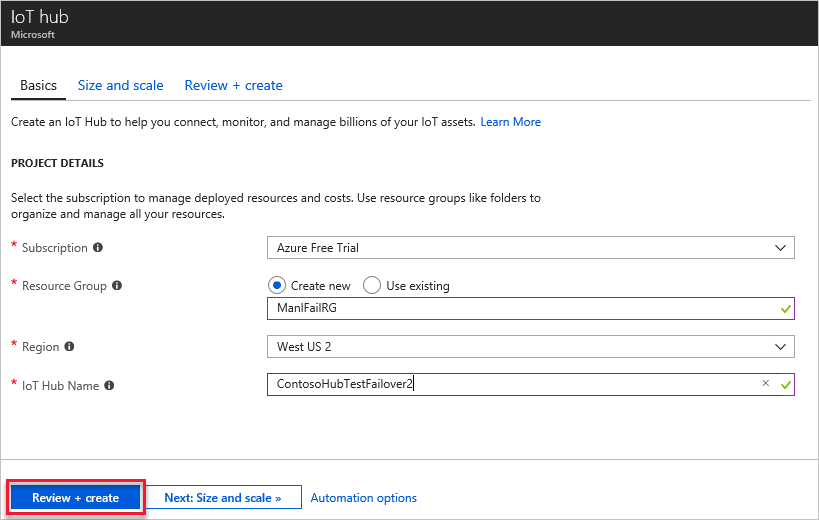
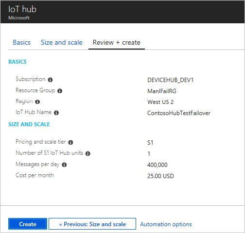
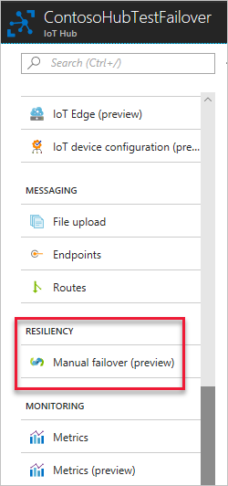
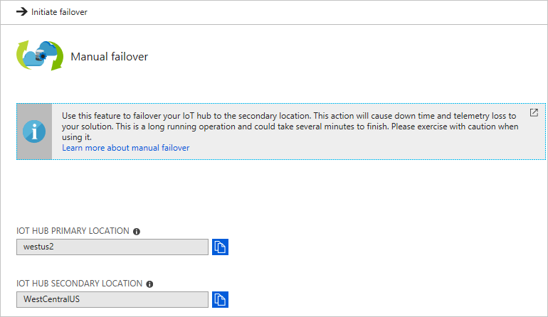
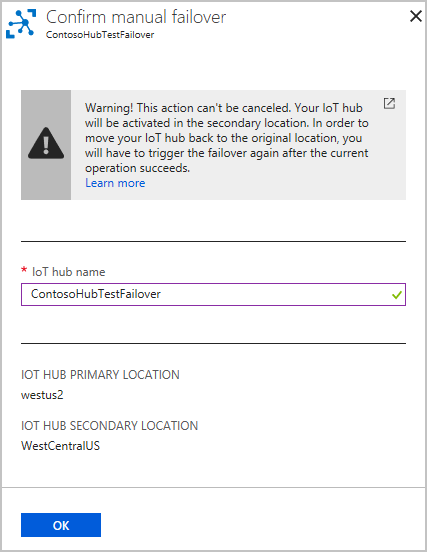
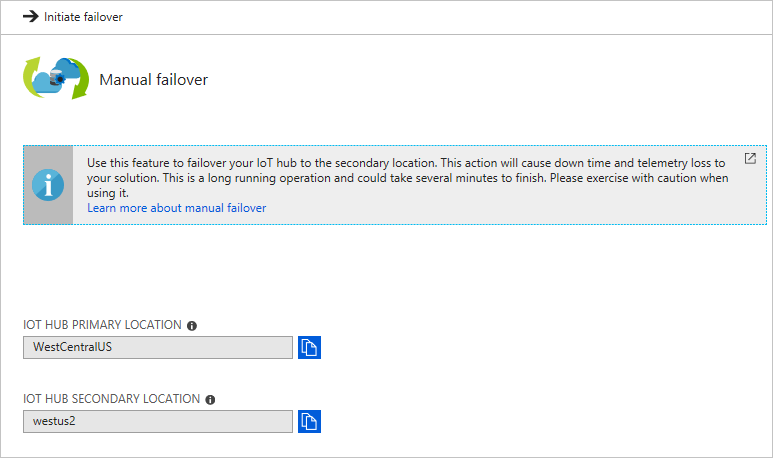
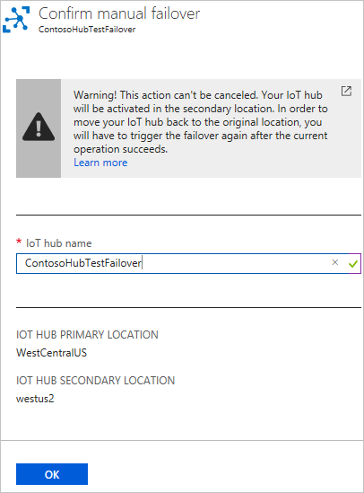

# Tutorial: Perform manual failover for an IoT hub (public preview)

Manual failover is a feature of the IoT Hub service that allows customers to [failover](https://en.wikipedia.org/wiki/Failover) their hub's operations from a primary region to the corresponding Azure geo-paired region. Manual failover can be done in the event of a regional disaster or an extended service outage. You can also perform a planned failover to test your disaster recovery capabilities, although we recommend using a test IoT hub rather than one running in production. The manual failover feature is offered to customers at no additional cost.

In this tutorial, you perform the following tasks:

> [!div class="checklist"]
> * Using the Azure portal, create an IoT hub. 
> * Perform a failover. 
> * See the hub running in the secondary location.
> * Perform a failback to return the IoT hub's operations to the primary location. 
> * Confirm the hub is running correctly in the right location.

## Prerequisites

- An Azure subscription. If you don't have an Azure subscription, create a [free account](https://azure.microsoft.com/free/?WT.mc_id=A261C142F) before you begin.

## Create an IoT hub

1. Log into the [Azure portal](https://portal.azure.com). 

2. Click **+ Create a resource** and select **Internet of Things**, then **IoT Hub**.

   

3. Select the **Basics** tab. Fill in the following fields.

    **Subscription**: select the Azure subscription you want to use.

    **Resource Group**: click **Create new** and specify **ManlFailRG** for the resource group name.

    **Region**: select a region close to you that is part of the preview. This tutorial uses `westus2`. A failover can only be performed between Azure geo-paired regions. The region geo-paired with westus2 is WestCentralUS.
    
   > [!NOTE]
   > Manual failover is currently in public preview and is *not* available in the following Azure regions: East US, West US, North Europe, West Europe, Brazil South, and South Central US.

   **IoT Hub Name**: specify a name for your Iot hub. The hub name must be globally unique. 

   

   Click **Review + create**. (It uses the defaults for size and scale.) 

4. Review the information, then click **Create** to create the IoT hub. 

   

## Perform a manual failover

Note that there is a limit of two failovers and two failbacks per day for an IoT hub.

1. Click **Resource groups** and then select the resource group **ManlFailRG**. Click on your hub in the list of resources. 

2. Under **Resiliency** on the IoT Hub pane, click **Manual failover (preview)**. Note that if your hub is not set up in a valid region, the manual failover option will be disabled.

   

3. On the Manual failover pane, you see the **IoT Hub Primary Location** and the **IoT Hub Secondary Location**. The primary location is initially set to the location you specified when you created the IoT hub, and always indicates the location in which the hub is currently active. The secondary location is the standard [Azure geo-paired region](../best-practices-availability-paired-regions.md) that is paired to the primary location. You cannot change the location values. For this tutorial, the primary location is `westus2` and the secondary location is `WestCentralUS`.

   

3. At the top of the Manual failover pane, click **Initiate failover**. You see the **Confirm manual failover** pane. Fill in the name of your IoT hub to confirm it's the one you want to failover. Then, to initiate the failover, click **OK**.

   The amount of time it takes to perform the manual failover is proportional to the number of devices that are registered for your hub. For example, if you have 100,000 devices, it might take 15 minutes, but if you have five million devices, it might take an hour or longer.

4. In the **Confirm manual failover** pane, fill in the name of your IoT hub to confirm it's the one you want to failover. Then, to initiate the failover, click OK. 

   

   While the manual failover process is running, there is a banner on the Manual Failover pane that tells you a manual failover is in progress. 

   

   If you close the IoT Hub pane and open it again by clicking it on the Resource Group pane, you see a banner that tells you the hub is not active. 

   

   After it's finished, the primary and secondary regions on the Manual Failover page are flipped and the hub is active again. In this example, the primary location is now `WestCentralUS` and the secondary location is now `westus2`. 

   

## Perform a failback 

After you have performed a manual failover, you can switch the hub's operations back to the original primary region -- this is called a failback. If you have just performed a failover, you have to wait about an hour before you can request a failback. If you try to perform the failback in a shorter amount of time, an error message is displayed.

A failback is performed just like a manual failover. These are the steps: 

1. To perform a failback, return to the Iot Hub pane for your Iot hub.

2. Under **Resiliency** on the IoT Hub pane, click **Manual failover (preview)**. 

3. At the top of the Manual failover pane, click **Initiate failover**. You see the **Confirm manual failover** pane. 

4. In the **Confirm manual failover** pane, fill in the name of your IoT hub to confirm it's the one you want to failback. To then initiate the failback, click OK. 

   

   The banners are displayed as explained in the [perform a failover](#perform-a-failover) section. After the failback is complete, it again shows `westus2` as the primary location and `WestCentralUS` as the secondary location, as set originally.

## Clean up resources 

To remove the resources you've created for this tutorial, delete the resource group. This action deletes all resources contained within the group. In this case, it removes the IoT hub and the resource group itself. 

1. Click **Resource Groups**. 

2. Locate and select the resource group **ManlFailRG**. Click on it to open it. 

3. Click **Delete resource group**. When prompted, enter the name of the resource group and click **Delete** to confirm. 

## Next steps

In this tutorial, you learned how to configure and perform a manual failover, and how to request a failback by performing the following tasks:

> [!div class="checklist"]
> * Using the Azure portal, create an IoT hub. 
> * Perform a failover. 
> * See the hub running in the secondary location.
> * Perform a failback to return the IoT hub's operations to the primary location. 
> * Confirm the hub is running correctly in the right location.

Advance to the next tutorial to learn how to manage the state of an IoT device. 

> [!div class="nextstepaction"]
[Manage the state of an IoT device](tutorial-device-twins.md)