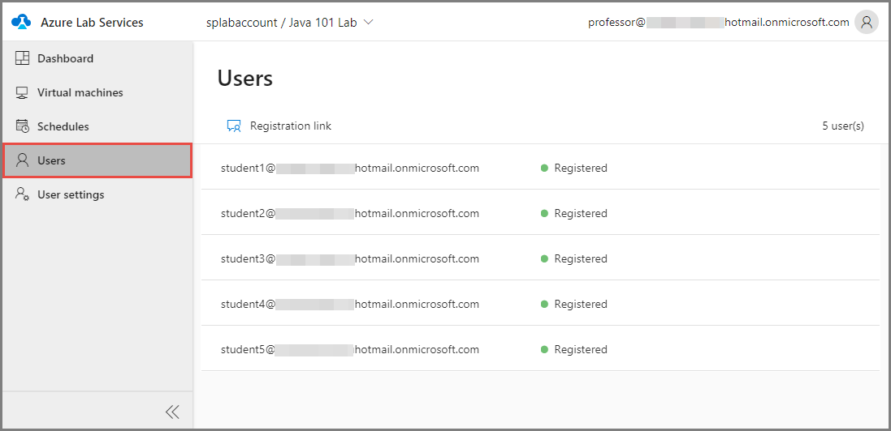
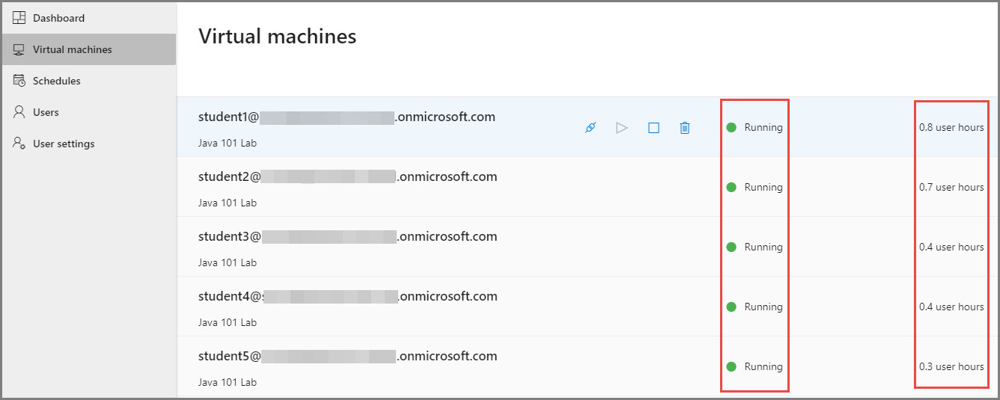
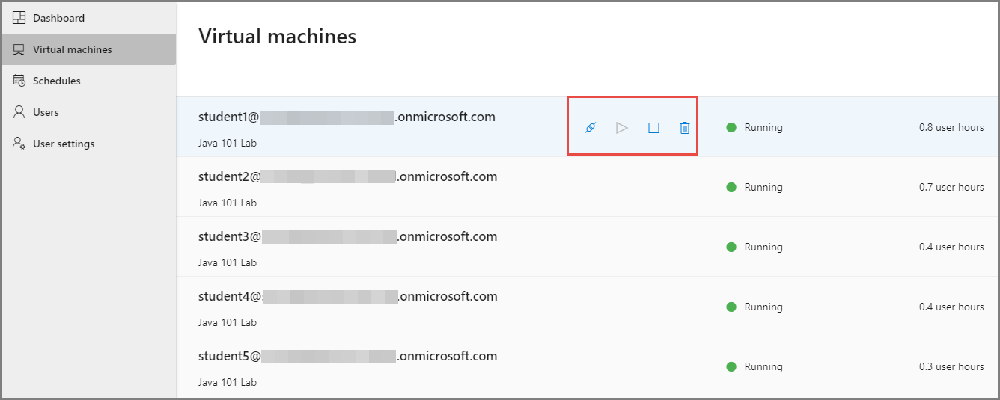

# Tutorial: Track usage of a lab in Azure Lab Service
This tutorial shows you how a lab creator/owner can track usage of a lab.

In this tutorial, you do the following actions:

> [!div class="checklist"]
> * View users registered with your lab
> * View the usage of VMs in the lab
> * Manage student VMs 

## View users registered with the lab

1. Navigate to [Azure Lab Services website](https://labs.azure.com). 
2. Select **Sign in** and enter your credentials. Azure Lab Services supports organizational accounts and Microsoft accounts.
3. On the **My labs** page, select the lab for which you want to track the usage. 
4. Select **Users** tab. You see students who have registered with your lab. Select **Registration link**, copy the link, and send it any new student who hasn't registered with your lab yet. 

    

## View the usage of VMs in the lab 

1. Select **Virtual machines** on menu to the left. 
2. Confirm that you see the status of VMs and the number of hours the VMs have been running. The time you spend on a student VM is not counted against the usage time shown in the last column. 

    

## Manage student VMs 
As you hover the mouse over a row in the list of virtual machine, you see controls to do the following tasks: 

- Connect to a VM
- Start a VM
- Stop a VM
- Delete a VM

 

## Next steps
In this tutorial, you learned how to find users who have registered with the lab, track usage of VMs in the lab, and manage VMs in the lab.

To learn more about classroom labs, see topics under [How-to guides](how-to-manage-lab-accounts.md).
