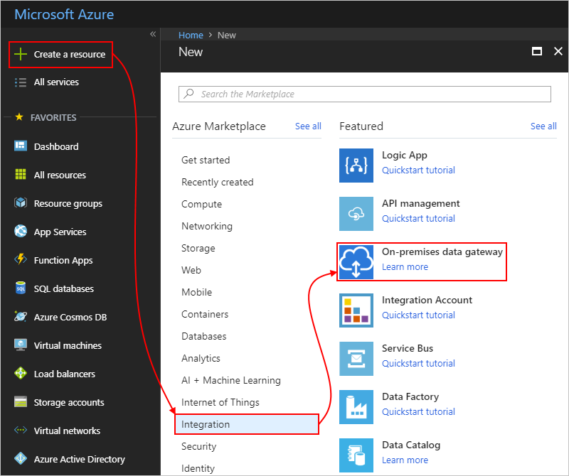
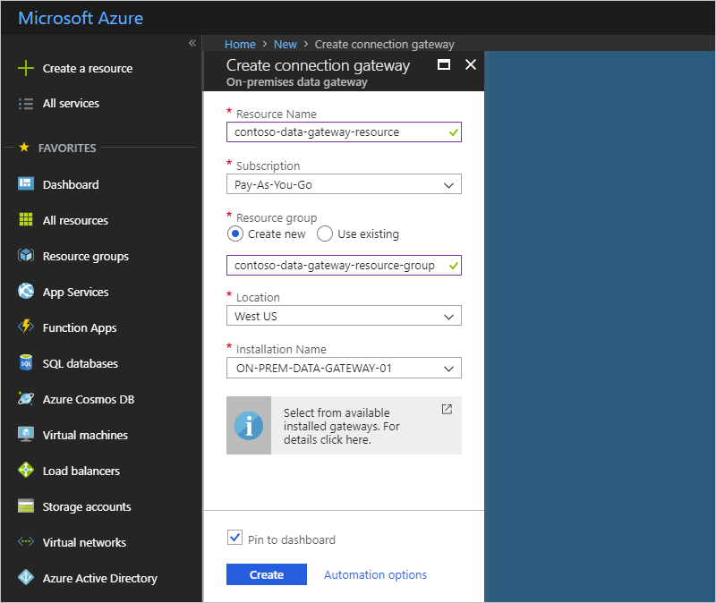
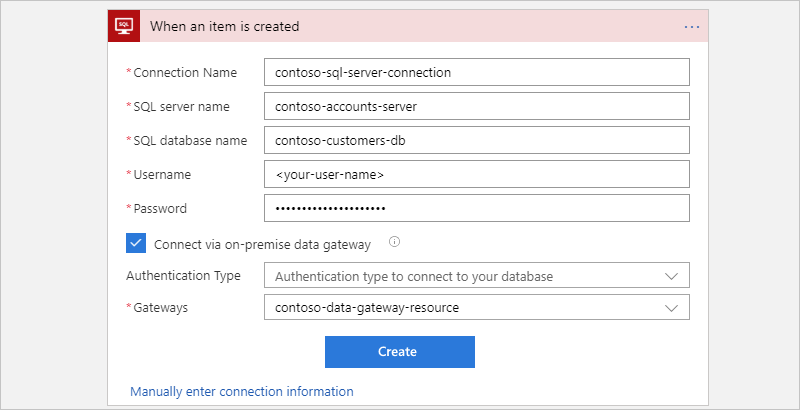
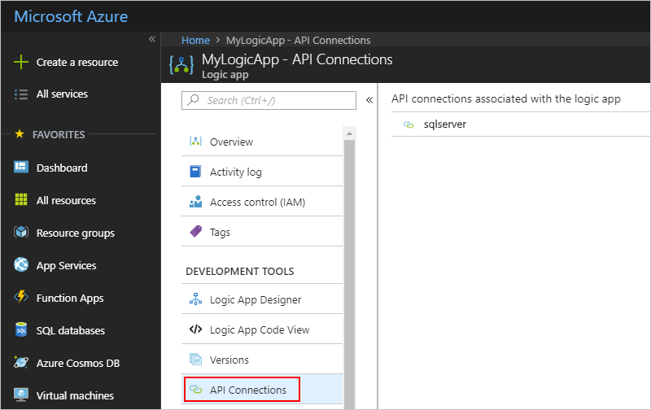

---
# required metadata
title: Access data sources on premises for Azure Logic Apps | Microsoft Docs
description: Create and set up the on-premises data gateway so you can access data sources on premises from logic apps
services: logic-apps
ms.service: logic-apps
author: ecfan
ms.author: estfan
manager: jeconnoc
ms.topic: article
ms.date: 07/20/2018

# optional metadata
ms.reviewer: yshoukry, LADocs
ms.suite: integration
---

# Connect to data sources on premises from Azure Logic Apps with on-premises data gateway

To access data sources on premises from your logic apps, 
you can create a data gateway resource in Azure so that 
your logic apps can use the [on-premises connectors](../logic-apps/logic-apps-gateway-install.md#supported-connections). 
This article shows how to create your Azure gateway resource *after* you 
[download and install the gateway on your local computer](../logic-apps/logic-apps-gateway-install.md). 

For information about how to use the gateway with other services, 
see these articles:

* [Microsoft Power BI on-premises data gateway](https://powerbi.microsoft.com/documentation/powerbi-gateway-onprem/)
* [Microsoft Flow on-premises data gateway](https://flow.microsoft.com/documentation/gateway-manage/)
* [Microsoft PowerApps on-premises data gateway](https://powerapps.microsoft.com/tutorials/gateway-management/)
* [Azure Analysis Services on-premises data gateway](../analysis-services/analysis-services-gateway.md)

## Prerequisites

* You've already [downloaded and installed the data gateway on a local computer](../logic-apps/logic-apps-gateway-install.md).

* Your gateway installation isn't already associated with a gateway resource in Azure. 
You can link your gateway installation only to one gateway resource, which happens when 
you create the gateway resource and select your gateway installation. This linking 
makes the gateway installation unavailable for other resources.

* When you sign in to the Azure portal and create the gateway resource, 
you must use the same sign-in account that was previously used to 
[install the on-premises data gateway](../logic-apps/logic-apps-gateway-install.md#requirements).
You must also use the same [Azure subscription](https://docs.microsoft.com/azure/architecture/cloud-adoption-guide/adoption-intro/subscription-explainer) 
that was used to install the gateway. If you don't have an Azure subscription yet, 
<a href="https://azure.microsoft.com/free/" target="_blank">sign up for a free Azure account</a>.

* To create and maintain the gateway resource in the Azure portal, your 
[Windows service account](../logic-apps/logic-apps-gateway-install.md#windows-service-account) 
must have at least **Contributor** permissions. The on-premises data gateway 
runs as a Windows service and is set up to use `NT SERVICE\PBIEgwService` 
for the Windows service login credentials. 

  > [!NOTE]
  > The Windows service account differs from the account used for 
  > for connecting to on-premises data sources and from the Azure work 
  > or school account used to sign in to cloud services.

## Download and install gateway

Before you can continue with the steps in this article, 
you must have the gateway already installed on a local computer.
and if you haven't already, follow the steps to 
[download and install the on-premises data gateway](../logic-apps/logic-apps-gateway-install.md). 

## Create Azure resource for gateway

After you install the gateway on a local computer, 
you can then create an Azure resource for your gateway. 
This step also associates your gateway resource with your Azure subscription.

1. Sign in to the <a href="https://portal.azure.com" target="_blank">Azure portal</a>. 
Make sure you use the same Azure work or school email address used to install the gateway.

2. On the main Azure menu, select **Create a resource** > 
**Integration** > **On-premises data gateway**.

   

3. On the **Create connection gateway** page, 
provide this information for your gateway resource:

   | Property | Description | 
   |----------|-------------|
   | **Name** | The name for your gateway resource | 
   | **Subscription** | Your Azure subscription's name, which should be the same subscription as your logic app. The default subscription is based on the Azure account you used to sign in. | 
   | **Resource group** | The name for the [Azure resource group](../azure-resource-manager/resource-group-overview.md) for organizing related resources | 
   | **Location** | Azure restricts this location to the same region that was selected for the gateway cloud service during [gateway installation](../logic-apps/logic-apps-gateway-install.md). 
**Note**: Make sure this gateway resource location matches the gateway cloud service location. Otherwise, your gateway installation might not appear in the installed gateways list for you to select in the next step. You can use different regions for your gateway resource and for your logic app. | 
   | **Installation Name** | If your gateway installation isn't already selected, select the gateway that you previously installed. | 
   | | | 

   Here is an example:

   

4. To add the gateway resource to your Azure dashboard, select **Pin to dashboard**. 
When you're done, choose **Create**.

   To find or view your gateway at any time, 
   from the main Azure menu, select **All services**. 
   In the search box, enter "on-premises data gateways", 
   and then select **On-premises Data Gateways**.

   

## Connect to on-premises data

After you create your gateway resource and associate 
your Azure subscription with this resource, 
you can now create a connection between your logic app 
and your on-premises data source by using the gateway.

1. In the Azure portal, create or open 
your logic app in the Logic App Designer.

2. Add a connector that supports on-premises connections, 
for example, **SQL Server**.

3. Now set up your connection:

   1. Select **Connect via on-premises data gateway**. 

   2. For **Gateways**, select the gateway resource you previously created. 

      Although your gateway connection location must exist in the 
      same region as your logic app, you can select a gateway 
      in a different region.

   3. Provide a unique connection name and the other required information. 

      The unique connection name helps you easily identify that connection later, 
      especially when you create multiple connections. If applicable, 
      also include the qualified domain for your username.
   
      Here is an example:

      

   4. When you're done, choose **Create**. 

Your gateway connection is now ready for your logic app to use.

## Edit connection

After you create a gateway connection for your logic app, 
you might want to later update the settings for that specific connection.

1. Find your gateway connection:

   * To find all API connections for just your logic app, 
   on your logic app's menu, under **Development Tools**, 
   select **API Connections**. 
   
     

   * To find all API connections associated with your Azure subscription: 

     * From the main Azure menu, go to **All services** > **Web** > **API Connections**. 
     * Or, from the main Azure menu, go to **All resources**.

2. Select the gateway connection you want, 
and then choose **Edit API connection**.

   > [!TIP]
   > If your updates don't take effect, 
   > try [stopping and restarting the gateway Windows service](./logic-apps-gateway-install.md#restart-gateway).

## Delete gateway resource

To create a different gateway resource, 
associate your gateway with a different resource, 
or remove the gateway resource, 
you can delete the gateway resource without 
affecting the gateway installation. 

1. From the main Azure menu, go to **All resources**. 

2. Find and select your gateway resource.

3. If not already selected, on your gateway resource menu, 
select **On-premises Data Gateway**. 

4. On the resource toolbar, choose **Delete**.

## Frequently asked questions

[!INCLUDE [existing-gateway-location-changed](../../includes/logic-apps-existing-gateway-location-changed.md)]

## Get support

* For questions, visit the [Azure Logic Apps forum](https://social.msdn.microsoft.com/Forums/en-US/home?forum=azurelogicapps).
* To submit or vote on feature ideas, visit the [Logic Apps user feedback site](http://aka.ms/logicapps-wish).

## Next steps

* [Secure your logic apps](./logic-apps-securing-a-logic-app.md)
* [Common examples and scenarios for logic apps](./logic-apps-examples-and-scenarios.md)
