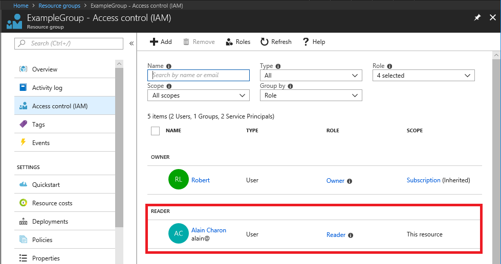

# Manage access using RBAC and Azure Resource Manager templates

[Role-based access control (RBAC)](overview.md) is the way that you manage access to resources in Azure. In addition to using Azure PowerShell or the Azure CLI, you can manage access to Azure resources using RBAC and [Azure Resource Manager templates](../azure-resource-manager/resource-group-authoring-templates.md). Templates can be helpful if you need to deploy resources consistently and repeatedly. This article describes how you can manage access using RBAC and templates.

## Example template to create a role assignment

In RBAC, to grant access, you create a role assignment. The following template demonstrates:
- How to assign a role to a user, group, or application at the resource group scope
- How to specify the Owner, Contributor, and Reader roles as a parameter

To use the template, you must specify the following inputs:
- The name of a resource group
- The unique identifier of a user, group, or application to assign the role to
- The role to assign
- A unique identifier that will be used for the role assignment

```json
{
  "$schema": "https://schema.management.azure.com/schemas/2015-01-01/deploymentTemplate.json#",
  "contentVersion": "1.0.0.0",
  "parameters": {
    "principalId": {
      "type": "string",
      "metadata": {
        "description": "The principal to assign the role to"
      }
    },
    "builtInRoleType": {
      "type": "string",
      "allowedValues": [
        "Owner",
        "Contributor",
        "Reader"
      ],
      "metadata": {
        "description": "Built-in role to assign"
      }
    },
    "roleNameGuid": {
      "type": "string",
      "metadata": {
        "description": "A new GUID used to identify the role assignment"
      }
    }
  },
  "variables": {
    "Owner": "[concat('/subscriptions/', subscription().subscriptionId, '/providers/Microsoft.Authorization/roleDefinitions/', '8e3af657-a8ff-443c-a75c-2fe8c4bcb635')]",
    "Contributor": "[concat('/subscriptions/', subscription().subscriptionId, '/providers/Microsoft.Authorization/roleDefinitions/', 'b24988ac-6180-42a0-ab88-20f7382dd24c')]",
    "Reader": "[concat('/subscriptions/', subscription().subscriptionId, '/providers/Microsoft.Authorization/roleDefinitions/', 'acdd72a7-3385-48ef-bd42-f606fba81ae7')]",
    "scope": "[resourceGroup().id]"
  },
  "resources": [
    {
      "type": "Microsoft.Authorization/roleAssignments",
      "apiVersion": "2017-05-01",
      "name": "[parameters('roleNameGuid')]",
      "properties": {
        "roleDefinitionId": "[variables(parameters('builtInRoleType'))]",
        "principalId": "[parameters('principalId')]",
        "scope": "[variables('scope')]"
      }
    }
  ]
}
```

The following shows an example of a Reader role assignment to a user after deploying the template.



## Deploy template using Azure PowerShell

To deploy the previous template using Azure PowerShell, follow these steps.

1. Create a new file named rbac-rg.json and copy the previous template.

1. Sign in to [Azure PowerShell](/powershell/azure/authenticate-azureps).

1. Get the unique identifier of a user, group, or application. For example, you can use the [Get-AzureRmADUser](/powershell/module/azurerm.resources/get-azurermaduser) command to list Azure AD users.

    ```azurepowershell
    Get-AzureRmADUser
    ```

1. Use a GUID tool to generate a unique identifier that will be used for the role assignment. The identifier has the format: `11111111-1111-1111-1111-111111111111`

1. Create an example resource group.

    ```azurepowershell
    New-AzureRmResourceGroup -Name ExampleGroup -Location "Central US"
    ```

1. Use the [New-AzureRmResourceGroupDeployment](/powershell/module/azurerm.resources/new-azurermresourcegroupdeployment) command to start the deployment.

    ```azurepowershell
    New-AzureRmResourceGroupDeployment -ResourceGroupName ExampleGroup -TemplateFile rbac-rg.json
    ```

    You are asked to specify the required parameters. The following shows an example of the output.

    ```Output
    PS /home/user> New-AzureRmResourceGroupDeployment -ResourceGroupName ExampleGroup -TemplateFile rbac-rg.json
    
    cmdlet New-AzureRmResourceGroupDeployment at command pipeline position 1
    Supply values for the following parameters:
    (Type !? for Help.)
    principalId: 22222222-2222-2222-2222-222222222222
    builtInRoleType: Reader
    roleNameGuid: 11111111-1111-1111-1111-111111111111
    
    DeploymentName          : rbac-rg
    ResourceGroupName       : ExampleGroup
    ProvisioningState       : Succeeded
    Timestamp               : 7/17/2018 7:46:32 PM
    Mode                    : Incremental
    TemplateLink            :
    Parameters              :
                              Name             Type                       Value
                              ===============  =========================  ==========
                              principalId      String                     22222222-2222-2222-2222-222222222222
                              builtInRoleType  String                     Reader
                              roleNameGuid     String                     11111111-1111-1111-1111-111111111111
    
    Outputs                 :
    DeploymentDebugLogLevel :
    ```

## Deploy template using the Azure CLI

To deploy the previous template using the Azure CLI, follow these steps.

1. Create a new file named rbac-rg.json and copy the previous template.

1. Sign in to the [Azure CLI](/cli/azure/authenticate-azure-cli).

1. Get the unique identifier of a user, group, or application. For example, you can use the [az ad user list](/cli/azure/ad/user#az-ad-user-list) command to list Azure AD users.

    ```azurecli
    az ad user list
    ```

1. Use a GUID tool to generate a unique identifier that will be used for the role assignment. The identifier has the format: `11111111-1111-1111-1111-111111111111`

1. Create an example resource group.

    ```azurecli
    az group create --name ExampleGroup --location "Central US"
    ```

1. Use the [az group deployment create](/cli/azure/group/deployment#az-group-deployment-create) command to start the deployment.

    ```azurecli
    az group deployment create --resource-group ExampleGroup --template-file rbac-rg.json
    ```

    You are asked to specify the required parameters. The following shows an example of the output.

    ```Output
    C:\Azure\Templates>az group deployment create --resource-group ExampleGroup --template-file rbac-rg.json
    Please provide string value for 'principalId' (? for help): 22222222-2222-2222-2222-222222222222
    Please provide string value for 'builtInRoleType' (? for help):
     [1] Owner
     [2] Contributor
     [3] Reader
    Please enter a choice [1]: 3
    Please provide string value for 'roleNameGuid' (? for help): 11111111-1111-1111-1111-111111111111
    {
      "id": "/subscriptions/00000000-0000-0000-0000-000000000000/resourceGroups/ExampleGroup/providers/Microsoft.Resources/deployments/rbac-rg",
      "name": "rbac-rg",
      "properties": {
        "additionalProperties": {
          "duration": "PT9.5323924S",
          "outputResources": [
            {
              "id": "/subscriptions/00000000-0000-0000-0000-000000000000/resourceGroups/ExampleGroup/providers/Microsoft.Authorization/roleAssignments/11111111-1111-1111-1111-111111111111",
              "resourceGroup": "ExampleGroup"
            }
          ],
          "templateHash": "0000000000000000000"
        },
        "correlationId": "33333333-3333-3333-3333-333333333333",
        "debugSetting": null,
        "dependencies": [],
        "mode": "Incremental",
        "outputs": null,
        "parameters": {
          "builtInRoleType": {
            "type": "String",
            "value": "Reader"
          },
          "principalId": {
            "type": "String",
            "value": "22222222-2222-2222-2222-222222222222"
          },
          "roleNameGuid": {
            "type": "String",
            "value": "11111111-1111-1111-1111-111111111111"
          }
        },
        "parametersLink": null,
        "providers": [
          {
            "id": null,
            "namespace": "Microsoft.Authorization",
            "registrationState": null,
            "resourceTypes": [
              {
                "aliases": null,
                "apiVersions": null,
                "locations": [
                  null
                ],
                "properties": null,
                "resourceType": "roleAssignments"
              }
            ]
          }
        ],
        "provisioningState": "Succeeded",
        "template": null,
        "templateLink": null,
        "timestamp": "2018-07-17T19:00:31.830904+00:00"
      },
      "resourceGroup": "ExampleGroup"
    }
    ```
    
## Next steps

- [Create and deploy your first Azure Resource Manager template](../azure-resource-manager/resource-manager-create-first-template.md)
- [Understand the structure and syntax of Azure Resource Manager Templates](../azure-resource-manager/resource-group-authoring-templates.md)
- [Azure Quickstart Templates](https://azure.microsoft.com/resources/templates/?term=rbac)
