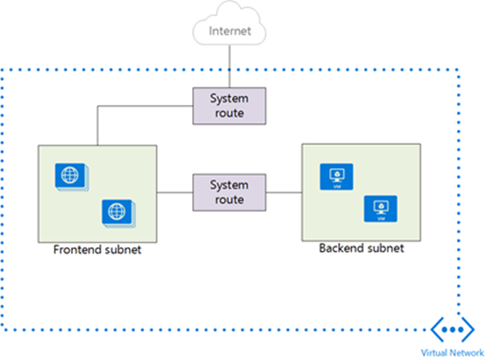
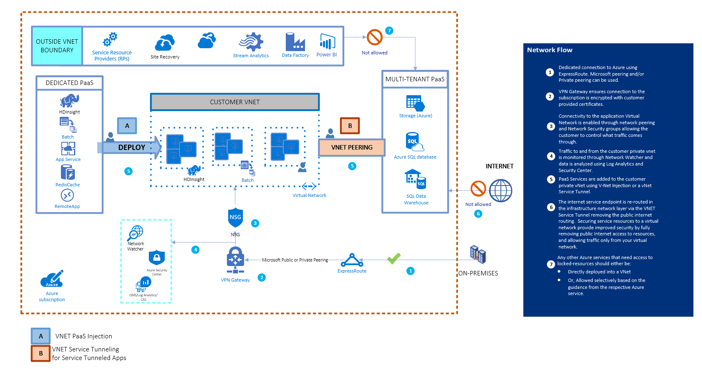
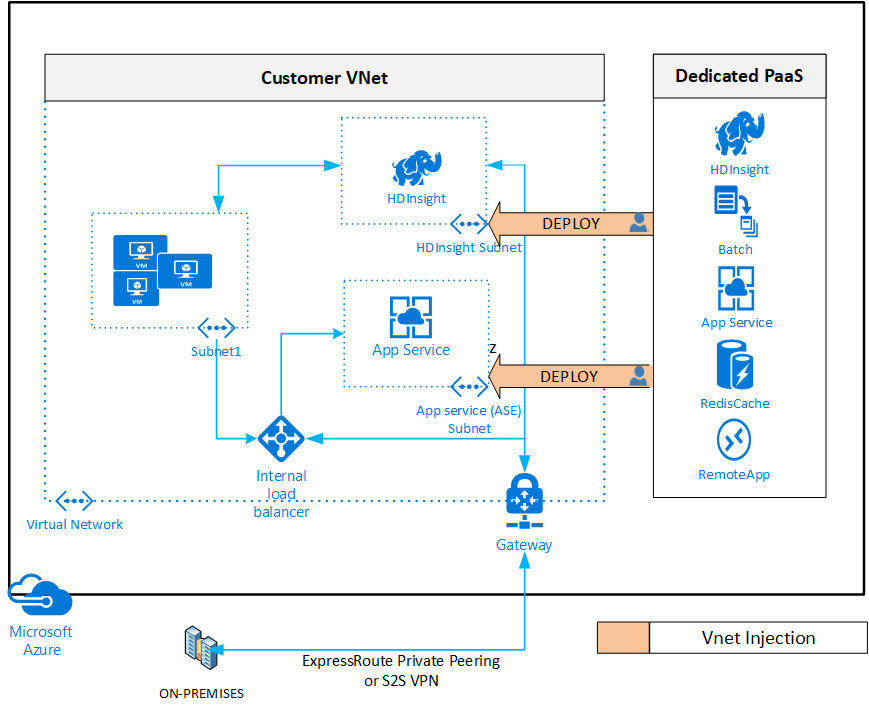
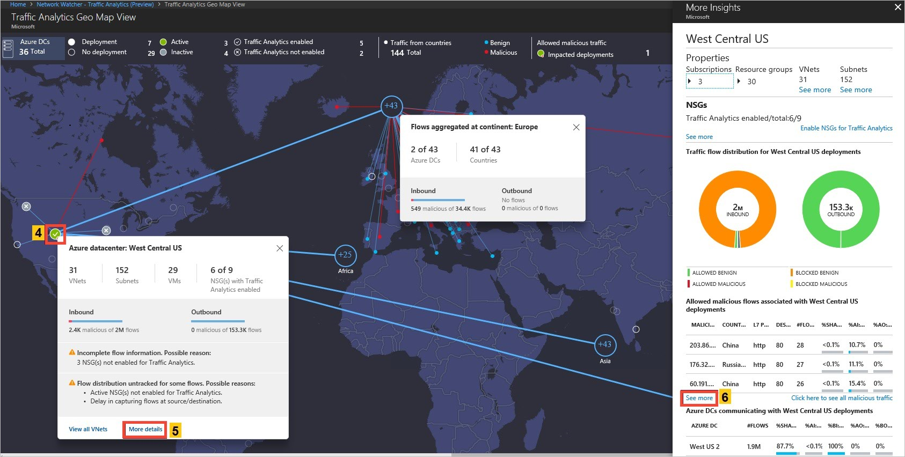
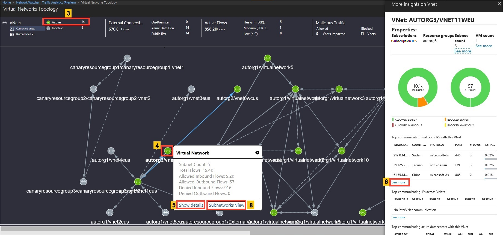
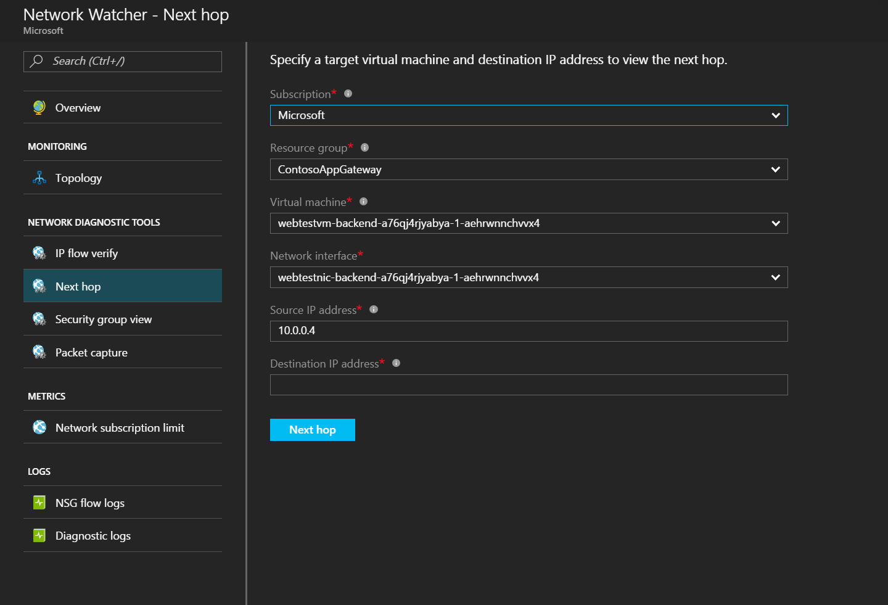

# Trusted Internet Connections guidance

This article covers how government agencies can use Microsoft Azure Government to help achieve compliance with the Trusted Internet Connections (TIC) initiative. The article describes how to use Azure Government across Azure infrastructure as a service (IaaS) and Azure platform as a service (PaaS) offerings.

## Trusted Internet Connections overview

The purpose of the TIC initiative is to optimize and standardize the security of individual external network connections that are used by federal agencies. The policy is outlined in the [Office of Management and Budget (OMB) Memorandum M-08-05](https://georgewbush-whitehouse.archives.gov/omb/memoranda/fy2008/m08-05.pdf).

In November 2007, the OMB established the TIC program to improve federal network perimeter security and incident response functions. TIC is designed to perform network analysis of all inbound and outbound .gov traffic to identify specific signatures and pattern-based data. TIC uncovers behavioral anomalies, such as botnet activity. Agencies are mandated to consolidate their external network connections and route all traffic through intrusion detection and prevention devices known as EINSTEIN. The devices are hosted at a limited number of network endpoints, which are referred to as _trusted internet connections_.

The objective of TIC is for agencies to know:
- Who is on my network (authorized or unauthorized)?
- When is my network accessed and why?
- What resources are accessed?

All agency external connections must currently route through an OMB-approved TIC. Federal agencies are required to participate in the TIC program as a TIC Access Provider (TICAP), or by contracting services with one of the major tier 1 internet service providers. These providers are referred to as Managed Trusted Internet Protocol Service (MTIPS) providers. TIC includes mandatory critical capabilities that are performed by the agency and MTIPS provider. In the current version of TIC, the EINSTEIN version 2 intrusion detection and EINSTEIN version 3 accelerated (3A) intrusion prevention devices are deployed at each TICAP and MTIPS. The agency establishes a "Memorandum of Understanding" with the Department of Homeland Security (DHS) to deploy EINSTEIN capabilities to federal systems.

As part of its responsibility to protect the .gov network, DHS requires the raw data feeds of agency net flow data to correlate incidents across the federal enterprise and perform analyses by using specialized tools. DHS routers provide the ability to collect IP network traffic as it enters or exits an interface. Network administrators can analyze the net flow data to determine the source and destination of traffic, the class of service, and so on. Net flow data is considered to be "non-content data" similar to the header, source IP, destination IP, and so on. Non-content data allows DHS to learn about the content: who was doing what and for how long.

The initiative also includes security policies, guidelines, and frameworks that assume on-premises infrastructure. As government agencies move to the cloud to achieve cost savings, operational efficiency, and innovation, the implementation requirements of TIC can slow down network traffic. The speed and agility with which government users can access their cloud-based data is limited as a result.

## Azure networking options

There are three main options to connect to Azure services:

- Direct internet connection: Connect to Azure services directly through an open internet connection. The medium and the connection are public. Application and transport level encryption are relied upon to ensure privacy. Bandwidth is limited by a site's connectivity to the internet. Use more than one active provider to ensure resiliency.
- Virtual private network (VPN): Connect to your Azure virtual network privately by using a VPN gateway.
The medium is public because it traverses a site's standard internet connection, but the connection is encrypted in a tunnel to ensure privacy. Bandwidth is limited depending on the VPN devices and the configuration chosen. Azure point-to-site connections are typically limited to 100 Mbps and site-to-site connections are limited to 1.25 Gbps.
- Azure ExpressRoute: ExpressRoute is a direct connection to Microsoft services. Because connectivity is through an isolated fiber channel, the connection can be public or private depending on the configuration that's used. The bandwidth is typically limited to a maximum of 10 Gbps.

There are several ways to meet the TIC Appendix H (Cloud Considerations) requirements, as specified in the Department of Homeland Security's, "Trusted Internet Connections (TIC) Reference Architecture Document, Version 2.0." In this article, DHS TIC guidance is referred to as **TIC 2.0**.

To enable the connection from the **Department or Agency (D/A)** to Azure or Office 365, without routing traffic through the D/A TIC, the D/A must use an encrypted tunnel or a dedicated connection to the cloud service provider (CSP). The CSP services can ensure connectivity to the D/A cloud assets isn't offered to the public internet for direct agency personnel access.

Office 365 is compliant with TIC 2.0 Appendix H by using either ExpressRoute with [Microsoft Peering](https://docs.microsoft.com/azure/expressroute/expressroute-circuit-peerings#expressroute-routing-domains) enabled or an internet connection that encrypts all traffic by using TLS 1.2. D/A end users on the D/A network can connect via their agency network and TIC infrastructure through the internet. All remote internet access to Office 365 is blocked and routes through the agency. The D/A can also connect to Office 365 over an ExpressRoute connection with Microsoft Peering (a type of public peering) enabled.  

For Azure only, the second option (VPN) and third option (ExpressRoute) can meet these requirements when they're used in conjunction with services that limit access to the internet.

## Azure infrastructure as a service offerings

Compliance with TIC policy by using Azure IaaS is relatively simple because Azure customers manage their own virtual network routing.

The main requirement to help assure compliance with the TIC reference architecture is to ensure your virtual network is a private extension of the D/A network. To be a _private_ extension, the policy requires no traffic leave your network except via the on-premises TIC network connection. This process is known as _force tunneling_. For TIC compliance, the process routes all traffic from any system in the CSP environment through an on-premises gateway on an organization's network out to the internet through the TIC.

Azure IaaS TIC compliance is divided into two major steps:

- Step 1: Configuration.
- Step 2: Auditing.

### Azure IaaS TIC compliance: Configuration

To configure a TIC-compliant architecture with Azure, you must first prevent direct internet access to your virtual network and then force internet traffic through the on-premises network.

#### Prevent direct internet access

Azure IaaS networking is conducted via virtual networks that are composed of subnets to which the network interface controllers (NICs) of virtual machines are associated.

The simplest scenario to support TIC compliance is to assure that a virtual machine, or a collection of virtual machines, can't connect to any external resources. Assure the disconnection from external networks by using network security groups (NSGs). Use NSGs to control traffic to one or more NICs or subnets in your virtual network. An NSG contains access control rules that allow or deny traffic based on traffic direction, protocol, source address and port, and destination address and port. You can change the rules of an NSG at any time, and changes are applied to all associated instances. To learn more about how to create an NSG, see [Filter network traffic with a network security group](https://docs.microsoft.com/azure/virtual-network/virtual-networks-create-nsg-arm-pportal).

#### Force internet traffic through an on-premises network

Azure automatically creates system routes and assigns the routes to each subnet in a virtual network. You can't create or remove system routes, but you can override some system routes with custom routes. Azure creates default system routes for each subnet. Azure adds optional default routes to specific subnets, or every subnet, when you use specific Azure capabilities. This type of routing ensures:
- Traffic that's destined within the virtual network stays within the virtual network.
- IANA-designated private address spaces like 10.0.0.0/8 are dropped, unless they're included in the virtual network address space.
- "Last-resort" routing of 0.0.0.0/0 to the virtual network internet endpoint.

All traffic that leaves the virtual network needs to route through the on-premises connection, to ensure that all traffic traverses the D/A TIC. You create custom routes by creating user-defined routes, or by exchanging Border Gateway Protocol (BGP) routes between your on-premises network gateway and an Azure VPN gateway. For more information about user-defined routes, see [Virtual network traffic routing: User-defined routes](https://docs.microsoft.com/azure/virtual-network/virtual-networks-udr-overview#user-defined). For more information about the BGP, see [Virtual network traffic routing: Border Gateway Protocol](https://docs.microsoft.com/azure/virtual-network/virtual-networks-udr-overview#border-gateway-protocol).

#### Add user-defined routes

If you use a route-based virtual network gateway, you can force tunneling in Azure. Add a user-defined route (UDR) that sets 0.0.0.0/0 traffic to route to a **next hop** of your virtual network gateway. Azure prioritizes user-defined routes over system-defined routes. All non-virtual network traffic is sent to your virtual network gateway, which can then route the traffic to on-premises. After you define the UDR, associate the route with existing subnets or new subnets within all virtual networks in your Azure environment.

#### Use the Border Gateway Protocol

If you use ExpressRoute or a BGP-enabled virtual network gateway, BGP is the preferred mechanism for advertising routes. For a BGP advertised route of 0.0.0.0/0, ExpressRoute and BGP-aware virtual network gateways ensure the default route applies to all subnets within your virtual networks.

### Azure IaaS TIC compliance: Auditing

Azure offers several ways to audit TIC compliance.

#### View effective routes

Confirm that your default route is propagated by observing the _effective routes_ for a particular virtual machine, a specific NIC, or a user-defined route table in [the Azure portal](https://docs.microsoft.com/azure/virtual-network/virtual-network-routes-troubleshoot-portal#diagnose-using-azure-portal) or in [Azure PowerShell](https://docs.microsoft.com/azure/virtual-network/virtual-network-routes-troubleshoot-powershell#diagnose-using-powershell). The **Effective Routes** show the relevant user-defined routes, BGP advertised routes, and system routes that apply to the relevant entity, as shown in the following figure:

> [!NOTE]
> You can't view the effective routes for a NIC, unless the NIC is associated with a running virtual machine.

#### Use Azure Network Watcher

Azure Network Watcher offers several tools to audit TIC compliance. For more information, see [this overview about Network Watcher](https://docs.microsoft.com/azure/network-watcher/network-watcher-monitoring-overview).

##### Capture network security group flow logs 

Use Network Watcher to capture network flow logs that indicate the metadata that surrounds IP traffic. The network flow logs contain the source and destination addresses of targets, and other data. You can use this data with logs from the virtual network gateway, on-premises edge devices, or the TIC, to monitor that all traffic routes on-premises. 

## Azure platform as a service offerings

Azure PaaS services, such as Azure Storage, are accessible through an internet-reachable URL. Anyone with approved credentials can access the resource, such as a storage account, from any location without traversing a TIC. For this reason, many government customers incorrectly conclude that Azure PaaS services aren't compliant with TIC policies. Many Azure PaaS services can be compliant with TIC policy. A service is compliant when the architecture is the same as the TIC-compliant IaaS environment ([as previously described](https://docs.microsoft.com/azure/security/compliance/compliance-tic#azure-infrastructure-as-a-service-offerings)) and the service is attached to an Azure virtual network.

When Azure PaaS services are integrated with a virtual network, the service is privately accessible from that virtual network. You can apply custom routing for 0.0.0.0/0 via user-defined routes or BGP. Custom routing ensures that all internet-bound traffic routes on-premises to traverse the TIC. Integrate Azure services into virtual networks by using the following patterns:

- **Deploy a dedicated instance of a service**: An increasing number of PaaS services are deployable as dedicated instances with virtual network-attached endpoints. You can deploy an App Service Environment for PowerApps in "Isolated" mode to allow the network endpoint to be constrained to a virtual network. The App Service Environment can then host many Azure PaaS services, such as Azure Web Apps, Azure API Management, and Azure Functions.
- **Use virtual network service endpoints**: An increasing number of PaaS services allow the option to move their endpoint to a virtual network private IP instead of a public address.

Services that support deployment of dedicated instances into a virtual network or use of service endpoints, as of May 2018, are listed in the following tables.

> [!Note]
> The availability status corresponds to the Azure services that are commercially available. The availability status for Azure services in Azure Government is pending.

### Support for service endpoints

|Service                        |Availability      |
|-------------------------------|------------------|
|Azure Key Vault                | Private preview  |
|Azure Cosmos DB                | Private preview  |
|Identity services              | Private preview  |
|Azure Data Lake                | Private preview  |
|Azure Database for PostgreSQL  | Private preview  |
|Azure Database for MySQL       | Private preview  |
|Azure SQL Data Warehouse       | Public preview   |
|Azure SQL Database             | General availability (GA) |
|Azure Storage                  | GA               |

### Support for virtual network injection

|Service                               |Availability      |
|--------------------------------------|------------------|
|Azure SQL Database Managed Instance   | Public preview   |
|Azure Kubernetes Service (AKS)        | Public preview   |
|Azure Service Fabric                  | GA               |
|Azure API Management                  | GA               |
|Azure Active Directory                | GA               |
|Azure Batch                           | GA               |
|App Service Environment               | GA               |
|Azure Redis Cache                     | GA               |
|Azure HDInsight                       | GA               |
|Virtual machine scale set             | GA               |
|Azure Cloud Services                  | GA               |

### Virtual network integration details

The following diagram shows the general network flow for access to PaaS services. Access is shown from both virtual network injection and virtual network service tunneling. For more information about network service gateways, virtual networks, and service tags, see [Network and application security groups: Service tags](https://docs.microsoft.com/azure/virtual-network/security-overview#service-tags).

1. A private connection is made to Azure by using ExpressRoute. ExpressRoute private peering with forced tunneling is used to force all customer virtual network traffic over ExpressRoute and back to on-premises. Microsoft Peering isn't required.
2. Azure VPN Gateway, when used in conjunction with ExpressRoute and Microsoft Peering, can overlay end-to-end IPSec encryption between the customer virtual network and the on-premises edge. 
3. Network connectivity to the customer virtual network is controlled by using NSGs that allow customers to permit/deny based on IP, port, and protocol.
4. The customer virtual network extends to the PaaS service by creating a service endpoint for the customer's service.
5. The PaaS service endpoint is secured to **default deny all** and to only allow access from specified subnets within the customer virtual network. The default denies also includes connections that originate from the internet.
6. Other Azure services that need to access resources within the customer virtual network should either be:  
   - Directly deployed into the virtual network.
   - Selectively allowed, based on the guidance from the respective Azure service.

#### Option A: Deploy a dedicated instance of a service (virtual network injection)

Virtual network injection enables customers to selectively deploy dedicated instances of a given Azure service, such as HDInsight, into their own virtual network. Service instances are deployed into a dedicated subnet in a customer's virtual network. Virtual network injection allows access to service resources through the non-internet routable addresses. On-premises instances use ExpressRoute or a site-to-site VPN to directly access service instances via virtual network address space, instead of opening a firewall to public internet address space. When a dedicated instance is attached to an endpoint, you can use the same strategies as for IaaS TIC compliance. Default routing ensures internet-bound traffic is redirected to a virtual network gateway that's bound for on-premises. You can further control inbound and outbound access through NSGs for the given subnet.

#### Option B: Use virtual network service endpoints (service tunnel)

An increasing number of Azure multitenant services offer "service endpoints." Service endpoints are an alternate method for integrating to Azure virtual networks. Virtual network service endpoints extend your virtual network IP address space and the identity of your virtual network to the service over a direct connection. Traffic from the virtual network to the Azure service always stays within the Azure backbone network. 

After you enable a service endpoint for a service, use policies exposed by the service
to restrict connections for the service to that virtual network. Access checks are enforced in the platform by the Azure service. Access to a locked resource is granted only if the request originates from the allowed virtual network or subnet, or from the two IPs that are used to identify your on-premises traffic if you use ExpressRoute. Use this method to effectively prevent inbound/outbound traffic from directly leaving the PaaS service.

## Cloud-native tools for network situational awareness

Azure provides cloud-native tools to help ensure that you have the situational awareness that's required to understand the traffic flows of your network. The tools aren't required for compliance with TIC policy. The tools can vastly improve your security capabilities.

### Azure Policy

[Azure Policy](https://azure.microsoft.com/services/azure-policy/) is an Azure service that provides your organization with better ability to audit and enforce compliance initiatives. Azure Policy is currently available in public preview in Azure services that are commercially available. Azure Policy isn't yet available in Azure Government. Customers can plan and test their Azure Policy rules now to assure future TIC compliance. 

Azure Policy is targeted at the subscription level. The service provides a centralized interface where you can perform compliance tasks, including:
- Manage initiatives
- Configure policy definitions
- Audit compliance
- Enforce compliance
- Manage exceptions

Along with many built-in definitions, administrators can define their own custom definitions by using simple JSON templates. Microsoft recommends the prioritization of auditing over enforcement, where possible.

The following sample policies can be used for TIC compliance scenarios:

|Policy  |Sample scenario  |Template  |
|---------|---------|---------|
|Enforce user-defined route table. | Ensure that the default route on all virtual networks points to an approved virtual network gateway for routing to on-premises.	| Get started with this [template](https://docs.microsoft.com/azure/azure-policy/scripts/no-user-def-route-table). |
|Audit if Network Watcher isn't enabled for a region.  | Ensure that Network Watcher is enabled for all used regions.  | Get started with this [template](https://docs.microsoft.com/azure/azure-policy/scripts/net-watch-not-enabled). |
|NSG x on every subnet.  | Ensure that an NSG (or a set of approved NSGs) with internet traffic blocked is applied to all subnets in every virtual network. | Get started with this [template](https://docs.microsoft.com/azure/azure-policy/scripts/nsg-on-subnet). |
|NSG x on every NIC. | Ensure that an NSG with internet traffic blocked is applied to all NICs on all virtual machines. | Get started with this [template](https://docs.microsoft.com/azure/azure-policy/scripts/nsg-on-nic). |
|Use an approved virtual network for virtual machine network interfaces.  | Ensure that all NICs are on an approved virtual network. | Get started with this [template](https://docs.microsoft.com/azure/azure-policy/scripts/use-approved-vnet-vm-nics). |
|Allowed locations. | Ensure that all resources are deployed to regions with compliant virtual networks and Network Watcher configuration.  | Get started with this [template](https://docs.microsoft.com/azure/azure-policy/scripts/allowed-locs). |
|Not allowed resource types, such as **PublicIPs**. | Prohibit the deployment of resource types that don't have a compliance plan. Use this policy to prohibit the deployment of public IP address resources. While NSG rules can be used to effectively block inbound internet traffic, preventing the use of public IPs further reduces the attack surface.	| Get started with this [template](https://docs.microsoft.com/azure/azure-policy/scripts/not-allowed-res-type).  |

### Network Watcher traffic analytics

Network Watcher [traffic analytics](https://azure.microsoft.com/en-in/blog/traffic-analytics-in-preview/) consume flow log data and other logs to provide a high-level overview of network traffic. The data is useful for auditing TIC compliance and to identify trouble spots. You can use the high-level dashboard to rapidly screen the virtual machines that are communicating with the internet and get a focused list for TIC routing.

Use the **Geo Map** to quickly identify the probable physical destinations of internet traffic for your virtual machines. You can identify and triage suspicious locations or pattern changes:

Use the **Virtual Networks Topology** to rapidly survey existing virtual networks:

### Network Watcher next hop tests

Networks in regions that are monitored by Network Watcher can conduct next hop tests. In the Azure portal, you can enter a source and destination for a sample network flow for Network Watcher to resolve the next hop destination. Run this test against virtual machines and sample internet addresses to ensure the next hop destination is the expected network virtual gateway.

## Conclusions

You can easily configure access for Microsoft Azure, Office 365, and Dynamics 365 to help comply with TIC 2.0 Appendix H guidance, as written and defined May 2018. Microsoft recognizes that the TIC guidance is subject to change. Microsoft endeavors to help customers meet the guidance in a timely manner as new guidance is released.

## Appendix: Trusted Internet Connections patterns for common workloads

| Category | Workload | IaaS | Dedicated PaaS / Virtual network injection  | Service endpoints  |
|---------|---------|---------|---------|--------|
| Compute | Azure Linux virtual machines | Yes | | |
| Compute | Azure Windows virtual machines | Yes | | |
| Compute | Virtual machine scale sets | Yes | | |
| Compute | Azure Functions | | App Service Environment | |
| Web and mobile | Internal web application | | App Service Environment| |
| Web and mobile | Internal mobile application | | App Service Environment | |
| Web and mobile | API applications | | App Service Environment | |
| Containers | Azure Container Service | | | Yes |
| Containers | Azure Kubernetes Service (AKS) \* | | | Yes |
| Database | Azure SQL Database | | Azure SQL Database Managed Instance \* | Azure SQL |
| Database | Azure Database for MySQL | | | Yes |
| Database | Azure Database for PostgreSQL | | | Yes |
| Database | Azure SQL Data Warehouse | | | Yes |
| Database | Azure Cosmos DB | | | Yes |
| Database | Azure Redis Cache | | Yes | |
| Storage | Azure Blob storage | Yes | | |
| Storage | Azure Files | Yes | | |
| Storage | Azure Queue storage | Yes | | |
| Storage | Azure Table storage | Yes | | |
| Storage | Azure Disk storage | Yes | | |

\* Public preview in Azure Government, May 2018.
