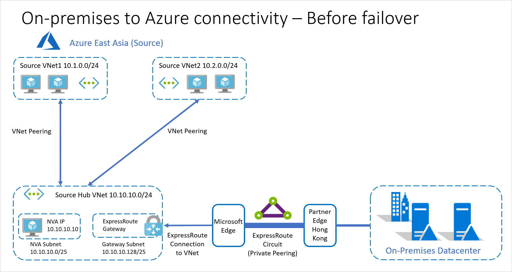
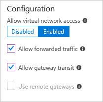

# Using ExpressRoute with Azure virtual machine disaster recovery

Microsoft Azure ExpressRoute lets you extend your on-premises networks into the Microsoft cloud over a private connection facilitated by a connectivity provider. This article describes how you can use ExpressRoute with Site Recovery for disaster recovery of Azure virtual machines.

## Prerequisites

Before you begin, ensure that you understand:
-	ExpressRoute [circuits](../expressroute/expressroute-circuit-peerings.md)
-	ExpressRoute [routing domains](../expressroute/expressroute-circuit-peerings.md#expressroute-routing-domains)
-	Azure virtual machine [replication architecture](azure-to-azure-architecture.md)
-	[Setting up replication](azure-to-azure-tutorial-enable-replication.md) for Azure virtual machines
-	[Failing over](azure-to-azure-tutorial-failover-failback.md) Azure virtual machines

## ExpressRoute and Azure virtual machine replication

When protecting Azure virtual machines with Site Recovery, replication data is sent to an Azure Storage account or replica Managed Disk on the target Azure region depending on whether your Azure virtual machines use [Azure Managed Disks](../virtual-machines/windows/managed-disks-overview.md). Although the replication endpoints are public, replication traffic for Azure VM replication, by default, does not traverse the Internet, regardless of which Azure region the source virtual network exists in.

For Azure VM disaster recovery, as replication data does not leave the Azure boundary, ExpressRoute is not required for replication. After virtual machines fail over to the target Azure region, you can access them using [private peering](../expressroute/expressroute-circuit-peerings.md#azure-private-peering).

## Replicating Azure deployments

An earlier [article](site-recovery-retain-ip-azure-vm-failover.md#on-premises-to-azure-connectivity), described a simple setup with one Azure virtual network connected to customer on-premises datacenter through ExpressRoute. Typical enterprise deployments have workloads split across multiple Azure virtual networks and a central connectivity hub establishes external connectivity, both to the Internet and to on-premises deployments.

This example describes a hub and spoke topology, which is common in enterprise deployments:
-	The deployment is in the **Azure East Asia** region and the on-premises datacenter has an ExpressRoute circuit connection through a partner edge in Hong Kong.
-	Applications are deployed across two spoke virtual networks – **Source VNet1** with address space 10.1.0.0/24 and **Source VNet2** with address space 10.2.0.0/24.
-	The hub virtual network, **Source Hub VNet**, with address space 10.10.10.0/24 acts as the gatekeeper. All communication across subnets goes through the hub.
-	The hub virtual network has two subnets – **NVA Subnet** with address space 10.10.10.0/25 and **Gateway Subnet** with address space 10.10.10.128/25.
-	The **NVA subnet** has a network virtual appliance with IP address 10.10.10.10.
-	The **Gateway Subnet** has an ExpressRoute gateway connected to an ExpressRoute connection that routes to customer on-premises datacenter through a Private Peering routing domain.
-	Each spoke virtual network is connected to the hub virtual network and all routing within this network topology is controlled through Azure Route Tables (UDR). All outbound traffic from one VNet to the other VNet, or to the on-premises datacenter is routed through the NVA.

### Hub and spoke peering

The spoke to hub peering has the following configuration:
-	Allow virtual network address: Enabled
-	Allow forwarded traffic: Enabled
-	Allow gateway transit: Disabled
-	Use remove gateways: Enabled

 

The hub to spoke peering has the following configuration:
-	Allow virtual network address: Enabled
-	Allow forwarded traffic: Enabled
-	Allow gateway transit: Enabled
-	Use remove gateways: Disabled

 

### Enabling replication for the deployment

For the above setup, first [set up disaster recovery](azure-to-azure-tutorial-enable-replication.md) for every virtual machine using Site Recovery. Site Recovery can create the replica virtual networks (including subnets and gateway subnets) on the target region and create the required mappings between the source and target virtual networks. You can also pre-create the target side networks and subnets and use the same while enabling replication.

Site Recovery does not replicate route tables, virtual network gateways, virtual network gateway connections, virtual network peering, or any other networking resources or connections. These and other resources not part of the [replication process](azure-to-azure-architecture.md#replication-process) need to be created during or before failover and connected to the relevant resources. You can use Azure Site Recovery’s powerful [recovery plans](site-recovery-create-recovery-plans.md) to automate creating and connecting additional resources using  automation scripts.

By default, the replication traffic does not leave the Azure boundary. Typically, NVA deployments also define a default route (0.0.0.0/0) that forces outbound Internet traffic to flow through the NVA. In this case, the appliance might get throttled if all the replication traffic passes through the NVA. The same also applies when using default routes for routing all Azure VM traffic to on-premises deployments. We recommend [creating a virtual network service endpoint](azure-to-azure-about-networking.md#create-network-service-endpoint-for-storage) in your virtual network for "Storage" so that the replication traffic does not leave Azure boundary.

## Failover models with ExpressRoute

When Azure virtual machines are failed over to a different region, the existing ExpressRoute connection to the source virtual network is not automatically transferred to the target virtual network on the recovery region. A new connection is required to connect ExpressRoute to the target virtual network.

You can replicate Azure virtual machines to any Azure region within the same geographic cluster as detailed [here](azure-to-azure-support-matrix.md#region-support). If the chosen target Azure region is not within the same geopolitical region as the source, you need to enable ExpressRoute Premium if you’re using a single ExpressRoute circuit for source and target region connectivity. For more details, check [ExpressRoute locations](../expressroute/expressroute-locations.md#azure-regions-to-expressroute-locations-within-a-geopolitical-region) and [ExpressRoute pricing](https://azure.microsoft.com/pricing/details/expressroute/).

### Two ExpressRoute circuits in two different ExpressRoute peering locations
-	This configuration is useful if you want to insure against failure of the primary ExpressRoute circuit and against large-scale regional disasters, which could also impact ExpressRoute peering locations and disrupt your primary ExpressRoute circuit.
-	Normally the circuit connected to the production environment is used as the primary circuit and the secondary circuit is a failsafe and typically of lower bandwidth. The bandwidth of the secondary can be increased in a disaster event, when the secondary must take over as the primary.
-	With this configuration you can establish connections from your secondary ExpressRoute circuit to the target virtual network post failover or have the connections established and ready for a disaster declaration, reducing your overall recovery time. With simultaneous connections to both primary and target region virtual networks, ensure that your on-premises routing uses the secondary circuit and connection only after failover.
-	The source and target virtual networks for VMs protected with Site Recovery can have the same or different IP addresses at failover per your requirement. In both cases, the secondary connections can be established prior to failover.

###	Two ExpressRoute circuits in the same ExpressRoute peering location
-	With this configuration, you can insure against failure of the primary ExpressRoute circuit, but not against large-scale regional disasters, which could impact ExpressRoute peering locations. With the latter, both the primary and secondary circuits can get impacted.
-	The other conditions for IP addresses and connections remain the same as those in the earlier case. You can have simultaneous connections from on-premises datacenter to source virtual network with the primary circuit and to the target virtual network with the secondary circuit. With simultaneous connections to both primary and target region virtual networks, ensure that your on-premises routing uses the secondary circuit and connection only after failover.
-	You can’t connect both circuits to the same virtual network when circuits are created at the same peering location.

###	Single ExpressRoute circuit
-	This configuration does not insure against a large-scale regional disaster, which could impact the ExpressRoute peering location.
-	With a single ExpressRoute circuit, you can’t connect source and target virtual networks simultaneously to circuit if the same IP address space is used on the target region.
-	When the same IP address space is used on the target region, the source side connection should be disconnected, and the target side connection established thereafter. This connection change can be scripted as part of a recovery plan.
-	In a regional failure, if the primary region is inaccessible, the disconnect operation could fail. Such an outage could impact connection creation to the target region when same IP address space is used on target virtual network.
-	If connection creation succeeds on target and primary region recovers later, you can face packet drops if two simultaneous connections attempt to connect to the same address space. To prevent packet drops, the primary connection should be terminated immediately. Post failback of virtual machines to the primary region, the primary connection can again be established after disconnecting the secondary connection.
-	If different address space is used on the target virtual network, then you can simultaneously connect to the source and target virtual networks from the same ExpressRoute circuit.

## Recovering Azure deployments
Consider the failover model with two different ExpressRoute circuits in two different peering locations, and retention of private IP addresses for the protected Azure virtual machines. The target recovery region is Azure SouthEast Asia and a secondary ExpressRoute circuit connection is established through a partner edge in Singapore.

To automate recovery of the entire deployment, in addition to replicating virtual machines and virtual networks, other relevant networking resources and connections must also be created. For the earlier hub and spoke network topology the following additional steps need to be taken during or after the [failover](azure-to-azure-tutorial-failover-failback.md) operation:
1.	Create the Azure ExpressRoute Gateway in the target region hub virtual network. The ExpressRoute Gateway is required to connect the target hub virtual network to the ExpressRoute circuit.
2.	Create the virtual network connection from the target hub virtual network to the target ExpressRoute circuit.
3.	Set up the VNet peerings between the target region’s hub and spoke virtual networks. The peering properties on the target region will be the same as those on the source region.
4.	Set up the UDRs in the hub VNet, and the two spoke VNets. The properties of the target side UDRs are the same as those on the source side when using the same IP addresses. With different target IP addresses, the UDRs should be modified accordingly.

The above steps can be scripted as part of a [recovery plan](site-recovery-create-recovery-plans.md). Depending on the application connectivity and recovery time requirements, the above steps can also be completed prior to starting the failover.

Post the recovery of the virtual machines and completion of the other connectivity steps, the recovery environment looks as follows:

A simple topology example for Azure VM disaster recovery with single ExpressRoute circuit, with same IP on target virtual machines, is detailed [here](site-recovery-retain-ip-azure-vm-failover.md#on-premises-to-azure-connectivity).

## Recovery Time Objective (RTO) considerations
To reduce the overall recovery time for your deployment, we recommend provisioning and deploying the additional target region [networking components](azure-vm-disaster-recovery-with-expressroute.md#enabling-replication-for-the-deployment) such as virtual network gateways beforehand. A small downtime is associated with deploying additional resources, and this downtime can impact the overall recovery time, if not accounted for during planning.

We recommend running regular [disaster recovery drills](azure-to-azure-tutorial-dr-drill.md) for protected deployments. A drill validates your replication strategy without data loss or downtime and doesn't affect your production environment. Running a drill also avoids last-minute configuration issues that can adversely impact recovery time objective. We recommend using a separate Azure VM network for the test failover, instead of the default network that was set up when you enabled replication.

If you’re using a single ExpressRoute circuit, we recommend using a different IP address space for the target virtual network to avoid connection establishment issues during regional disasters. If using different IP addresses is not feasible for your recovered production environment, the disaster recovery drill test failover should be done on a separate test network with different IP addresses as you can’t connect two virtual networks with overlapping IP address space to the same ExpressRoute circuit.

## Next steps
- Learn more about [ExpressRoute circuits](../expressroute/expressroute-circuit-peerings.md).
- Learn more about [ExpressRoute routing domains](../expressroute/expressroute-circuit-peerings.md#expressroute-routing-domains).
- Learn more about [ExpressRoute locations](../expressroute/expressroute-locations.md).
- Learn more about [recovery plans](site-recovery-create-recovery-plans.md) to automate application failover.
