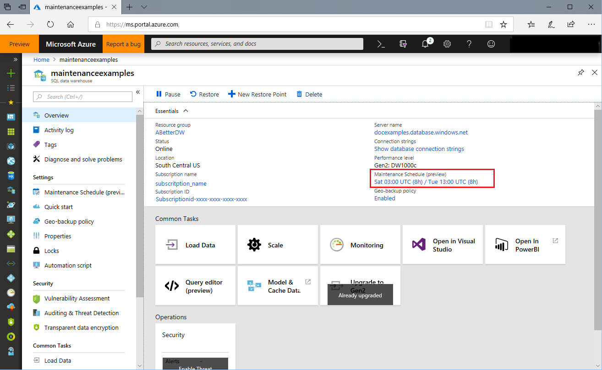

# Viewing a maintenance schedule 

## Portal

By default, all newly created Azure SQL Data Warehouse instances will have an 8hr system defined Primary and Secondary maintenance window applied during deployment, this can be edited as soon deployment is complete. No maintenance will take place outside of the specified maintenance windows without prior notification.
Complete the following steps to view the maintenance schedule that has been applied to your data warehouse in portal.

Complete the following steps to view the maintenance schedule that has been applied to your data warehouse in portal.
1.	Sign in to the [Azure portal](https://portal.azure.com/).
2.	Select the data warehouse that you would like to view. 
3.	The selected Azure SQL Data Warehouse will open on the overview blade. The Maintenance schedule applied to the selected data warehouse will be shown below the Maintenance schedule (preview).

## Next steps
[Learn more](https://docs.microsoft.com/azure/monitoring-and-diagnostics/monitor-alerts-unified-usage) about creating, viewing, and managing alerts using Azure Monitor.
[Learn more](https://docs.microsoft.com/azure/monitoring-and-diagnostics/monitor-alerts-unified-log-webhook) about Webhook actions for log alert rules.
[Learn more](https://docs.microsoft.com/azure/service-health/service-health-overview) about Azure Service Health

