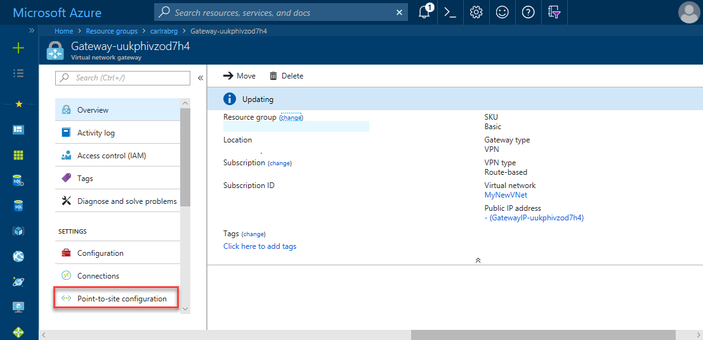
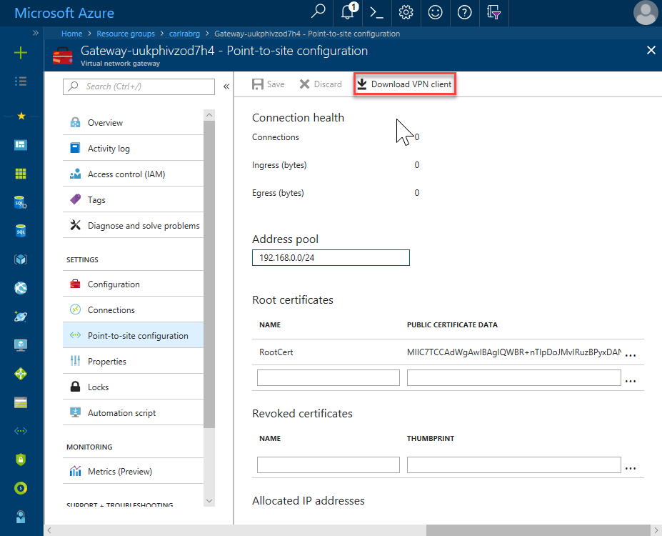
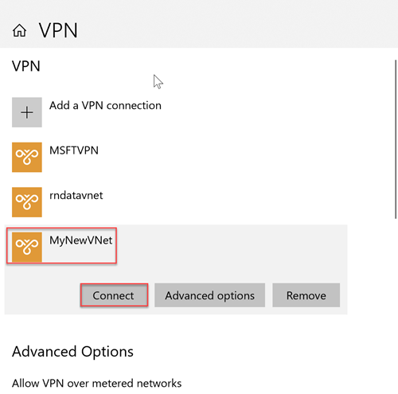
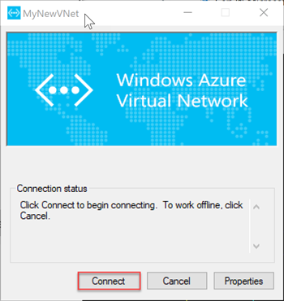
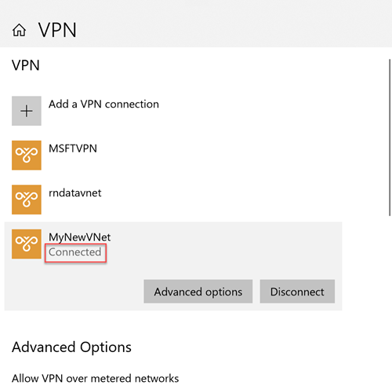

# Configure a point-to-site connection to connect to an Azure SQL Database Managed Instance from on-premises computer

This quickstart demonstrates how to connect to an Azure SQL Database Managed Instance using [SQL Server Management Studio](https://docs.microsoft.com/sql/ssms/sql-server-management-studio-ssms) (SSMS)  from an on-premises client computer over a point-to-site connection. For information about point-to-site connections, see [About Point-to-Site VPN](../vpn-gateway/point-to-site-about.md)

## Prerequisites

This quickstart:
- Uses as its starting point the resources created in this quickstart: [Create a Managed Instance](sql-database-managed-instance-get-started.md).
- Requires PowerShell 5.1 and Azure PowerShell 5.4.2 or higher your on-premises client computer.
- Requires the newest version of [SQL Server Management Studio](https://docs.microsoft.com/sql/ssms/sql-server-management-studio-ssms) (SSMS) on your on-premises client computer

## Attach a VPN gateway to your Managed Instance virtual network

1. Open Powershell on your on-premises client computer.
2. Copy and paste this PowerShell script. This script attaches a VPN Gateway to the Managed Instance virtual network that you created in the [Create a Managed Instance](sql-database-managed-instance-get-started.md) quickstart. This script performs the following three steps:
  - Creates and install certificates on client machine
  - Calculates the future VPN Gateway subnet IP range
  - Creates the GatewaySubnet
  - Deploys the Azure Resource Manager template that attaches the VPN Gateway to VPN subnet

   ```powershell
   $scriptUrlBase = 'https://raw.githubusercontent.com/Microsoft/sql-server-samples/master/samples/manage/azure-sql-db-managed-instance/attach-vpn-gateway'

   $parameters = @{
       subscriptionId = '<subscriptionId>'
       resourceGroupName = '<resourceGroupName>'
       virtualNetworkName = '<virtualNetworkName>'
       certificateNamePrefix  = '<certificateNamePrefix>'
       }

   Invoke-Command -ScriptBlock ([Scriptblock]::Create((iwr ($scriptUrlBase+'/attachVPNGateway.ps1?t='+ [DateTime]::Now.Ticks)).Content)) -ArgumentList $parameters, $scriptUrlBase 
   ```

3. Provide the requested parameters in the PowerShell script. The values for `<subscriptionId>`, `<resourceGroup>` and `<virtualNetworkName>` should match the ones that are used in [Create Managed Instance](sql-database-managed-instance-get-started.md) quickstart. The value for `<certificateNamePrefix>` can be a string of your choice.

4. Execute the PowerShell script.

## Create a VPN connection to your Managed Instance

1. Sign in to the [Azure portal](https://portal.azure.com/).
2. Open the resource group in which you created the virtual network gateway and then open the virtual network gateway resource.

      

3. Click **Point-to-site configuration** and then click **Download VPN client**.

      
4. Extract the files from the zip file and then open the extracted folder. 
5. Havigate to the WindowsAmd64 folder and open the **VpnClientSetupAmd64.exe** file.
6. If you recieve a **Windows protected your PC** message, click **More info** and then click **Run anyway**.

    \
7. Click **Yes** in the User Account Control dialog box to proceed.
8. In the MyNewVNet dialog box, click **Yes** to install a Vpn Client for MyNewVNet.

## Connect to the VPN connection.

1. Go to VPN connections on your client computer and click **MyNewVNet** to establish a connection to this VNet.

      
2. Click **Connect**.
3. In the MyNewVNet dialog box, click **Connect**.

      
4. When prompted that Connection Manager needs elevated privilege to update your route table, click **Continue**.
5. Click **Yes** in the User Account Control dialog box to proceed.

      

   You have established a VPN connection to your Managed Instance VNet.

## Use SSMS to connect to the Managed Instance

1. On the on-premises client computer, open SQL Server Management Studio (SSMS).
 
2. In the **Connect to Server** dialog box, enter the fully qualified **host name** for your Managed Instance in the **Server name** box, select **SQL Server Authentication**, provide your login and password, and then click **Connect**.

      

After you connect, you can view your system and user databases in the Databases node, and various objects in the Security, Server Objects, Replication, Management, SQL Server Agent, and XEvent Profiler nodes.

## Next steps

- For a quickstart showing how to connect from an Azure virtual machine, see [Configure a point-to-site connection](sql-database-managed-instance-configure-p2s.md)
- For an overview of the connection options for applications, see [Connect your applications to Managed Instance](sql-database-managed-instance-connect-app.md).
- To restore an existing SQL Server database from on-premises to a Managed instance, you can use the [Azure Database Migration Service (DMS) for migration](../dms/tutorial-sql-server-to-managed-instance.md) to restore from a database backup file or the [T-SQL RESTORE command](sql-database-managed-instance-get-started-restore.md) to restore from a database backup file.
