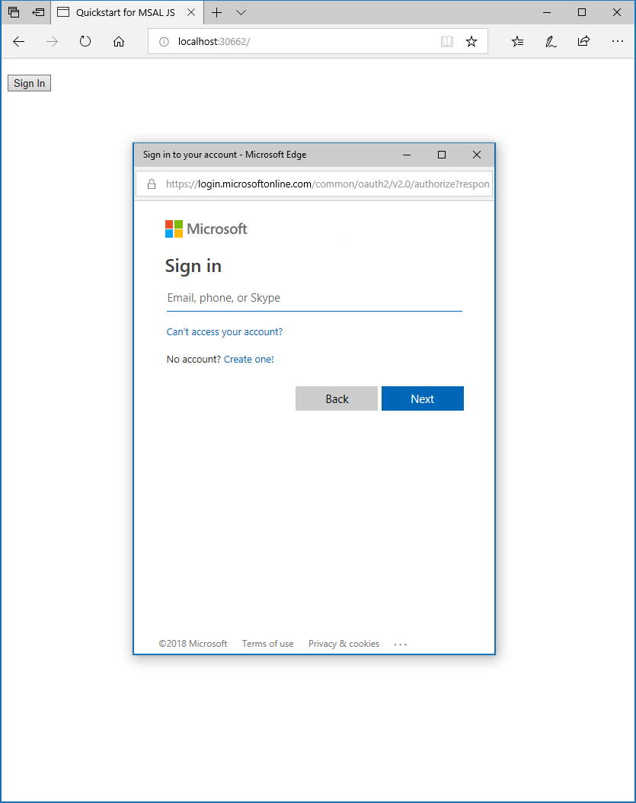
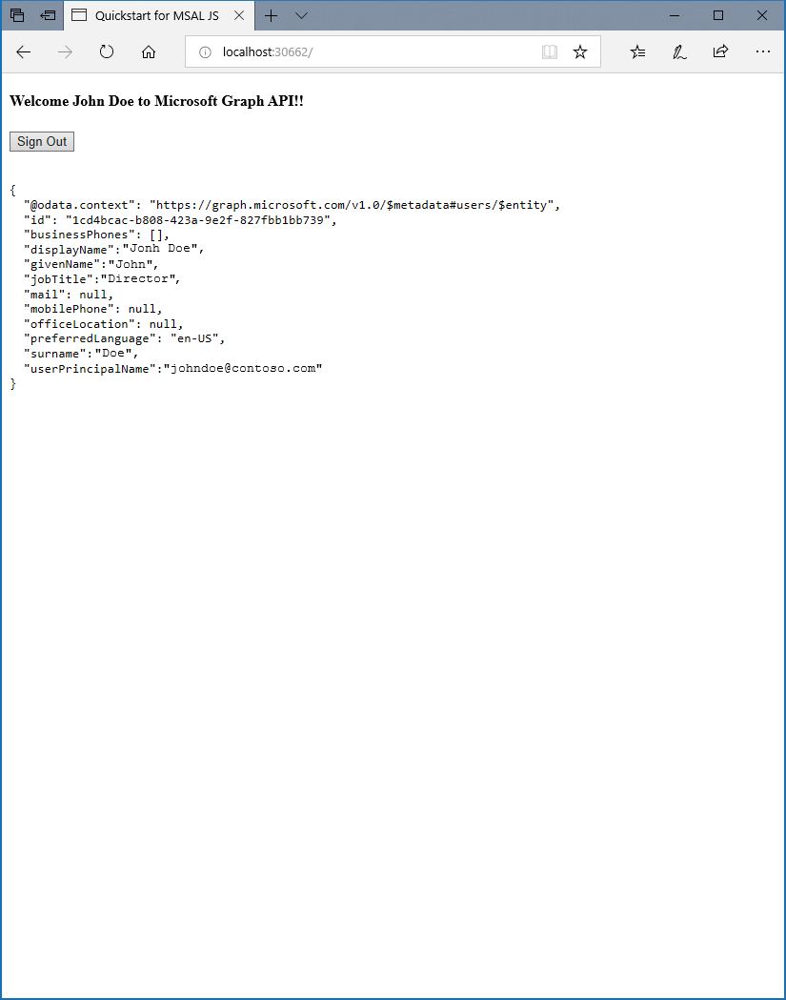

## Test your code

### Test with Node
If you're not using Visual Studio, make sure your web server is started.
1. Configure the server to listen to a TCP port that's based on the location of your **index.html** file. For Node, start the web server to listen to the port by running the following commands on a command line prompt from the application folder:

    ```bash
    npm install
    node server.js
    ```
1. Open the browser and type http://<span></span>localhost:30662 or http://<span></span>localhost:{port} where **port** is the port that your web server is listening to. You should see the contents of your index.html file and the **Sign In** button.

<p/><!-- -->

### Test with Visual Studio
If you're using Visual Studio, make sure to select the project solution and press **F5** to run your project. The browser opens to the http://<span></span>localhost:{port} location and you see the **Sign In** button.


## Test your application

After the browser loads your index.html file, click **Sign In**. You will be prompted to sign in with the Microsoft Azure Active Directory (Azure AD) v2.0 endpoint:




### Provide consent for application access

The first time that you sign in to your application, you're prompted to provide your consent to allow the application to access your profile and to sign you in:


### View application results
After you sign in, you should see your user profile information returned in the Microsoft Graph API response displayed on the page.



<!--start-collapse-->
### More information about scopes and delegated permissions

The Microsoft Graph API requires the `user.read` scope to read a user's profile. This scope is automatically added by default in every application that's registered on the registration portal. Other APIs for Microsoft Graph, as well as custom APIs for your back-end server, might require additional scopes. For example, the Microsoft Graph API requires the `Calendars.Read` scope to list the user’s calendars.

To access the user’s calendars in the context of an application, add the `Calendars.Read` delegated permission to the application registration information. Then, add the `Calendars.Read` scope to the `acquireTokenSilent` call.

>[!NOTE]
>The user might be prompted for additional consents as you increase the number of scopes.

If a back-end API doesn't require a scope (not recommended), you can use the `clientId` as the scope in the calls to acquire tokens.

<!--end-collapse-->

[!INCLUDE [Help and support](./active-directory-develop-help-support-include.md)]
