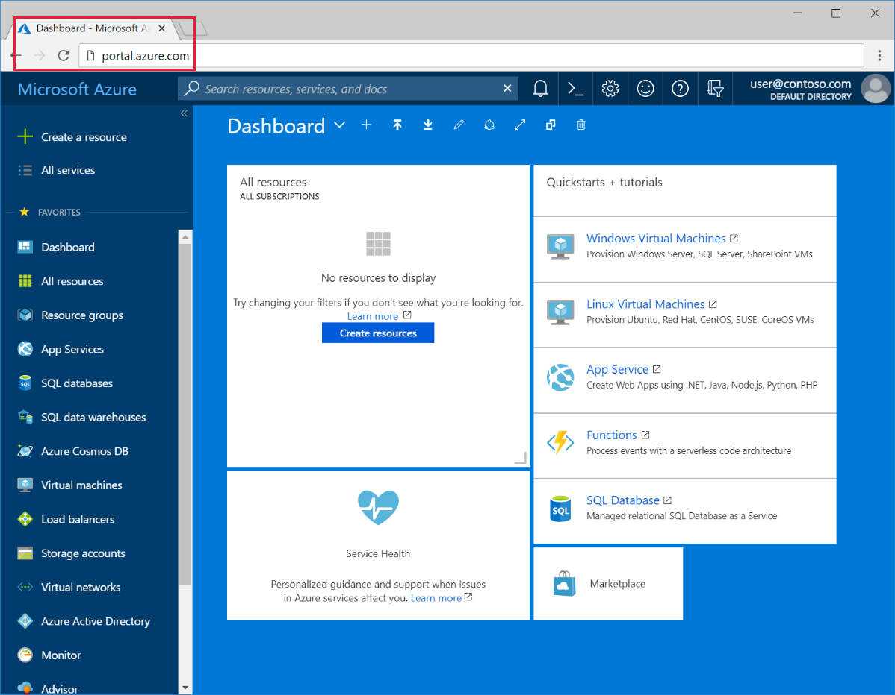
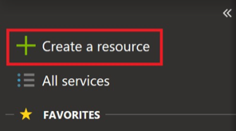
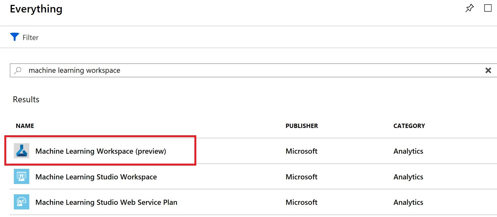
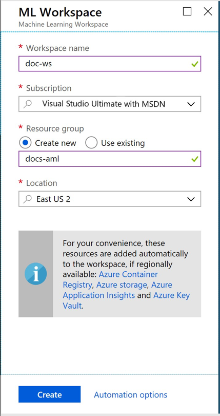

Sign in to the [Azure portal](https://portal.azure.com/) using the credentials for the Azure subscription you'll use. If you don't have an Azure subscription, create a [free account](https://azure.microsoft.com/free/?WT.mc_id=A261C142F) now.

The portal's workspace dashboard is supported on Edge, Chrome and Firefox browsers only.

   

Select the **Create a resource** button (+) in the upper-left corner of the portal.

   

Enter **Machine Learning** in the search bar. Select the search result named **Machine Learning Workspace**.

   

In the **Machine Learning Workspace** pane, scroll to the bottom and select **Create** to begin.

   

In the **ML Workspace** pane, configure your workspace.

   Field|Description
   ---|---
   Workspace name |Enter a unique name that identifies your workspace.  Here we'll use docs-ws. Names must be unique across the resource group. Use a name that is easy to recall and differentiate from the workspaces created by others.  
   Subscription |Choose the Azure subscription that you want to use. If you have multiple subscriptions, choose the appropriate subscription in which the resource is billed.
   Resource group | Use an existing resource group in your subscription, or enter a name to create a new resource group. A resource group is a container that holds related resources for an Azure solution.  Here we'll use docs-aml. 
   Location | Choose the location closest to your users and the data resources. This is where the workspace is created.

   

Select **Create** to begin the creation process.  It can take a few moments to create the workspace.

   To check on the status of the deployment, select the Notifications icon (bell) on the toolbar.

   

   When finished, a deployment success message appears.  It is also present in the notifications section.   Click on the **Go to resource** button to view the new workspace.
