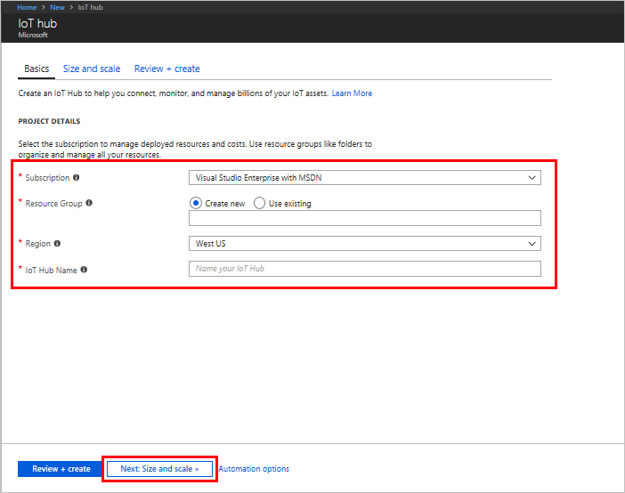
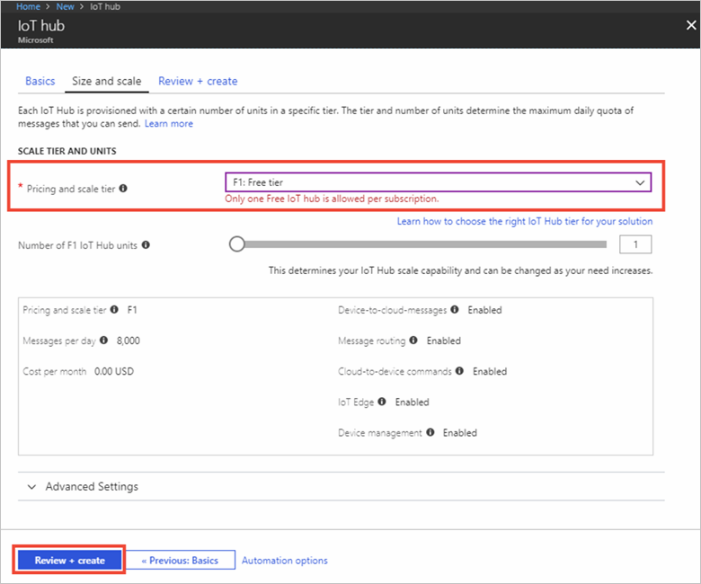

1. Sign in to the [Azure portal](https://portal.azure.com/).

2. Select **Create a resource** > **Internet of Things** > **IoT Hub**.
   
    

3. In the **IoT hub** pane, enter the following information for your IoT hub:

   * **Subscription**: Choose the subscription that you want to use to create this IoT hub.

   * **Resource group**: Create a resource group to host the IoT hub or use an existing one. For more information, see [Use resource groups to manage your Azure resources](../articles/azure-resource-manager/resource-group-portal.md).

   * **Region**: Select the closest location to you.

   * **Name**: Create a name for your IoT hub. If the name you enter is available, a green check mark appears.

   [!INCLUDE [iot-hub-pii-note-naming-hub](iot-hub-pii-note-naming-hub.md)]

   

4. Select **Next: Size and scale** to continue creating your IoT hub. 

5. Choose your **Pricing and scale tier**. For this article, select the **F1 - Free** tier if it's still available on your subscription. For more information, see the [Pricing and scale tier](https://azure.microsoft.com/pricing/details/iot-hub/).

   

6. Select **Review + create**.

7. Review your IoT hub information, then click **Create**. Your IoT hub might take a few minutes to create. You can monitor the progress in the **Notifications** pane.